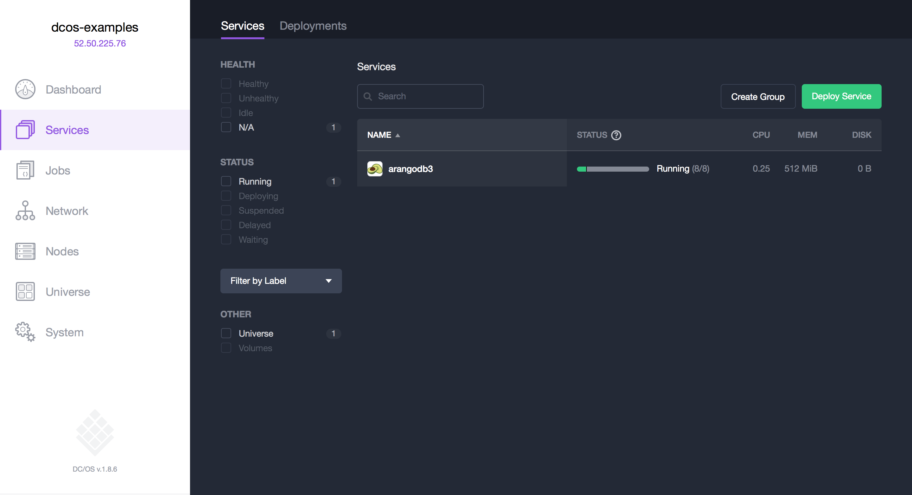
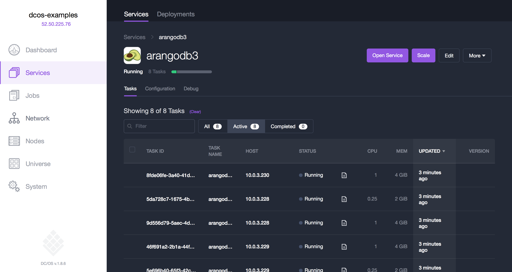
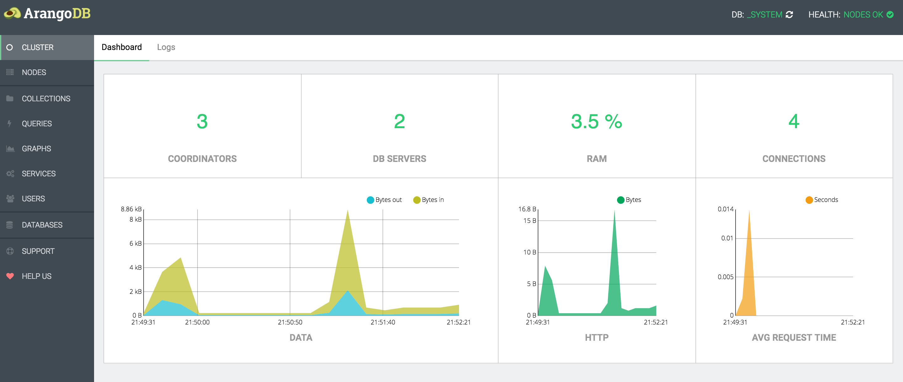

# Running ArangoDB on DC/OS

[ArangoDB](https://www.arangodb.com/) is a distributed, multi-model database featuring JSON
documents, graphs, and key/value pairs. It has a unified query language (AQL) that allows you
to mix all three data models and supports joins and transactions.

- Estimated time for completion: 5 minutes
- Target Audience: Anyone who wants to deploy a distributed multi-model database on DC/OS. Beginner level.
- Scope: Covers the basics in order to get you started with ArangoDB on DC/OS.

## Prerequisites

- A running DC/OS 1.8 cluster with at least 3 nodes
- [DC/OS CLI](https://dcos.io/docs/1.8/usage/cli/install/) installed

## Install ArangoDB

The DC/OS CLI provides a convenient way to deploy applications on your DC/OS cluster:

```bash
$ dcos package install arangodb3
The default configuration requires at least 3 nodes having 4.75 CPU, 22GB of memory and 20GB of persistent disk storage in total.
Continue installing? [yes/no] yes
Installing Marathon app for package [arangodb3] version [1.0.4]
Installing CLI subcommand for package [arangodb3] version [1.0.4]
New command available: dcos arangodb3
The ArangoDB DCOS Service has been successfully installed!

	Documentation: https://github.com/arangodb/arangodb3-dcos
	Issues: https://github.com/arangodb/arangodb3-dcos/issues
```

This command installs the `arangodb3` DC/OS CLI subcommand and starts an instance of the ArangoDB service with its default configuration under its default name, `arangodb3`. Now click on the Services tab in the DC/OS UI to watch ArangoDB start up:



Click on the ArangoDB service to reveal the tasks that the framework has started:



Click `Open Service` in the right upper corner to open the ArangoDB web interface.



Congratulations, you now have ArangoDB running on DC/OS!

## Use ArangoDB

Now that ArangoDB is running you can fill it with some data and use it as a data store for your applications.

To get started, talk to the `Coordinators` of your ArangoDB cluster. Note that you should not hardcode the `Coordinators` IP addresses and ports in your applications because they can move or change at any time throughout your cluster lifetime, for example because a tasks fails or due to scaling it up.

To connect to ArangoDB from the inside deploy the [ArangoDB Mesos HAProxy](https://github.com/arangodb/arangodb-mesos-haproxy).

Clone the repository and start the proxy:

```bash
$ git clone https://github.com/arangodb/arangodb-mesos-haproxy
$ cd arangodb-mesos-haproxy
$ dcos marathon app add marathon.json
```

To make your proxy highly available or scale it, you can simply add a few more instances via the Marathon UI.

## Further reading

### Deinstallation/Shutdown

Use the following commands to shut down and delete your ArangoDB service and the
command line tool:

```bash
$ dcos arangodb3 uninstall; dcos package uninstall arangodb3
```

The first command uses the `arangodb` subcommand to gracefully shut down and delete all instances of your ArangoDB service. The framework scheduler
itself will run in silent mode for another 120 seconds. This enables the second command to remove the `arangodb` subcommand and the entry in
Marathon that would otherwise restart the framework scheduler automatically.

### Configuration options

There are a number of configuration options, which can be specified in the following
way:

```bash
$ dcos package install --config=<JSON_FILE> arangodb3
```

where `JSON_FILE` is the path to a JSON file. For a list of possible
attribute values and their documentation see

```bash
$ dcos package describe --config arangodb3
```

### Further Information

For further information, visit the GitHub repo [arangoDB/arangodb-mesos-framework](https://github.com/arangoDB/arangodb-mesos-framework). Note that the ArangoDB service is also distributed as a Docker image (`arangodb/arangodb-mesos-framework`).

See the [README.md](https://github.com/ArangoDB/arangodb-mesos-framework) in the framework repository for details on how the framework scheduler is
configured.

### Support and bug reports

The ArangoDB Mesos framework and the DC/OS subcommand are supported by ArangoDB GmbH, the company behind ArangoDB. If you get
stuck, need help or have questions, just ask via one of the following channels:

- [Slack](http://slack.arangodb.com)
- [Google Group](https://groups.google.com/forum/#!forum/arangodb)
- `hackers@arangodb.com`: developer mailing list of ArangoDB
- `max@arangodb.com`: direct email to Max Neunhöffer
- `frank@arangodb.com`: direct email to Frank Celler
- `mop@arangodb.com`: direct email to Andreas Streichardt

Additionally, we track issues, bug reports, and questions via the GitHub
issue trackers at

- [arangodb-dcos](https://github.com/ArangoDB/arangodb3-dcos/issues): The DC/OS subcommand
- [arangodb-mesos](https://github.com/arangodb/arangodb-mesos-framework/issues): The ArangoDB service
- [arangodb-mesos-haproxy](https://github.com/arangodb/arangodb-mesos-haproxy/issues): The ArangoDB Mesos Proxy
