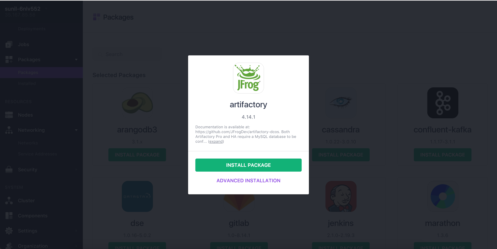
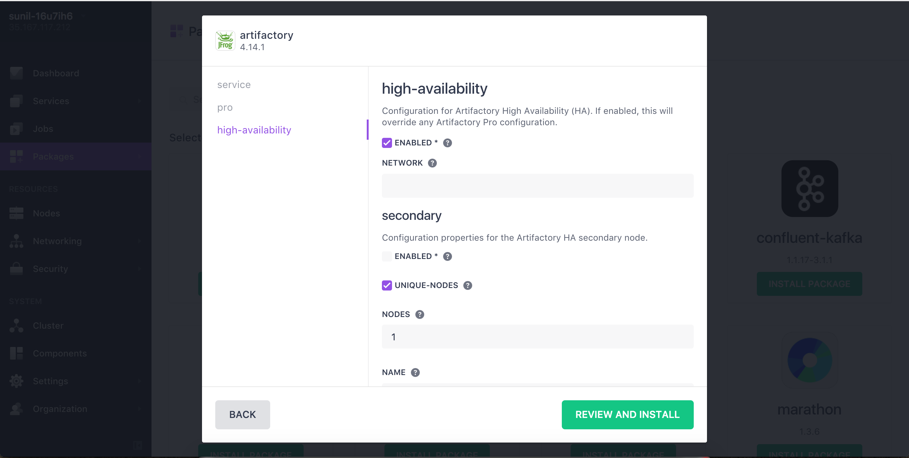
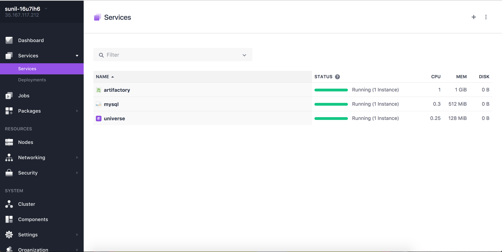
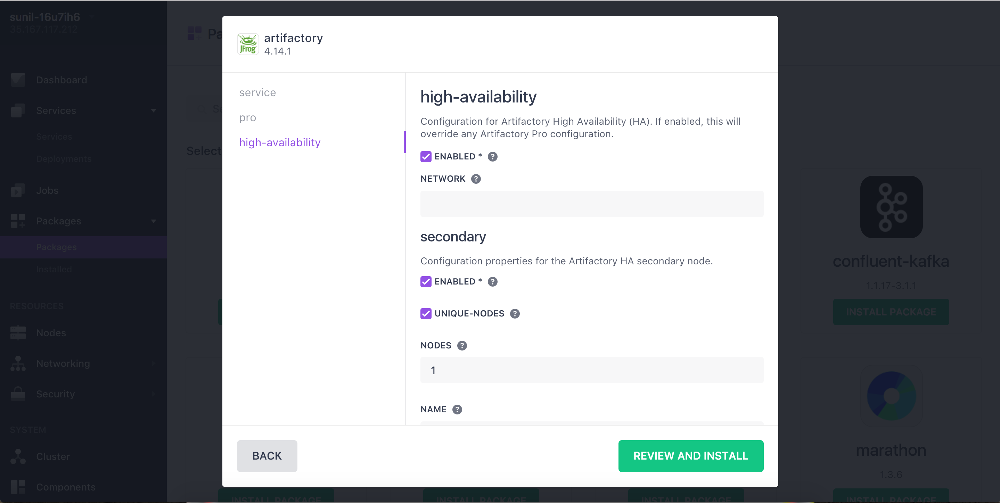
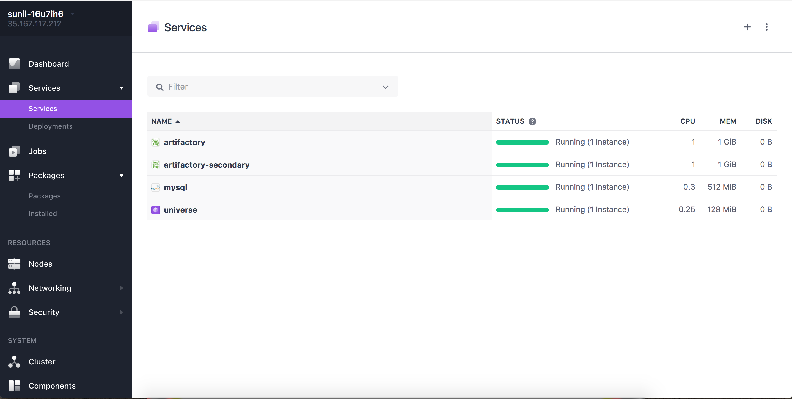
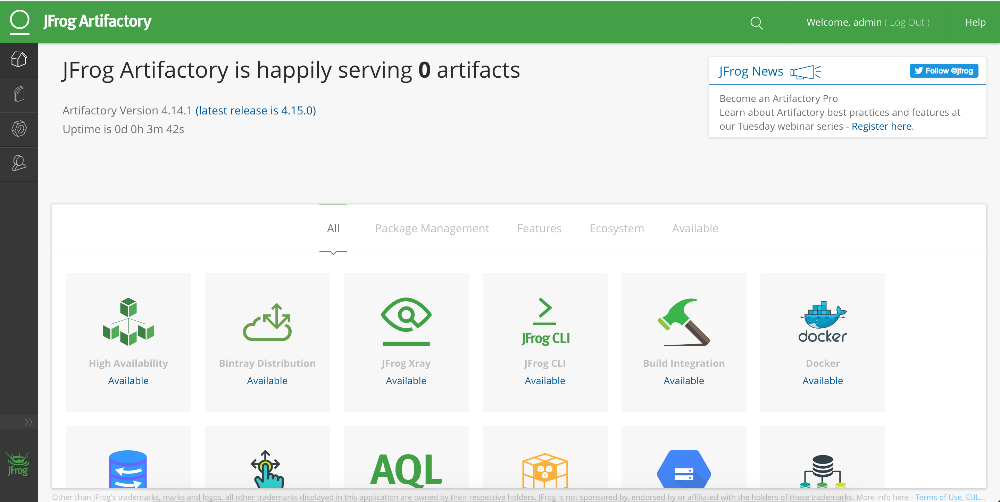

##Artifactory HA Installation Guide for DC/OS

##### Architecture of Artifactory HA


## To Set Up Artifactory HA in DCOS following are prerequisites:
1. **NFS Storage**
2. **Database (MySQL, Oracle,  MS SQL and PostgreSQL)**
3. **Artifactory Pro Enterprise Value Pack**

## It requires min 1 Public Slave to install Artifactory Pro or Enterprise

## Steps to Set Up Artifactory HA:

1. Mount NFS Storage to Each Private Node of DC/OS Cluster.<br />
    For example: You have artifactoryha.mount.com:/artifactory as your mount point.
    Mount it to /var/data/artha dir of your each private node of DC/OS.<br />
    ```sudo mount artifactoryha.mount.com:/artifactory /var/artifactory/```<br />
    All the nodes should share the same file storage, for now the only way is to use NFS. This requirement will be removed in the future.<br />
    Note: Provide permission to write and create subdirectories to /var/data/artha.
    
2. Install MySQL in DC/OS.<br />
    [Here is guide to install MySQL in DC/OS](install-mysql.md)
    The database is used by all the nodes to store metadata attached to artifacts.<br />

3. Install artifactory-primary using DC/OS user interface.<br />

    1. Select Artifactory Package from Universe

    
    
    2. Click on Install-> Advance Installation
    
    
    
    3. Provide license and database details in service tab as shown in screen shot
       
       
       ###NOTE: Make sure database name, is correct in connection-string as well as username & password for database.
       ### Licenses: Provide all Artifactory Licenses as a single string comma separated without white spaces in string.
    
    4. Install Artifactory-Primary for HA cluster by clicking ENABLED under high-availability tab as showed in image.  
       
    
    5. Review and Install. Make sure artifactory is running and Healthy.
       

4. Install Artifactory-secondary:DC/OS user interface / CLI.<br />
    1. Select Artifactory Package from Universe
    
        
        
    2. Click on Install-> Advance Installation
        
        
        
    3. Provide license and database details in service tab as shown in screen shot
        
           
        ###NOTE: Make sure database name, is correct in connection-string as well as username & password for database.
        ### Licenses: Provide all Artifactory Licenses as a single string comma separated without white spaces in string.
        
    4. Install Artifactory-Secondary for HA cluster by clicking ENABLED for high-availability and secondary under high-availability tab as showed in image.  
        
        
    5. Review and Install. Make sure artifactory-secondary is running and Healthy.
        
    
        ### NOTE: API Key of Artifactory generated by Artifactory-Primary to fetch license from Artifactory-Primary (Optional)

#NOW you are just one step away in accessing Artifactory

5. [Install Artifactory-lb by following this guide](install-artifactory-lb.md)

6. Access Artifactory on Public IP of DC/OS public slave. 

### Now try to access your DC/OS Public Slave load balancer you should be able to access Artifactory.

Here is how Artifactory UI looks like!!!



##To use JFrog Artifactory please visit wiki.jfrog.com

