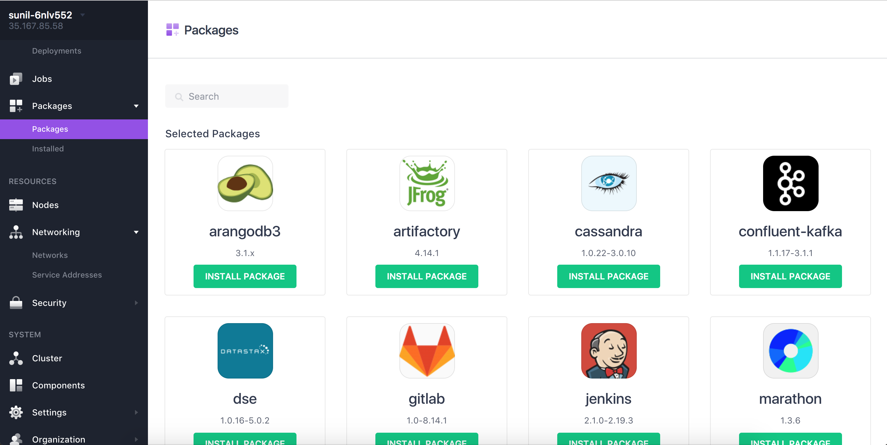
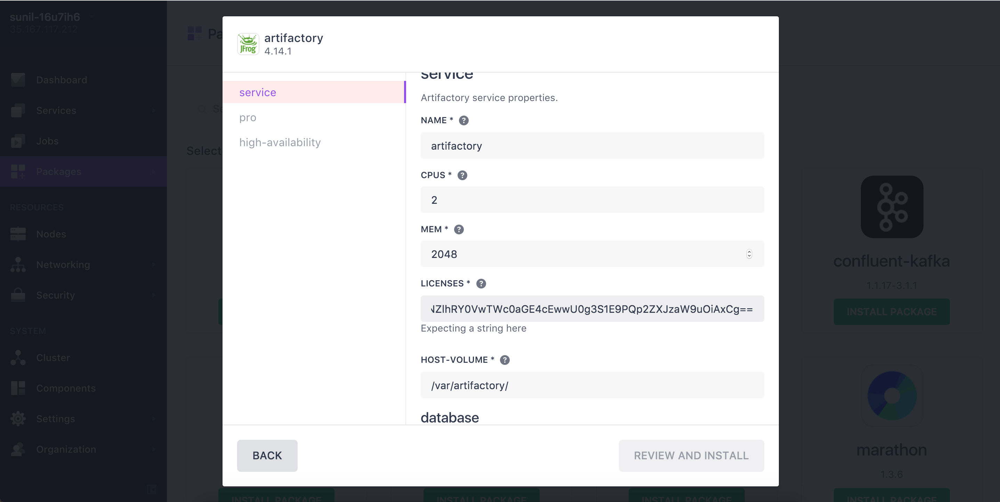
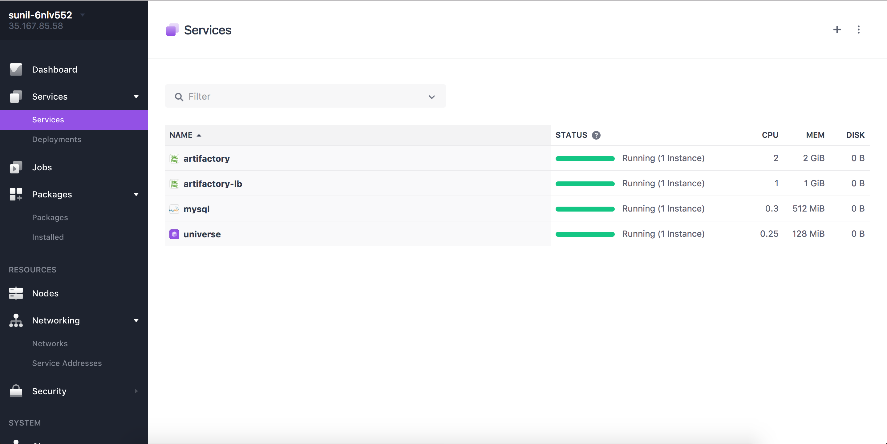

##Artifactory-Pro Installation Guide for DC/OS

## To Set Up Artifactory HA in DC/OS following are prerequisites:
1. **Database (MySQL)**
2. **Artifactory Pro License**

## It requires min 1 Public Slave to install Artifactory Pro or Enterprise

*[Here is guide to install MySQL in DC/OS](install-mysql.md)

*[Go here to Get your Trial License](https://www.jfrog.com/artifactory/free-trial-mesosphere/)

*Steps to Install Artifactory Pro

1. Select Artifactory Package from Universe

2. Click on Install-> Advance Installation

3. Provide license and database details in service tab as shown in screen shot

###NOTE: Make sure database name, is correct in connection-string as well as username & password for database.

4. Install Artifactory-Pro by clicking on Review and Install button.

5. Make sure Artifactory is running and its healthy by looking at Marathon UI.

##NOW you are just one step away in accessing Artifactory

6. [Install Artifactory-lb by following this guide](install-artifactory-lb.md)
