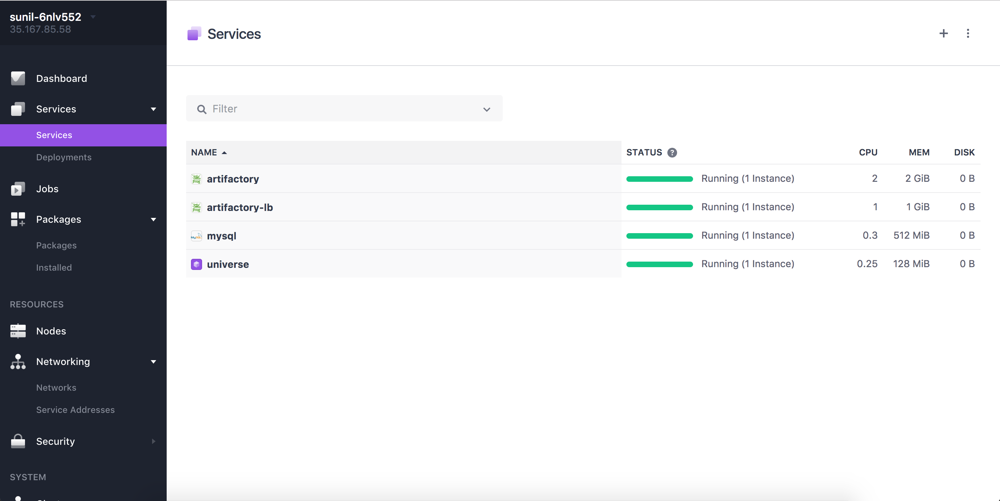

##Artifactory-lb Installation Guide for DC/OS

## To Set Up Artifactory-lb in DC/OS following are prerequisites:
1. **Running Artifactory**

## It requires min 1 Public Slave to install Artifactory Pro or Enterprise

## Steps to install Artifactory-lb:

1. Select Artifactory-lb package from Universe.

2. Click on Install -> Advance Installation.

### NOTE:  If name of your artifactory service is not "artifactory" then change it under artifactory tab. 
###Use pre populated API KEY in case you have changed artifactory password. follow steps 4 to 7 to fetch API KEY.

3. Click Review and Install.

4. Go to your Mesos UI.

5. Select Artifactory -> Artifactory-logs 

6. Select artifactory.log file and you will see output as following. Copy API key from artifactory.log file as showed in screen shot.

7. Paste selected API key in Artifactory-lb advance installation -> artifactory tab. as follows. Then review and install.

8. Make sure Artifactory-lb is running and its healthy by looking at Marathon UI.

### Awesome!! now you can access artifactory UI by going to public ip of node where Artifactory-lb is running.

Here is how Artifactory UI looks like!!!
