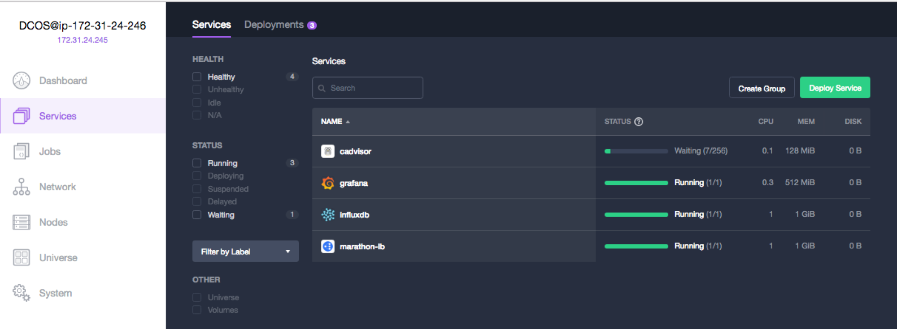
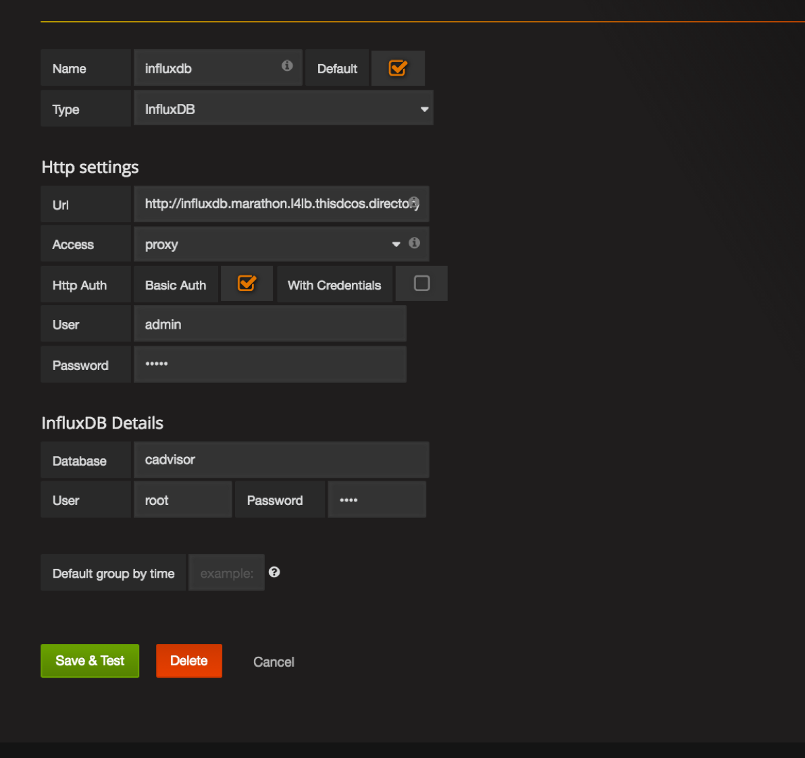
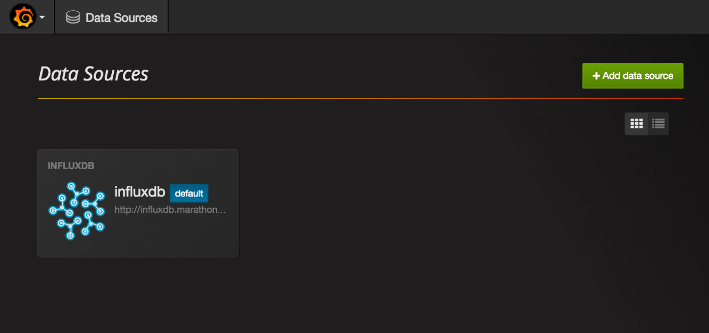
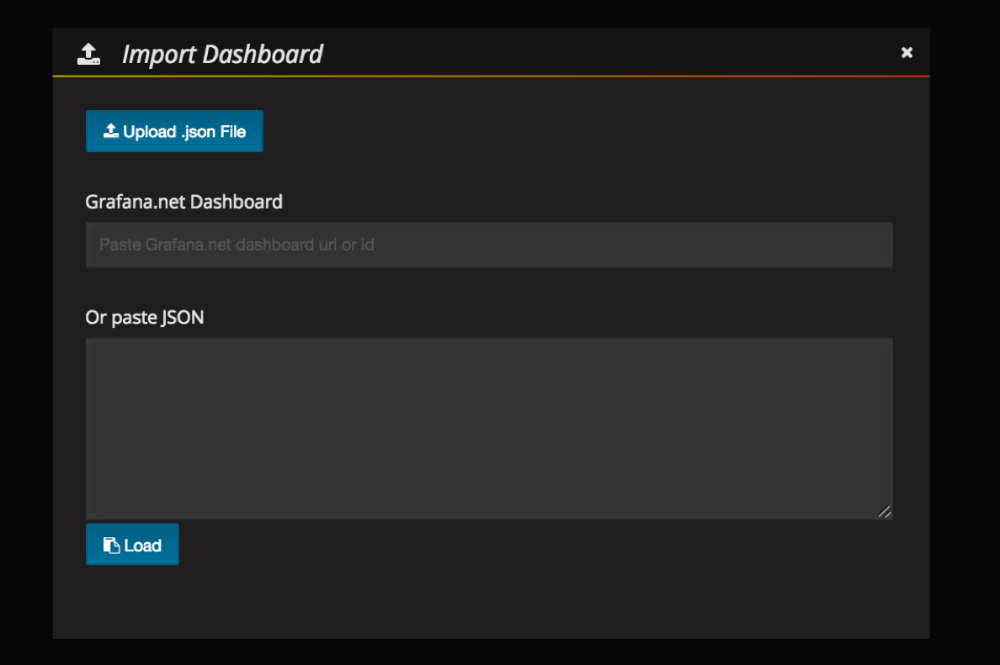
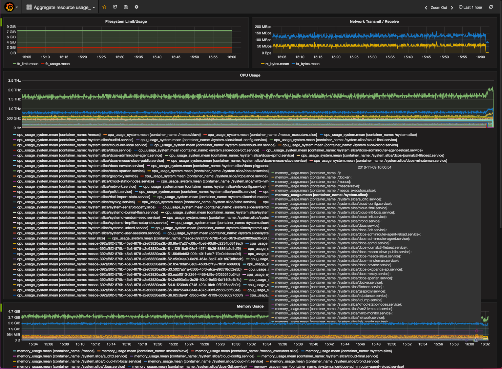

# How to deploy cAdvisor, InfluxDB and Grafana for monitoring nodes and containers on DC/OS

Monitoring of servers and applications in a DC/OS cluster is a need that becomes particularly evident as clusters grow over time in size, number of users and/or number of running applications. There are a plethora of options for monitoring a DC/OS cluster, including many open-source and commercial solutions from different vendors. Many of them can be installed directly from the DC/OS Universe, making it straightforward to try them for your particular use case and run them in your infrastructure. 

In this document, we will describe how to install and configure a DC/OS monitoring stack composed of three open source components that can be used together in order to gather, export, store and display detailed metrics about the hosts, applications and containers in your DC/OS cluster. These components are:

- [cAdvisor](https://github.com/google/cadvisor): cAdvisor (Container Advisor) provides container users an understanding of the resource usage and performance characteristics of their running containers. It is a running daemon that collects, aggregates, processes, and exports information about running containers. Specifically, for each container it keeps resource isolation parameters, historical resource usage, histograms of complete historical resource usage and network statistics. This data is exported by container and machine-wide.

- [InfluxDB](https://github.com/influxdata/influxdb): InfluxDB is an open source time series database with no external dependencies. It's useful for recording metrics, events, and performing analytics.

- [Grafana](https://github.com/grafana/grafana): Grafana is an open source, feature rich metrics dashboard and graph editor for Graphite, Elasticsearch, OpenTSDB, Prometheus and InfluxDB.

- Estimated time for completion: up to 30 minutes
- Target audience:
 - Operators
 - Application admins
- Scope: You'll learn how to install and configure cAdvisor, InfluxDB and Grafana in order to monitor your cluster's health and performance.

**Table of Contents**:

- [Prerequisites](#prerequisites)
- [Install](#install)
- [Use](#use)
- [Uninstall](#uninstall)

## Prerequisites

- A running DC/OS 1.8 cluster with at least a bootstrap node, a master, a private agent and a public agent.
- Marathon-LB running on the cluster's public agent.


## Install

### cAdvisor installation:

Log into DC/OS, go to Universe, and select the `cadvisor` package from Universe. Optionally, click on "Advanced Installation" and modify the following parameters according to your needs:

- Instances: this controls the amount of cAdvisor instances in your cluster. There should be one and just one instance of cAdvisor in each node of your cluster. The package is prepared to install a single instance per node, and is initially set to launch a maximum of 256 instances. This means that the deployment will deploy as many instances as nodes are there in your cluster, and then stay "Waiting" in case the number of nodes in the cluster is increased so that new instances are spawn. If you would like to keep the application in a "Running" state instead, you can just adjust this parameter to exactly the number of nodes in your cluster. If you add nodes to your cluster at a later time, you can simply increase the number of instances when cAdvisor is running in Marathon.

- Networking / InfluxDB host and port: these parameters control the location of the the InfluxDB host to stream the metrics to. This is initially set to values of `influxdb.marathon.l4lb.thisdcos.directory` and `8086`, which are the default values that the InfluxDB DC/OS package will listen in. If you'll be using an InfluxDB instance running outside of DC/OS, or simply a different endpoint or name to your influxDB instance, you can hange these to the IP address or DNS name of your InfluxDB host, and the port where it's listening on, respectively. Otherwise, the defaults with work with the DC/OS `influxdb` package's defaults.

- Networking / external access: Enable or disable creating a VIP for external access towards cAdvisor's web interface through a public node running Marathon-LB. Please note that the web interface of cAdvisor provides information about a single node. This VIP is be set to be "sticky", so that a browser session is always sent to the same cAdvisor instance.

Once these parameters are set, you can simply click "Install". A copy of cAdvisor will be spawned in each node of your cluster and will automatically start streaming metrics.

### InfluxDB installation:

Log into DC/OS, go to Universe, and select the `influxdb` package from Universe. Optionally, click on "Advanced Installation" and modify the following parameters according to your needs:

- CPUs / Mem: This package is set by default to use 1 vCPU and 2G RAM to run. Depending on the amount of nodes and traffic received, you may want to increase these numbers to avoid application restarts due to resource exhaustion. 

- Storage / Pre-create database and pre-create database name: InfluxDB can be configured to automatically create databases on startup. For this use case, we will need it to create a database called `cadvisor` and launch it on startup.

- Host_volume_influxdb: If storage persistence is not selected (see below), this package will use a subdirectory created under this path in the node where it runs to store data. If the container is restarted or destroyed, this data won't be automatically deleted. This can be modified to point to a directory where an NFS share is mounted, so that the contents of the database are stored in the NFS share. For example, we can mount our NFS sahre under `/mnt/nfs_share` in all nodes, and then use that value for the host_volume_influxdb parameter. This package will automatically create a subdirectory in there with the name used to deploy it (e.g. `/mnt/nfs_share/influxdb`)

- Persistence: Enable persistent storage, with the usage of either Local or External Persistent Volumes. The persistent volumes will be local if the "external" checkbox commented below is not selected.

- Persistence / external: Enable external persistent volumes. This allows to use an external storage system such as Amazon EBS, OpenStack Cinder, EMC Isilon, EMC ScaleIO, EMC XtremIO, EMC VMAX and Google Compute Engine persistent storage. Please note that in order to use external volumes with DC/OS, you MUST enable them during CLI or Advanced installation. 

Once these parameters are set, you can simply click "Install".

### Grafana installation:

Log into DC/OS, go to Universe, and select the `influxdb` package from Universe. Optionally, click on "Advanced Installation" and modify the following parameters according to your needs:

- Admin password: password to be used to access the Grafana interface as the "admin" user.

- Networking / external access: Enable or disable creating a VIP for external access through a public node running Marathon-LB. Please note that the current version of this package does not support accessing it through DC/OS's "Services" screen. The Grafana interface must be accessed through Marathon-LB, so this should be left checked.

- Networking / external_access_port : Port to be used in Marathon-LB running in your cluster's public node(s) for publishing the Grafana interface.

## Use

Once the three packages are up and running, the instances of cAdvisor running in each node of your cluster should be streaming metrics towards InfluxDB. 



These metrics can be displayed and graphed according to Grafana's powerful "dashboard" options. In order to display the metrics of a cluster, log into the Grafana cluster through your public node's IP address, and the port chosen to display the interface (by default, port 13000): 

`http://[your_public_node_ip_address]:13000`

You will be presented with Grafana's login screen. Use the default `admin` account with the default `admin` password (or the password value you chose during installation).


After logging in, you are presented with Grafana's "Home Dashboard" screen. Grafana boots with no data sources or dashboards pre-loaded, so we'll need to connect it to InfluxDB, and then load a dashboard that reads and graphs the information stored in it.

### Add InfluxdB Data Source to Grafana

Click on the top-left corner button of the Grafana interface and select "Data Sources". 


Click on the "Add data source" button and you'll be presented with the "Add data source screen".



Fill in the following parameters:

- Name: `influxdb`
- Check the "Default" box to make this the default data source for the system
- Type: select `InfluxDB`

Http settings:
- Url: `http://influxdb.marathon.l4lb.thisdcos.directory:8086`
- Access: proxy
- Check "Basic Auth" only on "Http Auth"
- User: `admin`
- Password: `admin`

InfluxDB details:
- Database: `cadvisor`
- User: `root`
- Password: `root`

Finally, click on "Save and Test". If things are working correctly, you should see a message with "Success. Data Source is working."

After that, the "influxdb" data source is configured and appears as available when clicking on "Data Sources"



### Add dashboard to Grafana

The last step for the metrics to be displayed in grafana is to add a dashboard where the desired metrics are displayed. With this document, we are providing a base dashboard that allows to display filesystem, network, cpu and memory usage across the cluster, separated by services and agreggating the different instances per service.

Please download the [example dashboard](./etc/dashboard_aggregate_resource_usage.json) to your computer.

Go to the Dashboards home screen by clicking on the Grafana button on the top left of the screen, and clicking on "Dashboards", then on "Home".

Click on the "Home" button at the top of the screen. This will create a drop-down menu with all the dashboards in the system. Find the "Import" button at the bottom of the screen and click on it. You will be presented with an "Import Dashboard" screen. Find the "Upload .json file" and click on it:



Select the JSON file that you downloaded with the [example dashboard](etc/dashboard_aggregate_resource_usage.json). Select the influxdb source of data that was previously configured.


Click on "Save and Open". The Dashboard should now open up showing the different metrics.



## Uninstall

You can uninstall any of these components from the User Interface, in the "Universe", "Installed" menu.

To uninstall a component using the DC/OS CLI, run the `dcos package uninstall` command. For examplefollowing command:

```
$ dcos package uninstall grafana
```


