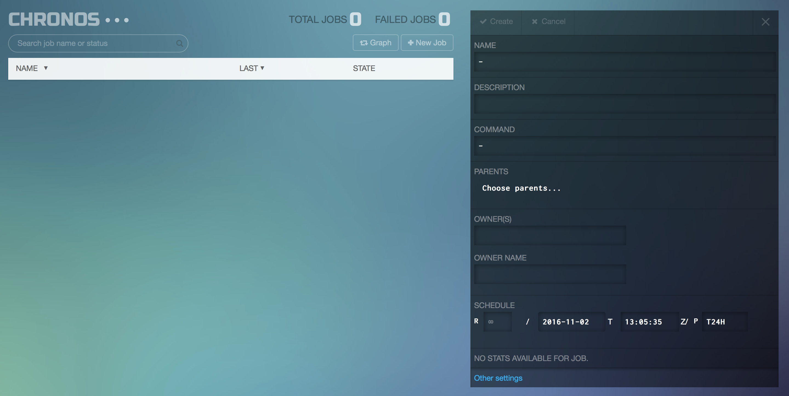

# How to use Chronos on DC/OS

Note: DC/OS now includes a built-in [job scheduler](https://dcos.io/docs/1.8/usage/jobs/), which is the preferable way to schedule batch jobs.

[Chronos](http://mesos.github.io/chronos/) is still available on DC/OS, representing the original way to run batch jobs. It is a highly-available, distributed job scheduler, providing the a robust way to run batch jobs. Chronos schedules jobs across the DC/OS cluster and manages dependencies between jobs in an intelligent way.


- Estimated time for completion: 15 minutes
- Target audience:
 - Data engineers
 - Data scientists
 - DevOps engineers
- Scope: Setup and usage of a batch scheduler for DC/OS.

**Table of Contents**:

- [Prerequisites](#prerequisites)
- [Install Chronos](#install-chronos)
- [Create a scheduled job](#create-a-scheduled-job)
- [Uninstall Chronos](#uninstall-chronos)

## Prerequisites

- A running DC/OS 1.8 cluster with 1 nodes with at least 2GB of RAM and 1 CPU available in the cluster.
- [DC/OS CLI](https://dcos.io/docs/1.8/usage/cli/install/) installed.

## Install Chronos

From the command line, enter this command:

```bash
$ dcos package install chronos
We recommend a minimum of one node with at least 1 CPU and 2GB of RAM available for the Chronos Service.
Continue installing? [yes/no] yes
Installing Marathon app for package [chronos] version [2.4.0]
Chronos DCOS Service has been successfully installed!

	Documentation: http://mesos.github.io/chronos
	Issues: https://github.com/mesos/chronos/issues
```

Note that you can specify a JSON configuration file along with the Chronos installation command to customize the setup, like so: `dcos package install chronos --options=<config_file>`. For more information, see the DC/OS CLI [command reference](https://dcos.io/docs/1.8/usage/cli/command-reference/).

Next, validate that Chronos is successfully installed. Go to the `Services` tab of the DC/OS UI and check if Chronos shows up in the list as `Healthy`:


In addition, run this command to view installed services:

```bash
$ dcos package list
NAME        VERSION  APP       COMMAND     DESCRIPTION
chronos     2.4.0    /chronos  ---         A fault tolerant job scheduler for Mesos which handles dependencies and ISO8601 based schedules.
```

## Create a scheduled job

Open the Chronos UI from the DC/OS UI via the `Open Service` button and click the `New Job` link to bring up the form for creating jobs.



Next, fill in the following values in the form:

- `NAME`: "Date"
- `DESCRIPTION`: "Prints the current date"
- `COMMAND`: `/bin/date`
- `OWNER(S)`: Enter your email address.
- `SCHEDULE`: Enter `T10S` in the `P` field

Note that Chronos uses [ISO 8601 Interval Notation](https://en.wikipedia.org/wiki/ISO_8601#Time_intervals) to describe job schedules, so `T10S` means run this job every 10 seconds.

Now click the `Create` button at the top of the form to submit the job.

Let's verify that our job ran successfully. Run the following CLI command to view all completed tasks:

```bash
$ dcos task --completed ct*
NAME              HOST        USER  STATE  ID
ChronosTask:Date  10.0.3.226  root    F    ct:1478092145000:0:Date:
ChronosTask:Date  10.0.3.229  root    F    ct:1478092135000:0:Date:
ChronosTask:Date  10.0.3.230  root    F    ct:1478091935000:0:Date:
```
Note that the `--completed` argument includes tasks that have completed their execution. Chronos uses the prefix `ct` for all its tasks, so `ct*` filters out Chronos tasks.

To view the output of a task, copy one of the values under the `ID` column in the output of the previous command and use it as the argument to `dcos task log`:

```bash
$ dcos task log --completed ct:1478092145000:0:Date:
Executing pre-exec command '{"arguments":["mesos-containerizer","mount","--help=false","--operation=make-rslave","--path=\/"],"shell":false,"value":"\/opt\/mesosphere\/packages\/mesos--55e36b7783f1549d26b7567b11090ff93b89487a\/libexec\/mesos\/mesos-containerizer"}'
Received SUBSCRIBED event
Subscribed executor on 10.0.3.226
Received LAUNCH event
Starting task ct:1478092145000:0:Date:
/opt/mesosphere/packages/mesos--55e36b7783f1549d26b7567b11090ff93b89487a/libexec/mesos/mesos-containerizer launch --command="{"environment":{"variables":[{"name":"mesos_task_id","value":"ct:1478092145000:0:Date:"},{"name":"CHRONOS_JOB_OWNER","value":"michael@dcos.io"},{"name":"CHRONOS_JOB_NAME","value":"Date"},{"name":"HOST","value":"10.0.3.226"},{"name":"CHRONOS_RESOURCE_MEM","value":"128.0"},{"name":"CHRONOS_RESOURCE_CPU","value":"0.1"},{"name":"CHRONOS_RESOURCE_DISK","value":"256.0"}]},"shell":true,"user":"root","value":"\/bin\/date"}" --help="false" --unshare_namespace_mnt="false"
Forked command at 7835
Wed Nov  2 13:09:06 UTC 2016
Command exited with status 0 (pid: 7835)
```

You can also see the status of the job you entered in the Chronos UI:


## Uninstall Chronos

To uninstall Chronos enter the following command:

```bash
$ dcos package uninstall chronos
```

Finally, to get rid of all traces of Chronos in ZooKeeper, follow the steps outlined in the [framework cleaner](https://docs.mesosphere.com/1.8/usage/managing-services/uninstall/#framework-cleaner).
