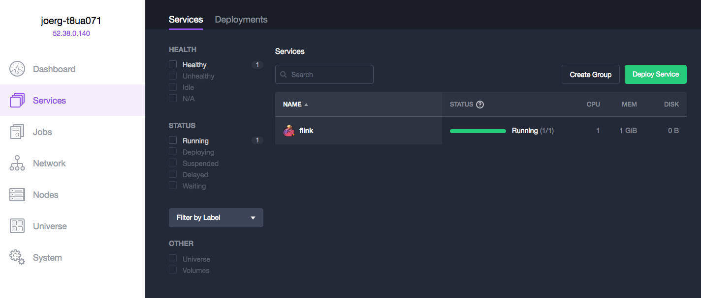
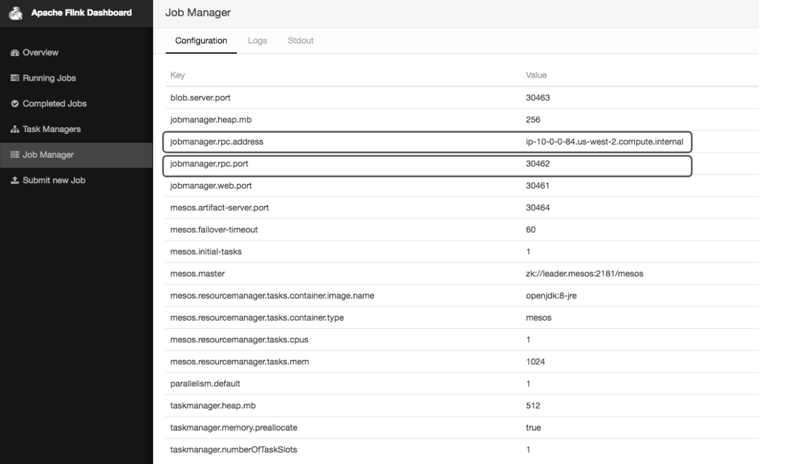

# How to use Apache Flink on DC/OS

[Apache Flink](https://flink.apache.org/) is an open source platform for distributed stream and batch data processing. Apache Flink comes with native Mesos support and can be also installed a DC/OS service

- Estimated time for completion: 5 minutes
- Target audience: Data engineers; basic knowledge of Apache Flink and DC/OS is helpful, but not required.
- Scope: Install and use Flink.

**Table of Contents**:

- [Prerequisites](#prerequisites)
- [Install Apache Flink](#install-flink)
- [Use Apache Flink](#use-flink)
- [Uninstall Apache Flink](#uninstall-flink)

## Prerequisites

- A running DC/OS 1.8 cluster with 1 agents with each 2 CPU and 2 GB of RAM available.
- [DC/OS CLI](https://dcos.io/docs/1.8/usage/cli/install/) installed.

## Install Flink

To install Apache Flink, do:

```bash
dcos package install flink
This DC/OS Service is currently EXPERIMENTAL. There may be bugs, incomplete features, incorrect documentation, or other discrepancies. Flink requires by default 2 CPUs with 2GB of RAM on private nodes.
Continue installing? [yes/no] yes
Installing Marathon app for package [flink] version [1.2.0]
DC/OS Flink is being installed!

  Documentation: https://ci.apache.org/projects/flink/flink-docs-release-1.2/
```

After this, you should see the Flink service running via the `Services` tab of the DC/OS UI:



## Use Flink

NOTE: In order to have better access to the input and output files, it makes sense to store those in HDFS.

### Flink UI
In the following we will use the DC/OS [Admin Router](https://dcos.io/docs/1.8/development/dcos-integration/#-a-name-adminrouter-a-admin-router) to provide access to the Flink UI: use the URL `http://$DCOS_DASHBOARD/service/flink/` and replace `$DCOS_DASHBOARD` with the URL of your DC/OS UI. Alternatively, you can also klick `Open Service` in the DC/OS UI.

Let us start our first job by going to `Submit new Job` in the Flink UI. We first need to add the respective jar file. For this example we will use the WordCount example jar file which can be found in `flink/build-target/examples/batch/WordCount.jar`.

Next, we can define our job as shown below:


After the job has finished we should be able to see some details about the WordCount job:


### Flink CLI from container

We can alternetively use the native Flink CLI from a docker container.
Therefore we need to know the Jobmanager rpc adress and port which can be retrieved from the Flink UI:



```bash
$ dcos node ssh --master-proxy --leader

core@ip-10-0-6-55 ~ $ docker run -it mesosphere/dcos-flink:1.2.0-1.2 /bin/bash

root@2a9c01d3594e:/flink-1.2.0# ./bin/flink run -m <jobmangerhost>:<jobmangerjobmanager.rpc.port> ./examples/batch/WordCount.jar --input file:///etc/resolv.conf --output file:///etc/wordcount_out
```

### DC/OS Flink CLI
Coming soon.


## Uninstall Flink

To uninstall Flink:

```bash
$ dcos package uninstall flink
```


