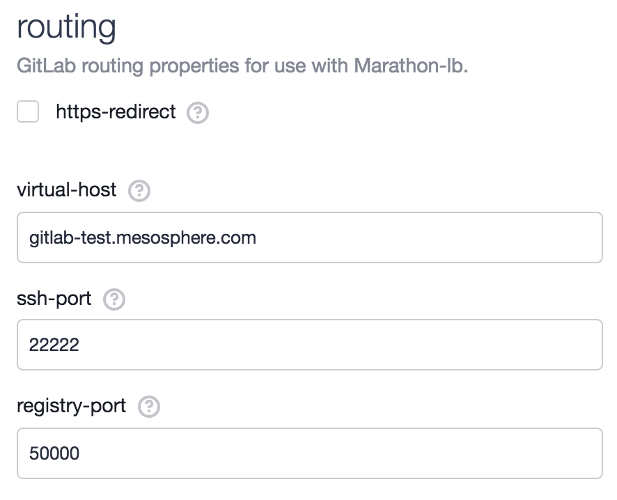
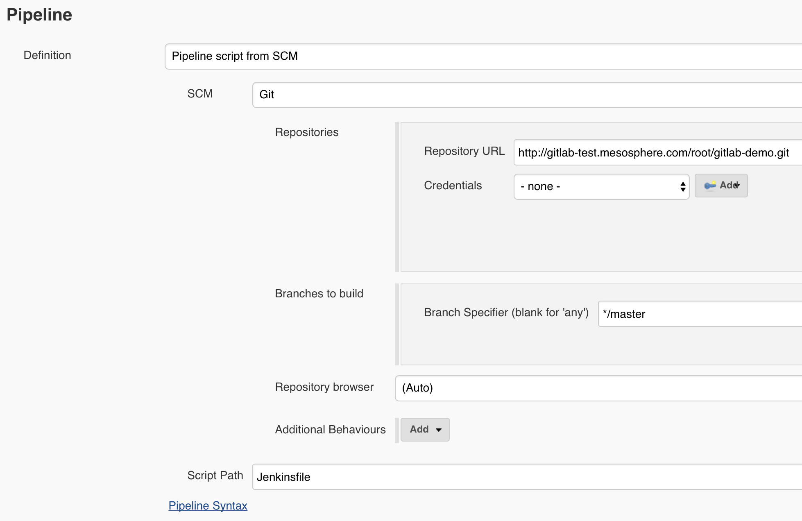
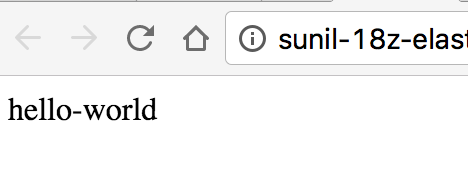

# How to use  Gitlab on DC/OS

[Gitlab](https://gitlab.com) an open source developer tool that allows you to host git repositories, review code, track issues, host Docker images and perform continuous integration.

Using GitLab on DC/OS now allows you to co-locate all of the tools you need for developers on one easy to manage cluster. Just as with any Universe package, you can robustly install several side by side instances of GitLab to provide segregated instances for each of your development teams. Alternatively, you can just as easily install GitLab in a highly available configuration that many teams use concurrently.


This quickstart installation uses the single node version of GitLab that includes an installation of Postgres and Redis in the same container.

The instructions below use a pinned hostname constraint to success the application is always restarted on the same host by Marathon. This allows it to get back to its data but means that you could lose data if that agent goes down. We recommend checking out the production installation instructions on alternative options and considerations.

- Estimated time for completion: up to 10 minutes
- Target audience:
 - Operators
 - Application admins
 - Quality/Release engineers
 - CI/CD admins
- Scope: You'll learn how to install Gitlab and how to use it to build and deploy a Docker image on Marathon.

**Table of Contents**:

- [Prerequisites](#prerequisites)
- [Setting up Gitlab](#setting-up-gitlab)
- [Setting up the Repository](#setting-up-the-repository)
- [Set up the Pipeline](#set-up-the-pipeline)
- [Resources](#resources)

## Prerequisites

- DC/OS 1.8 or later
- [Marathon-lb](https://dcos.io/docs/1.8/usage/service-discovery/marathon-lb/usage/) must be installed and running
- [Jenkins](https://docs.mesosphere.com/1.8/usage/service-guides/jenkins/) must be installed and running
- An available hostname configured to point to the public agent(s) where Marathon-lb is running (e.g. `gitlab-test.mesosphere.com`)
- Either set up appropriate certificates on each of your hosts, or configure each of your hosts to use your hostname (i.e. `gitlab-test.mesosphere.com`) as a [Docker insecure registry](https://docs.docker.com/registry/insecure/).
You will need to do this for the Jenkins agent too using the [Advanced Configuration instructions](https://docs.mesosphere.com/1.8/usage/service-guides/jenkins/advanced-configuration/).
- Ports 22222 and 50000 opened on the public agent where Marathon-lb is running. If you're using an ELB or similar in front of the public agent, make sure it's listening on those ports too.

## Setting up Gitlab

1. Before starting, identify the hostname of a private agent that you'd like to install GitLab to. Typically this will be one that has an EBS volume or similar mounted, that you are regularly snapshotting or have set up some other sort of backup solution on. You can pick one of these by visiting the "Nodes" page on your cluster and choosing a private node. We'll use `10.0.0.134` for this example.


- Visit the Universe page in DC/OS, and click on the "Install Package" button underneath GitLab.
- Click on "Advanced Installation" and navigate to the "routing" tab. Specify the virtual host you prepared earlier, e.g. `gitlab-test.mesosphere.com`:



- Finally, let's enter the hostname we want GitLab to run on. Navigate to the "single-node" tab and put the node hostname you picked earlier into the pinned hostname field:


- We're ready to install! Click the green "Review and Install" button, verify your settings are correct and then click "Install". Navigate to the services UI to see GitLab deploying. The first run will take a few minutes while it initialises the built-in Postgres database.
- Once GitLab has deployed, navigate to the hostname you used earlier for virtual host. You should see the following page inviting you to set up the root password:


- Finally, you will want to ensure your DC/OS agents are authenticated against this registry. You can either run `docker login` on each of these nodes or [see the instructions](https://mesosphere.github.io/marathon/docs/native-docker-private-registry.html) on how you might distribute your Docker credentials.

## Setting up the Repository

1. Let's start by creating a new project in GitLab. Our application is going to use a simple customised Nginx container serving an HTML page. First, create a new project called gitlab-demo. For simplicity, we chose "Public" visibility.


1. Once this is done, clone the project to your local machine:

```
git clone http://gitlab-test.mesosphere.com/root/gitlab-demo.git && cd gitlab-demo
```

2. Then, let's create a very simple index.html page:

```
echo "hello-world" >> index.html
```

3. Now, let's create a simple Dockerfile that describes how to build our Docker image:

```
nano Dockerfile
```

4. Paste in the following contents, which will extend the official Nginx container and add our `index.html` file to it:

```
FROM nginx COPY index.html /usr/share/nginx/html/index.html
```

5. Next, we'll create a simple Marathon application definition. Putting this into version control is good practice and makes it easy to implement and track changes to your application definition as the underlying application:

```
nano marathon.json
```

6. This will tell Marathon how to run our application. Paste the following into it, replacing the address to the Docker registry with your own:
```
{ "id": "/nginx", "cpus": 1, "mem": 128, "instances": 1, "container": { "docker": { "image": "gitlab-test.mesosphere.com:50000/root/gitlab-demo:latest", "portMappings": [ { "containerPort": 80, "protocol": "tcp", "name": "http" } ], "network": "BRIDGE" } }, "labels": { "DCOS_SERVICE_PORT_INDEX": "0", "DCOS_SERVICE_SCHEME": "http", "DCOS_SERVICE_NAME": "gitlab" }, "uris": [ "file:///etc/docker.tar.gz" ] }
```

7. Finally, let's create a simple Jenkinsfile. This is a new way to programmatically define your builds that was released as part of [the Pipeline feature](https://jenkins.io/doc/pipeline/) of Jenkins 2.0. This will pull from the GitLab instance you've just set up, build the Docker image, push it to the GitLab registry, and then trigger a deployment using [the Marathon plugin](https://github.com/jenkinsci/marathon-plugin) for Jenkins:

```
nano Jenkinsfile
```

8. Paste the following Groovy script into it. Note that this won't work on an Enterprise DC/OS cluster without saving a token credential and setting the `credentialsId` within the Marathon deploy step:

```
def gitCommit() { sh "git rev-parse HEAD > GIT_COMMIT" def gitCommit = readFile('GIT_COMMIT').trim() sh "rm -f GIT_COMMIT" return gitCommit }

node { // Checkout source code from Git stage 'Checkout' checkout scm

  // Build Docker image
  stage 'Build'
  sh "docker build -t gitlab-test.mesosphere.com:50000/root/gitlab-demo:${gitCommit()} ."

  // Log in and push image to GitLab
  stage 'Publish'
  withCredentials(
      [[
          $class: 'UsernamePasswordMultiBinding',
          credentialsId: 'gitlab',
          passwordVariable: 'GITLAB_PASSWORD',
          usernameVariable: 'GITLAB_USERNAME'
      ]]
  ) {
      sh "docker login -u ${env.GITLAB_USERNAME} -p ${env.GITLAB_PASSWORD} -e demo@mesosphere.com gitlab-test.mesosphere.com:50000"
      sh "docker push gitlab-test.mesosphere.com:50000/root/gitlab-demo:${gitCommit()}"
  }


  // Deploy
  stage 'Deploy'

  marathon(
      url: 'http://marathon.mesos:8080',
      forceUpdate: false,
      filename: 'marathon.json',
      appid: 'nginx',
      docker: "gitlab-test.mesosphere.com:50000/root/gitlab-demo:${gitCommit()}".toString()
  )

}
```

9. Now that we've got our four files, add, commit and push them to the repository:

```
git add *
git commit -m "Inital commit."
git push
```


## Set up the Pipeline

Now that we've got the repository set up, we need to set up a job in Jenkins that runs on any change to our repository.

1. Navigate to Jenkins. First we'll add the GitLab username and password. For now, we'll re-use the root user, but you can create new users as you see fit. Make sure to call these credentials `gitlab` as referenced in the Jenkinsfile:


- Next, go back to the Jenkins homepage and and click on New Item. We'll create a new "Pipeline" job:


- For this simple example, we'll just select `"Poll SCM" and set the schedule to * * * * *`. This asks us to poll every minute, which might be inefficient for large installations:


- Next, change the Pipeline definition to use "Pipeline script from SCM" and configure the demo repository:



- Within a minute of pressing save, you should see the pipeline trigger (as it has never run before), and build agents spinning up on DC/OS. You can check that it's working by going to the GitLab project and viewing the "Registry" page. You should see a tagged image that corresponds to the SHA of the last commit of your `gitlab-demo` repository:


- Finally, go back to the Services page of the DC/OS UI. You'll see a new "nginx" service. Clicking on the "Open Service" button for this will take you to a "hello-world" page being served by the Nginx we just built!



You can test this pipeline further by pushing commits to the GitLab repository. These commits will trigger new Jenkins build, which will push an updated version of the application to GitLab and then trigger a Marathon deployment!


## Resources

- [About GitLab](https://about.gitlab.com/about/)

- [Deploy GitLab on DC/OS today](https://mesosphere.com/blog/2016/09/16/gitlab-dcos/) on the Mesosphere blog
