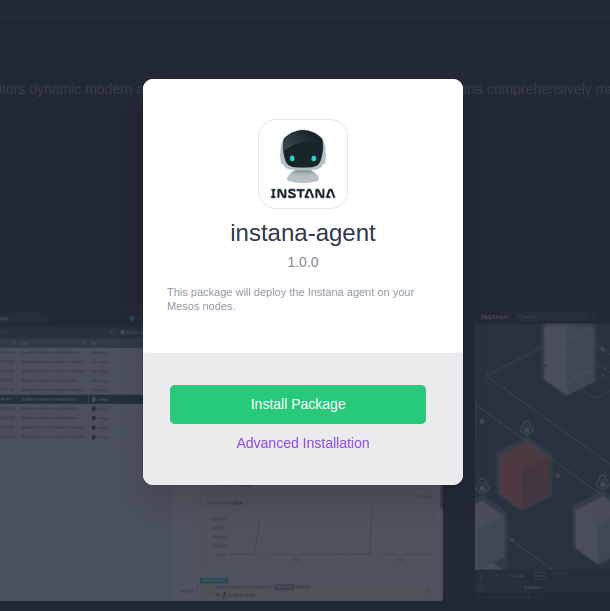

# Instana agent deployment on DC/OS

Instana is the next generation Application Performance Management solution that automatically monitors dynamic modern applications, including scheduled environments. Instana comprehensively manages your application’s quality of service with zero to absolute minimal configuration effort.

The Instana agent package can be installed to DC/OS setups using the official package from the DC/OS universe.

* **Estimated time for completion**: 2 minutes
* **Target audience**: On-Premise- or 
* **Scope**: Learn how to install the Instana agent on a DC/OS Cluster.

## Prerequisites

* A running DC/OS 1.8 cluster
* (On-Premise customers only): A running Instana backend machine
* Your Instana agent key

## Deploying the Instana agent

In order to install the Instana agent, go to the Universe listing in the DC/OS web UI, and **click on "Install"** on the Instana agent list item. Since you need to provide custom informations, **click "Advanced Installation"**. The only required action here is to **fill in your Instana agent key**.

If you're a SaaS customer, that is reporting to the US environment, the rest of the values can be left with the default values. EU - SaaS customers should **switch to the "saas-eu-west-1.Instana.io" endpoint**. If you're an on-premises customer, please **enter your backend machine's host address** and **set the port to 1444**. 

Also, you can assign host tags here.

## Scaling the Instana agent

This is being taken care of by the deployment constraints. If you have, say, three hosts, and set the scaling to three, DC/OS will deploy exactly one isntana agent on each host. If you want different host tags for each and every machine, the isntana agent needs to be deployed separately.

