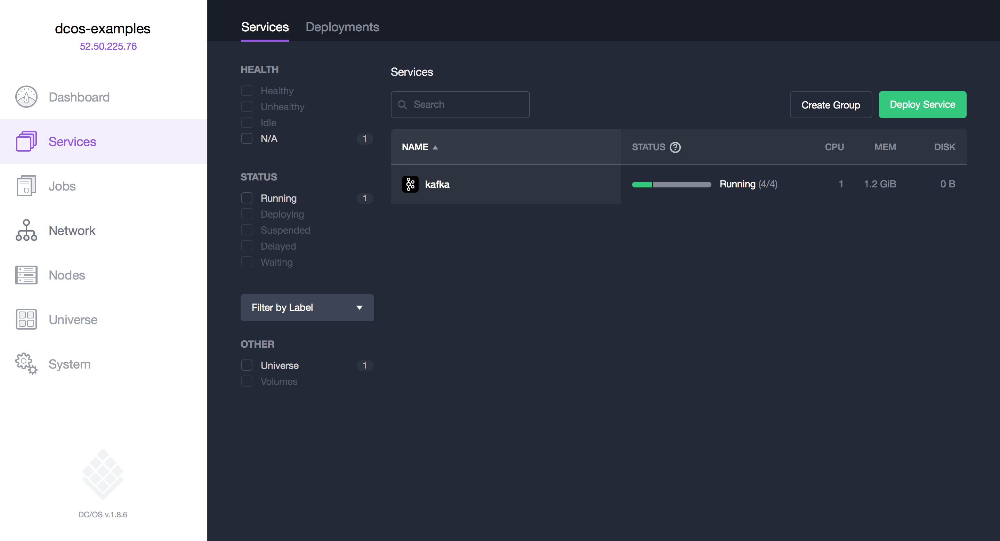

# How to use Apache Kafka on DC/OS

[Apache Kafka](https://kafka.apache.org/) is a distributed high-throughput publish-subscribe messaging system with strong ordering guarantees. Kafka clusters are highly available, fault tolerant, and very durable. The [DC/OS Kafka](https://docs.mesosphere.com/1.8/usage/service-guides/kafka/) service gives you direct access to the Kafka API so that existing producers and consumers can interoperate. You can configure and install DC/OS Kafka in moments. Multiple Kafka clusters can be installed on DC/OS and managed independently, so you can offer Kafka as a managed service to your organization. Kafka is written in Scala and uses [Apache ZooKeeper](https://zookeeper.apache.org/) for coordination.

- Estimated time for completion: 20 minutes
- Target Audience: Anyone interested in a pub-sub messaging system.
- Scope:
 - Install the DC/OS Kafka service.
 - Use the enhanced DC/OS CLI to create Kafka topics.
 - Use Kafka on DC/OS to produce and consume messages.

**Terminology**:

- **Broker:** A Kafka message broker that routes messages to one or more topics.
- **Topic:** A Kafka topic is message filtering mechanism in the pub/sub systems. Subscribers register to receive/consume messages from topics.
- **Producer:** An application that producers messages to a Kafka topic.
- **Consumer:** An application that consumes messages from a Kafka topic.

**Table of Contents**:

- [Prerequisites](#prerequisites)
- [Install Kafka](#install-kafka)
 - [Typical installation](#typical-installation)
 - [Minimal installation](#minimal-installation)
- [Topic Management](#topic-management)
- [Produce and consume messages](#produce-and-consume-messages)
 - [List Kafka client endpoints](#list-kafka-client-endpoints)
 - [Produce a message](#produce-a-message)
 - [Consume a message](#consume-a-message)
- [Uninstall Kafka](#uninstall-kafka)

## Prerequisites

- A running DC/OS 1.8 cluster with 3 private agents each with 2 CPUs and 2 GB of RAM available.
- [DC/OS CLI](https://dcos.io/docs/1.8/usage/cli/install/) installed.

## Install Kafka

Assuming you have a DC/OS cluster up and running, you have two options to install Kafka, described in the following.

### Typical installation

Install a Kafka cluster with 3 brokers using the DC/OS CLI:

```bash
$ dcos package install kafka
Installing Marathon app for package [kafka] version [1.1.16-0.10.0.0]
Installing CLI subcommand for package [kafka] version [1.1.16-0.10.0.0]
New command available: dcos kafka
DC/OS Kafka Service is being installed.

	Documentation: https://docs.mesosphere.com/current/usage/service-guides/kafka/
	Issues: https://dcosjira.atlassian.net/projects/KAFKA/issues
```

Note that while the DC/OS CLI subcommand `kafka` is immediately available, it takes a few moments for Kafka to start running in the cluster.

To validate that the Kafka service is running and healthy you can go to the DC/OS UI:



### Minimal installation

To start a minimal cluster with a single broker, create a JSON options file named `kafka-minimal.json`:

```json
{
    "brokers": {
        "count": 1,
        "mem": 512,
        "disk": 1000
    }
}
```
Install the Kafka cluster:

```bash
$ dcos package install kafka --options=kafka-minimal.json
```

## Topic management

To add a topic, execute the following command, using the DC/OS CLI:

```bash
$ dcos kafka topic create topic1 --partitions 1 --replication 1
{
  "message": "Output: Created topic \"topic1\".\n"
}
```
## Produce and consume messages

### List Kafka client endpoints

To list available Kafka endpoints, do the following:

```bash
$ dcos kafka connection
{
  "address": [
    "10.0.3.228:9655",
    "10.0.3.229:9750",
    "10.0.3.230:10031"
  ],
  "zookeeper": "master.mesos:2181/dcos-service-kafka",
  "dns": [
    "broker-0.kafka.mesos:9655",
    "broker-1.kafka.mesos:9750",
    "broker-2.kafka.mesos:10031"
  ],
  "vip": "broker.kafka.l4lb.thisdcos.directory:9092"
}
```

The above shows an example of what a Kafka client endpoint will look like. Note the address and ports will be different from cluster to cluster, since these services are dynamically provisioned. Record the `"address"` values from your cluster for use in the next step.

### Produce a message

To publish a message to the topic `topic1` we created in the previous step, carry out the following steps.

First, log into the leading Master and use the `mesosphere/kafka-client` to connect to the Kafka cluster:

```bash
$ dcos node ssh --master-proxy --leader

core@ip-10-0-6-55 ~ $ docker run -it mesosphere/kafka-client

root@581d2b97d276:/bin# echo "Hello, World." | ./kafka-console-producer.sh --broker-list KAFKA_ADDRESS:PORT --topic topic1
```

Replace the above `KAFKA_ADDRESS:PORT` with the Kafka client endpoint address from your cluster, in our case `kafka-console-producer.sh --broker-list 10.0.3.228:9655 --topic topic1`.

### Consume a message

To subscribe to the topic `topic1` and consume messages (still within the Kafka client from above) execute the following:

```bash
root@581d2b97d276:/bin# ./kafka-console-consumer.sh --zookeeper leader.mesos:2181/dcos-service-kafka --topic topic1 --from-beginning
Hello, World.
^CProcessed a total of 1 messages
```

Note that in order to stop consuming messages, hit `CTRL-C`. 

## Uninstall Kafka

To uninstall Kafka:

```bash
$ dcos package uninstall --app-id=kafka kafka
```

Use the [framework cleaner](https://docs.mesosphere.com/1.8/usage/managing-services/uninstall/#framework-cleaner) to remove your Kafka instance from ZooKeeper and to destroy all data associated with it. The script requires several arguments, the values for which are derived from your service name:

- `framework-role` is `kafka-role`
- `framework-principal` is `kafka-principal`
- `zk_path` is `dcos-service-kafka`

## Further resources

1. [DC/OS Kafka Official Documentation](http://docs.mesosphere.com/1.8/usage/service-guides/kafka)
1. [Kafka API Reference](https://kafka.apache.org/documentation.html)
