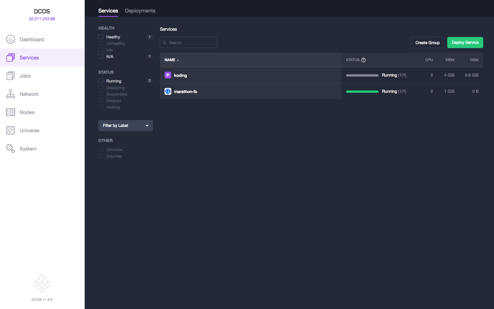

# How to use Koding on DC/OS

[Koding](https://wwww.koding.com/) is cloud development platform. Through the use of Stacks, you can define server environments which include all of the necessary software for you to develop your code. You can then deploy these stacks to your local Mesosphere DC/OS instance or to any of our supported cloud providers.

- Estimated time for completion: 10 minutes
- Target audience: Development teams
- Scope: Learn how to use Koding on DC/OS.


**Table of Contents**:

- [Prerequisites](#prerequisites)
- [Install Marathon-LB](#install-marathon-lb)
- [Install Koding](#install-koding)
- [Access Koding](#access-koding)
- [Use Koding in production](#use-koding-in-production)

## Prerequisites

- A running DC/OS 1.8 cluster with at least 1 [private agent](https://dcos.io/docs/1.8/overview/concepts/#public) node with 2 CPUs and 2 GB of RAM available.
- [DC/OS CLI](https://dcos.io/docs/1.8/usage/cli/install/) installed.

## Install Marathon-LB

To make Koding accessible from the public Internet, we will use [Marathon-LB](https://github.com/mesosphere/marathon-lb), a HA-proxy-based load balancer for DC/OS. To install Marathon-LB from the DC/OS CLI, do:

```bash
$ dcos package install marathon-lb
We recommend at least 2 CPUs and 1GiB of RAM for each Marathon-LB instance.
Continue installing? [yes/no] yes
Installing Marathon app for package [marathon-lb] version [1.4.2]
Marathon-lb DC/OS Service has been successfully installed!
See https://github.com/mesosphere/marathon-lb for documentation.
```
Note that for advanced Marathon-LB configurations such as enabling HTTPS see the [Marathon-LB Quick Start](https://dcos.io/docs/1.8/usage/service-discovery/marathon-lb/quickstart/) guide.


## Install Koding

To install Koding, login to DC/OS and go to the universe tab. Select Koding and and then click on advanced installation. You will be presented with a list of options.

Your first option will be what to name the Koding service. We suggest using the default of "koding".

You will then be able to allocate CPUs and memory to Koding.

Next, you will need to pick which node to run Koding on. This is to preserve data across restarts of the Koding service. Select a node with enough available resources (as you just defined) from your available private agent nodes.

After you select a node, you will be asked for a hostname. This hostname is used within the Koding application to define where Koding lives. Individual teams will live at subdomains of this hostname. It mostly exists to be displayed inside the application, but should be where you intend Koding to be accessed from. You may want to make a CNAME record of this host and a wildcard record for any subdomains to point to the FQDN you set up in the next step.

Lastly, to make Koding accessible to the world, we need to use the fully qualified domain name of the public agent node running marathon-lb or the load balancer pointing to your public agent nodes (for instance "DCOS-PublicSlaveLo-1CHPNZSAH97SJ-604928754.eu-west-1.elb.amazonaws.com").

After all options are configured, press Review and Install and the Install to set up Koding.  Please note that it may take up to 10 minutes for the Koding service to become available.

Last but not least, to check if all required services (Marathon-LB and Koding itself) are running, use the DC/OS UI where in the `Services` tab you should see both Marathon-LB and Koding listed with their statuses as "Running".



## Access Koding

Once you've installed the necessary services as outlined above, navigate to the domain name that you set as your virtual host in your browser. You should now see the Koding login page.

