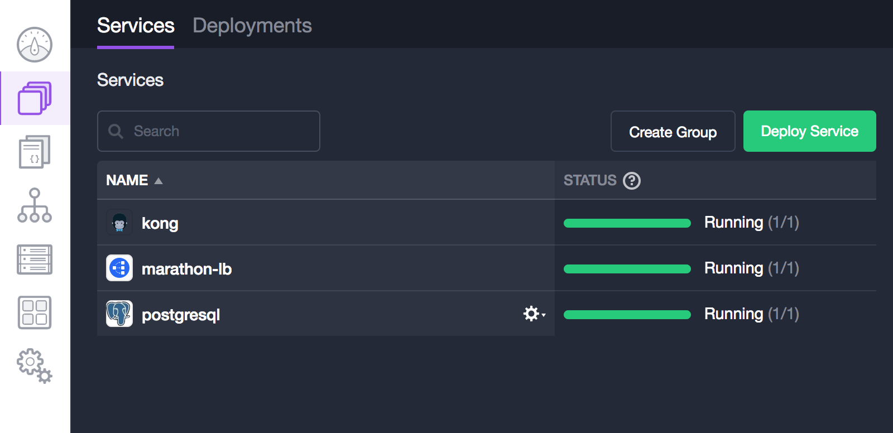
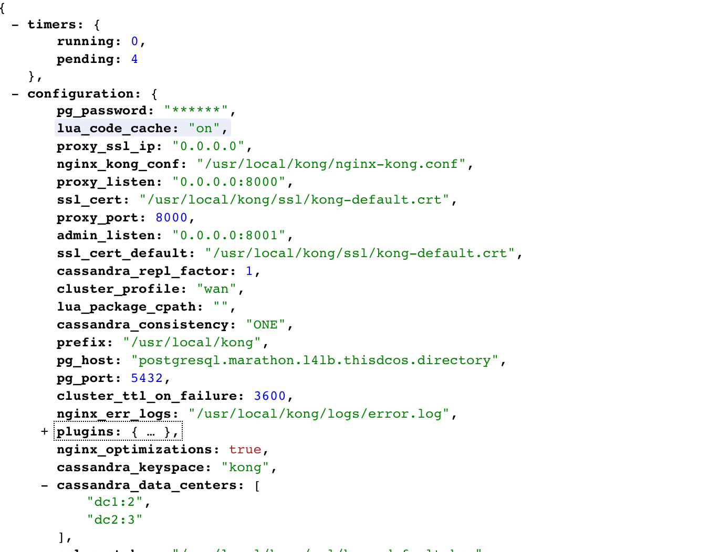

# How to use Kong on DC/OS

[Kong](https://getkong.org) is a scalable, open source API Layer (also known as an API Gateway, or API Middleware). Kong runs in front of any RESTful API and is extended through Plugins, which provide extra functionality and services beyond the core platform. DC/OS allows you to quickly configure and manage Kong.

- Estimated time for completion: 5 minutes
- Target audience: Anyone interested in running an API gateway server
- Scope: Learn how to install Kong on DC/OS

## Prerequisites

- A running DC/OS 1.8 cluster with at least 1 node having at least 1.3 CPUs and 1 GB of RAM available.
- Marathon-LB installed
- Postgresql installed

## Install Postgresql

First install a postgresql database in your DC/OS cluster using the existing Universe package. Configure the package by creating a file called `options.json` with following contents:

```json
{
  "service": {
    "name": "postgresql"
  },
  "postgresql": {
    "cpus": 0.3,
    "mem": 512
  },
  "database": {
    "username": "kong",
    "password": "kong",
    "dbname": "kong"
  },
  "storage": {
    "host_volume": "/tmp",
    "pgdata": "pgdata",
    "persistence": {
      "enable": true,
      "volume_size": 512,
      "external": {
        "enable": false,
        "volume_name": "postgresql",
        "provider": "dvdi",
        "driver": "rexray"
      }
    }
  },
  "networking": {
    "port": 5432,
    "host_mode": false,
    "external_access": {
      "enable": false,
      "external_access_port": 15432
    }
  }
}
```

The above `options.json` file configures Postgresql as follows:

- `username`: This parameter configures the username for the kong database.
- `password`: This parameter configures the password for the kong database.
- `dbname`: This parameter configures the name of the kong database.
- `persistence`: This parameter enables persistent volumes for postgresql.

Install postgresql using this `options.json` file:

```bash
$ dcos package install postgresql --options=options.json
```

To verify that our postgresql instance is up and running, we can use `dcos task` command:

```bash
$ dcos task
NAME         HOST        USER  STATE  ID
marathon-lb  10.0.6.130  root    R    marathon-lb.104e0ebe-03be-11e7-b790-627a33830456
postgresql   10.0.0.71   root    R    postgresql.0f2867a0-03cb-11e7-b790-627a33830456
```
## Install Kong
Next, install Kong. If you have installed postgresql with a different username, password, dbname, or id, customize the kong installation accordingly.  
```bash
$ dcos package install kong
This DC/OS Service is currently EXPERIMENTAL. There may be bugs, incomplete features, incorrect documentation, or other discrepancies. Prerequisites for this service include postgres and marathon-lb. See https://github.com/dcos/examples/tree/master/1.8/kong for more details.
Continue installing? [yes/no] yes
Installing Marathon app for package [kong] version [0.9.9]
Kong has been installed.
```
To verify that our kong instance is up and running, we can use `dcos task` command:

```bash
$ dcos task
NAME         HOST        USER  STATE  ID
kong         10.0.0.71   root    R    kong.c2cd2cc9-03cb-11e7-b790-627a33830456
marathon-lb  10.0.6.130  root    R    marathon-lb.104e0ebe-03be-11e7-b790-627a33830456
postgresql   10.0.0.71   root    R    postgresql.0f2867a0-03cb-11e7-b790-627a33830456
```

Now that Kong is installed, curl the marathon-lb endpoint to validate that it is up and running.  `curl http://<public-agent-ip>:10002`. You should see output similar to this:




## Uninstall Kong

To uninstall Kong, run following command:

```bash
dcos package uninstall kong
```
