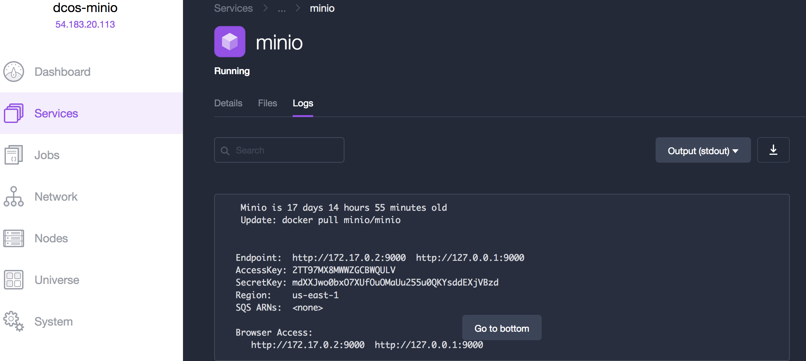
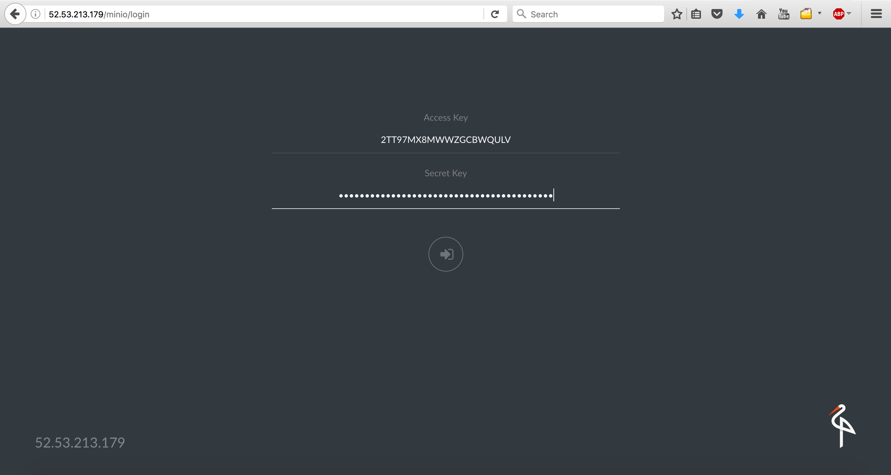

# Install and use Minio on DC/OS

[Minio](https://minio.io) is an object storage server released under Apache License v2.0. It is compatible with Amazon S3 cloud storage service. It is best suited for storing unstructured data such as photos, videos, log files, backups and container / VM images. Size of an object can range from a few KBs to a maximum of 5TB.

Minio server is light enough to be bundled with the application stack, similar to NodeJS, Redis and MySQL. 

This quickstart installation uses the single node version of Minio (Minio FS), checkout the [docs](https://docs.minio.io) for more details.

The instructions below use a pinned hostname constraint to ensure the application is always restarted on the same host by Marathon. This allows it to get back to its data but means that you could lose data if that agent goes down. 

- Estimated time for completion: up to 5 minutes. 
- Target audience:
 - Operators
 - Application admins
 - Developers 
 - Devops Engineers
- Scope: Learn to install Minio on DC/OS and learn to use it using minio command line tool `mc`.

**Table of Contents**:

- [Prerequisites](#prerequisites)
- [Setting up Minio](#setting-up-minio)
- [Using Browser Interface](#using-browser-interface)
- [Install mc](#install-mc)
- [Configure mc](#configure-mc)
- [Resources](#resources)

## Prerequisites

- DC/OS 1.8 or later
- [Marathon-LB](https://dcos.io/docs/1.8/usage/service-discovery/marathon-lb/usage/) must be installed and running
- IP address of the public agent(s) where Marathon-LB or an available hostname configured to point to the public agent(s) where Marathon-LB is running.

## Setting up Minio 

1. Before starting, identify the IP address or hostname of a public agent where Marathon-LB is running. 


- Visit the Universe page in DC/OS, and click on the "Install Package" button underneath Minio.


- Click on "Advanced Installation" and navigate to the "networking" tab. Specify the IP address or hostname of the public agent where Marathon-LB is running. Make sure you remove the leading http:// and the trailing / from the IP. 


- We're ready to install! Click the green "Review and Install" button, verify your settings are correct and then click "Install". Navigate to the services UI to see Minio deploying.
 
- Once Minio has been deployed, navigate to the IP/hostname you used earlier for virtual host. You should see the following login page for Minio's browser interface. 


## Using Browser Interface
- The access key and secret key for the browser interface can be obtained from logs of the minio service.



- Navigate to services UI and click on minio and go to the logs section. Copy the AcessKey and SecretKey and use it to log into the browser interface.





## Install mc 

- Minio Client (mc) is a CLI tool which provides a modern alternative to UNIX commands like ls, cat, cp, mirror, diff etc, to operate on filesystems and Amazon S3 compatible cloud storage service.

- [Click here](https://docs.minio.io/docs/minio-client-quickstart-guide) for instructions on installing mc.

## Configure mc
```sh
mc config host add <ALIAS> <YOUR-S3-ENDPOINT> <YOUR-ACCESS-KEY> <YOUR-SECRET-KEY> <API-SIGNATURE>

```

Example, 

```sh
mc config host add minio-dcos http://52.53.213.179 2TT97MX8MWWZGCBWQULV mdXXJwo0bxO7XUfOuOMaUu255u0QKYsddEXjVBzd

mc mb minio-dcos/my-bucket

mc cp my-file minio-dcos/my-bucket/

mc ls minio-dcos/my-bucket
```

## Resources

- [Minio website](https://minio.io)

- [Minio Github](https://github.com/minio/minio)

- [Minio Documentation](https://docs.minio.io)

