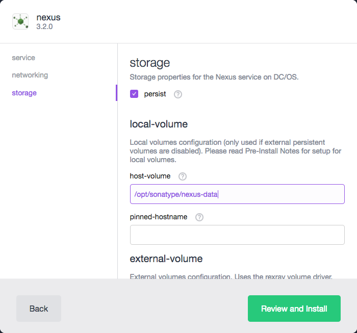

# How to use Nexus Repository Manager 3 on DC/OS

[Nexus Repository Manager 3](https://www.sonatype.com/nexus-repository-oss) is a repository manager that supports a broad variety of package managers, namely Bower, Docker, Maven 2, npm, NuGet, PyPI, and Raw site repositories. DC/OS allows you to quickly configure, install and manage a Nexus 3 instance.

- Estimated time for completion: 10 minutes
- Target audience: Anyone interested in running a repository manager.
- Scope: Learn how to install Nexus 3 on DC/OS

**Table of Contents**:
- [Prerequisites](#prerequisites)
- [Install Nexus 3](#install-nexus-3)
  - [Ephemeral Configuration and Storage](#ephemeral-configuration-and-storage)
  - [Persistent Local Storage](#persistent-local-storage)
  - [Persistent External Storage](#persistent-external-storage)
- [Using Nexus as a Docker Proxy]

## Prerequisites

- A running DC/OS 1.8 cluster with at least 1 node having at least 1 CPUs and 2 GB of RAM available.
- *Optional* [DC/OS CLI](https://dcos.io/docs/1.8/usage/cli/install/) installed.

## Install Nexus 3

### Ephemeral Configuration and Storage

Getting Nexus installed without persistent configuration and storage is a single click operation. This allows one to gain familiarity with the product without any setup or overhead. This setup is not suggested as all data and configuration are tied to the running agent and will be destroyed when that instance is terminated. The next sections will discuss how to setup persistent local or external storage.

To install via the DC/OS Universe, navigate the the Universe section and find nexus. Click Install to bring up the install modal and then click Install Pacakge.


To install via the CLI, run the following command.

```
dcos package install nexus
```

Once installed Nexus Repository Manager will scale to a single instance on a DC/OS agent. Once available it will show up under services with a Running task for the Nexus instance. The service should be available at the address indicated in the Endpoints under the task's configuration.

### Persistent Local Storage

Local storage provides a way to persist the Nexus configuration and data. Given limitations to the automated deployment of the Nexus container, the ownership of the local folder must be manually set on the node running Nexus. The folder must be owned by UID 200, the user which runs the Nexus server within the Docker image. Setting ownership can be done by remotely logging into the node by ssh.

```
ssh user@hostname
mkdir -p /opt/sonatype/nexus-data
chown -R 200:200 /opt/sonatype/nexus-data
```

After adjusting the folder ownership, persistent local storage can be configured in the Advanced Installation options under Storage. Enable persist in the storage section and adjust the host-volume to the folder created above.



Since the local storage is tied to the node Nexus is running on, it makes sense to set a pinned hostname to ensure that Nexus always runs on this node. Pinned hostname is available in the Advanced Installation network section and should be set to the node that was configured above.

If the pinned hostname is not set, Nexus can run on an node where the storage was not configured and fail. If all agents have the same folder configured for Nexus, this folder should be a shared mounted file system to ensure that there is a definitive source for all Nexus data.

### Persistent External Storage

Another way to ensure configuration and data persistence is to use external storage. Nexus is compatible with the rexray volumne driver for Docker volumes. In order to use external volumes, enable persist in the storage section, enable external volumes and set the volume name in the external volumes section.

## Using Nexus as a Docker Registry

*The Docker Daemon requires a trusted signed certificate for HTTPS communication. Information on setting this up in available in the [Using Self-Signed Certificates with Nexus Repository Manager and Docker Daemon](https://support.sonatype.com/hc/en-us/articles/217542177-Using-Self-Signed-Certificates-with-Nexus-Repository-Manager-and-Docker-Daemon) article.*

Nexus Repository Manager 3 can be used as a Docker registry or to proxy other Docker registries. This section will briefly go through how to deploy a Docker image to DC/OS while using Nexus as a Docker proxy. It will assume a working knowledge of the Nexus product although more details about Nexus can be found in the [Nexus documentation](http://books.sonatype.com/nexus-book/index.html).

### Expose Port for Docker Registry Connector

As a first step, Edit the service to expose a new port of the Connector. Choose an available port on the DC/OS agent.


When Nexus comes back up there should be two ports assigned. One which hosts Nexus Repository Manager and one which is available for the Docker Connector.


### Configure Docker Registry

Configure a Docker Registry in Nexus using the Repository Connector port configured in the first step of this section. This is the port which will be mapped to the port discovered in the second section.


The Docker Registry should now be available on the port discovered in the second section. A new service can be deployed in the DC/OS web UI using the new Docker Registry.

