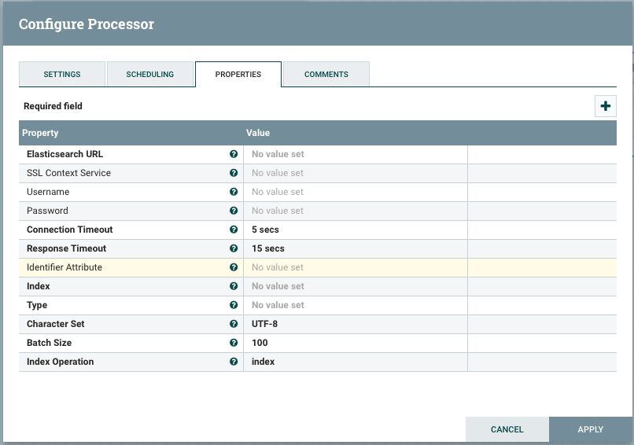

# How to use Apache Nifi on DC/OS

[Nifi](http://nifi.apache.org) is an easy to use, powerful, and reliable system to process and distribute data.
Running Apache Nifi on DC/OS allows you to manage your data flow very easily. Saving data on HDFS or consuming data from Kafka will be easily scalable.

- Estimated time for completion: 5 minutes
- Target audience: Data engineers
- Scope: Install and use Apache Nifi.

**Table of Contents**:

- [Prerequisites](#prerequisites)
- [Install Nifi](#install-nifi)
- [Use Nifi](#use-nifi)
- [Example of Usage](#example-of-usage)
- [Uninstall Nifi](#uninstall-nifi)

## Prerequisites

- A running DC/OS 1.8 cluster with at least 1 private node.
- [DC/OS CLI](https://dcos.io/docs/1.8/usage/cli/install/) installed.


## Install Nifi


```bash
$ dcos package install nifi
Nifi on DC/OS is in alpha and there may be bugs, incomplete features, incorrect documentation or other discrepancies.
Continue installing? [yes/no] yes
Installing Marathon app for package [nifi] version [1.1.1]
Nifi has been successfully installed.
Documentation can be found at https://nifi.apache.org/docs.html
Please keep in mind that first start of nifi can take a more than 60 seconds, so please be patient.
```

After this, you should see the Nifi service running via the `Services` tab of the DC/OS UI:


## Use Nifi

You typically want to access Nifi via a web browser outside of the DC/OS cluster. To access the Apache Nifi UI from outside of the DC/OS cluster you can use [Marathon-LB](https://dcos.io/docs/1.8/usage/service-discovery/marathon-lb/), which is recommended for production usage.

You can also use [Admin Router](https://dcos.io/docs/1.8/development/dcos-integration/#-a-name-adminrouter-a-admin-router) to provide access to the Apache NIfi UI, which is fine for dev/test setups.

In the following we will use the Endpoint URL (agent where Nifi was deployed). Below you can find instruction how to find it: 

 - Go to the **Services** tab
 - Select "nifi" in the list of running services
 - Once the Nifi service is `Healthy`,
 - Select the "nifi" task.
 - Click the Endpoint URL to open the Nifi status page in a new tab.


## Example of Usage

Let's try to create a first flow in our new instance of Nifi.
We first drag a **Processor** onto the graph. When we do this, we are given the option of choosing many different types of Processors.


Ok, so as you can see this list is pretty huge! We can try to read some data from Kafka topic. To do that we need to choose processor called **ConsumeKafka** or **ConsumeKafka__0__10** (depends on your kafka version).


In the properties tab we need to fill at least those bolded fields. The most interesting for us are:

- **Kafka Brokers** - list of the kafka brokers. If you are using kafka from DC/OS please take a look at the [Kafka Documentation](https://github.com/dcos/examples/tree/master/1.8/kafka/#list-kafka-client-endpoints) to check how to determine it.
- **Topic Names** - list of the topics to consume, separated by comma.
- **Group Id** - that value is used to identify consumers that are within the same consumer group.

First processor is ready. Now, when we have the data we can try to send it to another destination like Elasticsearch. 
Please choose a new processor called **PutElasticsearchHttp**.




After completing all required fields, your flow should look like this:


Now we have to connect them and run:


## Uninstall Nifi

To uninstall Nifi:

```bash
$ dcos package uninstall nifi
```

## Further resources

1. [Nifi docs](https://nifi.apache.org)