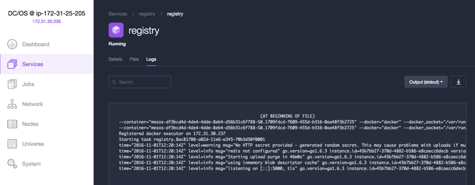
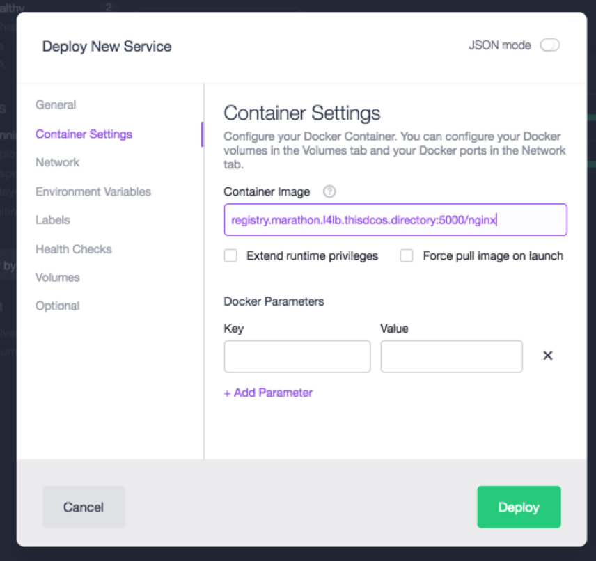

# How to use Docker Registry on DC/OS

The Docker [registry](https://docs.docker.com/registry/) is a stateless, highly scalable server side application that stores and lets you distribute Docker images. This DC/OS package provides a private registry that can be made available to any other component in the system through a [virtual IP](https://dcos.io/docs/1.8/usage/service-discovery/load-balancing-vips/virtual-ip-addresses/) with the default of `registry.marathon.l4lb.thisdcos.directory:5000`.

Note that this package will install with the default parameters, but Docker registry requires a valid TLS certificate and key to work properly and secure connections between the engines and registry hosting the cache. Follow this document to learn how to configure a download location for the certificate and key in the Advanced Installation “security” section.

- Estimated time for completion: up to 30 minutes
- Target audience:
 - Operators
 - Application admins
- Scope: You'll learn how to install the Docker registry and how to use it to push and pull docker images, and to act as a proxy for another registry.

**Table of Contents**:

- [Prerequisites](#prerequisites)
- [Install](#install)
- [Use](#use)
- [Storage options](#storage-options)
- [Uninstall](#uninstall)

## Prerequisites

- A running DC/OS 1.8 cluster with at least a bootstrap node, a master and an agent.
- SSH access to the nodes

### Creating a valid TLS certificate

The Docker registry requires a TLS certificate and a TLS key to operate. This certificate will also need to be installed in the nodes that need to access the Docker registry. This package uses two downloadable URIs to store the certificate and key. 
The certificate and key will be shared with the application from a host with a web server installer. For the purposes of this example, we will generate the certificate in a local Linux or OSX host, and use the DC/OS Bootstrap node to host the certificate and key files, leveraging the fact that it already runs an NGINX web server by default. Any other web server accessible from the private nodes of the cluster could also be used.

Note that above means that the location of your secrets will be OPEN in the bootstrap node to download, at least during package installation, so this process is not considered adequate for production setups. Consider making these files available only during the process of booting up the registry, and then moving them outside of the “downloadable” path for security.

A production install should count with proper valid certificates, or use a third party certificate authority such as [Let’s Encrypt](https://letsencrypt.org/). During this tutorial, we will use self-signed certs as outlined in the Docker [docs](https://github.com/docker/distribution/blob/master/docs/insecure.md#using-self-signed-certificates).

#### Create a self-signed certificate

To create a self-signed certificate in the *bootstrap* node with the correct common name and subject alternative names do as follows.

Open a terminal in the *bootstrap* node, and generate a certificate in the `/genconf/serve` directory of your DC/OS installation. Note that this assumes that your installation directory for DC/OS in the bootstrap node is `~`.  If your installation path differs, please generate these files in the adequate `/genconf/serve` location):

```bash
$ cd ~/genconf/serve   #use the /genconf/serve location of your install
$ openssl req -newkey rsa:4096 -nodes -sha256 -keyout domain.key -x509 -days 365 -out domain.crt

Generating a 4096 bit RSA private key
...............................................................................................................................................................................................++
.................................................................++
writing new private key to 'domain.key'
-----
You are about to be asked to enter information that will be incorporated
into your certificate request.
What you are about to enter is what is called a Distinguished Name or a DN.
There are quite a few fields but you can leave some blank
For some fields there will be a default value,
If you enter '.', the field will be left blank.
-----
Country Name (2 letter code) [XX]:US
State or Province Name (full name) []:NY
Locality Name (eg, city) [Default City]:NYC
Organization Name (eg, company) [Default Company Ltd]:Mesosphere
Organizational Unit Name (eg, section) []:SE
Common Name (eg, your name or your servers hostname) []:'registry.marathon.l4lb.thisdcos.directory'
Email Address []:myemailaddress@mesosphere.com
```
After executing this command, your certificate and key should be available in the current directory:

```bash
# ls -la domain.*
-rw-r--r--. 1 root root 2130 Oct 21 07:24 domain.crt
-rw-r--r--. 1 root root 3272 Oct 21 07:24 domain.key
# cat domain.crt
-----BEGIN CERTIFICATE-----
MIIF9zCCA9+gAwIBAgIJAJEcQ0sL/gcJMA0GCSqGSIb3DQEBCwUAMIGRMQswCQYD
VQQGEwJVUzELMAkGA1UECAwCTlkxDDAKBgNVBAcMA05ZQzETMBEGA1UECgwKbWVz
(...)
bFot/v8ZSth2VHyo2+jxeXUGtbfa1hrvd0YbTLjdsnnZcQoDcVv7VTerJkMNoCrn
0ymy4CLVZ8lRrW6VTHDAe+MAapN8QUYPxJcy1p0ohhlgOYITR8mraWLe2eC/sWym
Ecp0VKA7+x7f2jBwzSIK8k5HJI/GCzJwre5RGTcYaIMxseQtVk+Mi6BJTg==
-----END CERTIFICATE-----
```

These `registry-certificate` and `registry-key` files will be used by the application to facilitate authentication to agents that request to download images from the registry. 

#### Copy certificate to all agents

The next step to facilitate that authentication is to add the certificate to all of the agents in the cluster, so that whenever any of them wants to download an image from the registry, they can use this certificate to validate the connection. This is achieved by distributing the `domain.crt` file to each of the agents running Docker, and saving it  in all agent nodes in the cluster as:

```
/etc/docker/certs.d/registry.marathon.l4lb.thisdcos.directory:5000/ca.crt
```

We will upload the certificate file to one of the *MASTER* nodes, and then execute a loop to opens an SSH connection to each of the agents, and add the certificate to the agent’s trusted certificate list in the path above. Note that for this to work, the Master node must have a valid SSH key/ID stored allowing it to connect to other agents. If you have a working key in a `.pem` file in your computer that is valid for your agent nodes, you can copy it to the MASTER node with:

```bash
$ scp -i my_key.pem my_key.pem  centos@master:~ 
#where "centos" is a valid user to log into the master node, and
#"master" is the IP address or name of your MASTER node
```

Also, the nodes in your DC/OS cluster should be configured to allow sudo from non-tty. In order to enable that, some CentOS and RedHat nodes require to edit the `/etc/sudoers` file and remove or comment-out the line:

```bash
Defaults requiretty
```

Otherwise, you’ll run into this error when running the SSH command loops below:

`sudo: sorry, you must have a tty to run sudo`

Alternatively, you can also use other methods to copy this file to the right location in every agent of the cluster, such as a configuration management tool or script. The files could also come from a file share mounted to all of the nodes, like Azure Files.

So, SSH to one of your Master nodes and execute the steps described in the following.

Add the key that was copied to the Master in the step above to the SSH keychain:

```bash
$ eval `ssh-agent -s` && ssh-add ~/my_key.pem
Agent pid 10638
Identity added: /home/centos/my_key.pem (/home/centos/my_key.pem)
```

Make sure that `jq` is installed:

```bash
$ sudo yum install -y epel-release && sudo yum install -y jq
```

Copy the `domain.crt` file from your terminal to the master node:

```bash
$ export BOOTSTRAP_IP=[your bootstrap node IP address]
$ export BOOTSTRAP_PORT=[your bootstrap node’s TCP port]
$ curl -O $BOOTSTRAP_IP:$BOOTSTRAP_PORT/domain.crt
```

Find out and store the list of your agent nodes IP addresses:

```bash
$ MESOS_AGENTS=$(curl -sS master.mesos:5050/slaves | jq '.slaves[] | .hostname' | tr -d '"');
```

Configure your agents to accept liberal TCP connections:

```bash
$ for i in $MESOS_AGENTS; do ssh "$i" -oStrictHostKeyChecking=no "sudo sysctl -w net.netfilter.nf_conntrack_tcp_be_liberal=1"; done
```

Create a temporary `/etc/privateregistry/certs` directory in your agents:

```bash
$ for i in $MESOS_AGENTS; do ssh "$i" -oStrictHostKeyChecking=no "sudo mkdir --parent /etc/privateregistry/certs/"; done
```

Copy the certificate and key to your home directory in the agents:

```bash
$ for i in $MESOS_AGENTS; do scp -o StrictHostKeyChecking=no ./domain.* "$i":~/; done
```

Move the certificate and key files to the temporary directory:

```bash
$ for i in $MESOS_AGENTS; do ssh "$i" -oStrictHostKeyChecking=no "sudo mv ./domain.* /etc/privateregistry/certs/"; done
```

Create the directory for holding the certificates of the registry that we will create in DC/OS:

```bash
$ for i in $MESOS_AGENTS; do ssh "$i" -oStrictHostKeyChecking=no "sudo mkdir --parent /etc/docker/certs.d/registry.marathon.l4lb.thisdcos.directory:5000"; done
```

Copy the certificate and key files to the directory of the DC/OS registry:

```bash
$ for i in $MESOS_AGENTS; do ssh "$i" -oStrictHostKeyChecking=no "sudo cp /etc/privateregistry/certs/domain.crt /etc/docker/certs.d/registry.marathon.l4lb.thisdcos.directory:5000/ca.crt"; done
```

Restart the docker daemon:

```bash
$ for i in $MESOS_AGENTS; do ssh "$i" -oStrictHostKeyChecking=no "sudo systemctl restart docker"; done
```

Optionally, for additional security you can modify permissions as so:

```bash
$ for i in $MESOS_AGENTS; do ssh "$i" -oStrictHostKeyChecking=no 'sudo chown -R root:root /etc/docker/certs.d/registry.marathon.l4lb.thisdcos.directory:5000/'; done
$ for i in $MESOS_AGENTS; do ssh "$i" -oStrictHostKeyChecking=no 'sudo chmod 444 -R /etc/docker/certs.d/registry.marathon.l4lb.thisdcos.directory:5000/'; done
$ for i in $MESOS_AGENTS; do ssh "$i" -oStrictHostKeyChecking=no 'sudo chmod 400 -R /etc/docker/certs.d/registry.marathon.l4lb.thisdcos.directory:5000/ca.crt'; done
$ for i in $MESOS_AGENTS; do ssh "$i" -oStrictHostKeyChecking=no 'sudo systemctl restart docker'; done
```

The package can now be installed from the Universe, using the bootstrap’s node IP address and TCP port to download the certificate and key file.

## Install

Log into DC/OS, go to Universe, and select the Registry package from Universe. Select `Advanced Installation`.  Enter the bootstrap node’s IP address and port in the `Advanced Installation`:


After installation, the package will be running under the `Services` tab:


You can check the package instance’s correct functioning by clicking on the package name and looking at the task’s logs:


Look at the logs and check the correct functioning:



## Use

Now that the Docker registry is installed and running, we can push and pull images from it.

### Push an image to the local registry

Log into one of the nodes of the cluster, download any image from Docker Hub, and push it to the local registry:

```bash
# docker pull nginx
Using default tag: latest
latest: Pulling from library/nginx
43c265008fae: Pull complete
e4c030a565b1: Pull complete
685b7631c1ce: Pull complete
Digest: sha256:dedbce721065b2bcfae35d2b0690857bb6c3b4b7dd48bfe7fc7b53693731beff
Status: Downloaded newer image for nginx:latest
# docker tag nginx registry.marathon.l4lb.thisdcos.directory:5000/nginx
# docker push registry.marathon.l4lb.thisdcos.directory:5000/nginx
The push refers to a repository [registry.marathon.l4lb.thisdcos.directory:5000/nginx]
bc1394447d64: Pushed
6591c6f92a7b: Pushed
f96222d75c55: Pushed
latest: digest: sha256:dedbce721065b2bcfae35d2b0690857bb6c3b4b7dd48bfe7fc7b53693731beff size: 948
```

### Check the contents of the local registry

```bash
# curl --insecure https://registry.marathon.l4lb.thisdcos.directory:5000/v2/_catalog
{"repositories":["nginx"]}
```

### Pull image from local registry

The Docker registry at `registry.marathon.l4lb.thisdcos.directory:5000` is now available for use in your Marathon applications. It can be used to launch applications from the GUI or the CLI interfaces.

#### From the Marathon UI

Simply use ```registry.marathon.l4lb.thisdcos.directory:5000``` as a prefix in the `Container Settings`/`Container Image` field of the `Services` form:



Launch your application normally and check it’s working correctly in the “Services” tab:


##### From the CLI

Check that your DC/OS CLI is connected properly to the DC/OS cluster:

```
$ dcos node
   HOSTNAME          IP                          ID
172.31.30.236  172.31.30.236  df3bcd4d-4de4-4dde-8eb4-d56b31c6f788-S1
172.31.30.237  172.31.30.237  df3bcd4d-4de4-4dde-8eb4-d56b31c6f788-S0
```

Write a JSON file that uses the image from the local registry:

```
$cat registry-example-app.json
{
  "volumes": null,
  "id": "/registry-example-app",
  "cmd": null,
  "args": null,
  "user": null,
  "env": null,
  "instances": 3,
  "cpus": 0.2,
  "mem": 64,
  "disk": 0,
  "gpus": 0,
  "executor": null,
  "constraints": null,
  "fetch": null,
  "storeUrls": null,
  "backoffSeconds": 1,
  "backoffFactor": 1.15,
  "maxLaunchDelaySeconds": 3600,
  "container": {
    "docker": {
      "image": "registry.marathon.l4lb.thisdcos.directory:5000/nginx",
      "forcePullImage": false,
      "privileged": false,
      "portMappings": [
        {
          "containerPort": 80,
          "protocol": "tcp",
          "name": "registry-example-app",
          "servicePort": 10101,
          "labels": {
            "VIP_0": "/registry-example-app:80"
          }
        }
      ],
      "network": "BRIDGE"
    }
  },
  "healthChecks": null,
  "readinessChecks": null,
  "dependencies": null,
  "upgradeStrategy": {
    "minimumHealthCapacity": 1,
    "maximumOverCapacity": 1
  },
  "labels": {
    "HAPROXY_GROUP": "external"
  },
  "acceptedResourceRoles": null,
  "residency": null,
  "secrets": null,
  "taskKillGracePeriodSeconds": null,
  "portDefinitions": [
    {
      "port": 10101,
      "protocol": "tcp",
      "labels": {}
    }
  ],
  "requirePorts": false
}
```

Load that JSON into Marathon:

```
$ dcos marathon app add registry-example-app.json
```

Check that the application is running properly:

```
$ dcos marathon app list
ID                     MEM   CPUS  TASKS  HEALTH  DEPLOYMENT  CONTAINER  CMD
/marathon-lb           1024   1     1/1    1/1       ---        DOCKER   ['sse', '-m', 'http://master.mesos:8080', '--health-check', '--haproxy-map', '--group', 'external']
/registry              256   0.2    1/1    1/1       ---        DOCKER   None
/registry-example-app   64   0.2    3/3    ---       ---        DOCKER   None
```

## Storage options

Running the registry in a production environment will require that each machine in the cluster has an external volume mounted at the
same location. External volumes can be backed by any number of systems, including NFS, CIFS, Ceph, and others. This will allow the registry to persist data
to the external volume while still being able to run on any agent in the cluster, preventing against outages due to machine failure.

If you already have a mount point, great! Enter the path in the "Advanced Installation" options of the Universe UI. Alternatively you can use the CLI, by creating an `options.json` file that resembles the following example:

```bash
$ cat options.json
{
    "service": {
        "name": "registry-prod",
        "cpus": 2.0,
        "mem": 4096
    },
    "storage": {
        "host-volume": "/mnt/registry"
    }
}
```

Then, install the Docker registry by running the following command:

```bash
$ dcos package install registry --options=options.json
```

If you don't have a file share set up and are looking for a solution, continue to the next section for instructions on how to set up a shares using
CIFS on Microsoft Azure or NFS on Amazon EFS.

### Creating a CIFS file share on Microsoft Azure

First, you need to create a [Storage Account](https://portal.azure.com/#create/Microsoft.StorageAccount-ARM) in the **same resource group** in which you've launched your DC/OS cluster. In this particular example, let's create the storage account `mh9storage` in the resource group `mh9`:


Now, create a file share. In the example shown here it's called `registry`:


### Mounting an Azure CIFS file share on Ubuntu

Log into the DC/OS master node. To determine the master, look up `MASTERFQDN` in the `Outputs` section of the deployment in Azure:


Next, add the private SSH key locally:

```bash
$ ssh-add ~/.ssh/azure
Identity added: /Users/mhausenblas/.ssh/azure (/Users/mhausenblas/.ssh/azure)
```

Next, if you haven't already, tunnel the master node using the following command (note that the `-L 8000:localhost:80` is
forwarding port `8000` from your local machine to port `80` on the remote host:

```bash
$ ssh azureuser@dcosmastersfjro3nzmohea.westus.cloudapp.azure.com -A -p 2200 -L 8000:localhost:80
```

On this node you can now [mount the File Share](https://azure.microsoft.com/en-us/documentation/articles/storage-how-to-use-files-linux/) we
created in the previous step. 

First, let's make sure that the CIFS mount utils are available:

```bash
$ sudo apt-get update && sudo apt-get -y install cifs-utils
```

And now we can mount the file share:

```bash
azureuser@dcosmastersfjro3nzmohea:~$ sudo mkdir -p /mnt/registry
azureuser@dcosmastersfjro3nzmohea:~$ sudo mount -t cifs    \
  //mh9storage.file.core.windows.net/registry /mnt/registry \
  -o vers=3.0,username=REDACTED,password=REDACTED,dir_mode=0777,file_mode=0777
```

Be sure to replace the `REDACTED` value for the `username` and `password` options with your username and password. Note that the value for `password` is
`KEY2` from `Access keys`, as shown here:


To check if the file share works, we upload a test file via the Azure portal:


If all is well, you should be able to list the contents of the mounted file share on the DC/OS master node:

```bash
azureuser@dcosmastersfjro3nzmohea:~$ ls -al /mnt/registry
total 1
-rwxrwxrwx 1 root root 19 Mar 20 11:21 test.txt
```

Finally, using the `pssh` tool, configure each of the DC/OS agents to mount the file share.

```bash
$ sudo apt-get install pssh
$ cat pssh_agents
10.0.3.226
10.0.3.227
10.0.3.228
10.0.3.229
10.0.3.230
10.0.7.0

$ parallel-ssh -O StrictHostKeyChecking=no -l azureuser -h pssh_agents "if [ ! -d "/mnt/registry" ]; then mkdir -p "/mnt/registry" ; fi"
$ parallel-ssh -O StrictHostKeyChecking=no -l azureuser -h pssh_agents "mount -t cifs //mh9storage.file.core.windows.net/registry /mnt/registry -o vers=3.0,username=REDACTED,password=REDACTED,dir_mode=0777,file_mode=0777"
```

### Creating an NFS file share with Amazon EFS

To start, open the [Amazon EFS console](https://console.aws.amazon.com/efs/), click `Create file system` and then `Create file system`. Make sure you are in the same availability zone as as your DC/OS cluster.

Select the VPC of your DC/OS cluster and click `Next Step`:


Optional settings can be left blank, or you can add tags to the volume if desired.  Click `Next Step`:


You will see a `Review and create` screen. Double check that the appropriate availability zone is selected, then click `Create File System`:


Once your EFS volume has been created, Amazon provides a link (click `here`) on instructions for mounting on Amazon, Red Hat, and SuSE Linux:


See below for instructions on mounting an NFS volume on CoreOS.

### Mounting an NFS file share on CoreOS

First, get the link to the EFS NFS fileshare you created in the previous step, replacing `xxxxxxxx` with your unique EFS ID:

```bash
$ echo $(curl -s http://169.254.169.254/latest/meta-data/placement/availability-zone).fs-xxxxxxxx.efs.us-west-2.amazonaws.com:/
```

Next, follow our documentation for [mounting NFS volumes](https://dcos.io/docs/1.8/administration/storage/nfs/) to mount your EFS NFS filesystem on each of your DC/OS agents.


## Uninstall

To uninstall the Docker registry using the DC/OS CLI, run the following command:

```
$ dcos package uninstall registry
```

