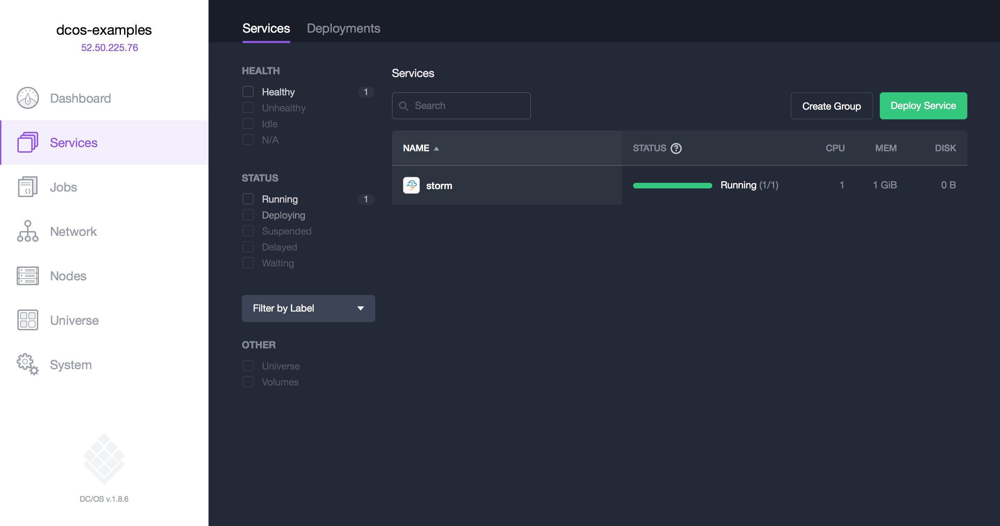

# How to use Apache Storm on DC/OS

[Apache Storm](http://storm.apache.org) is a distributed realtime computation system.
The [DC/OS Storm](https://github.com/mesos/storm) service is a Mesos framework that allows you to manage
and use Storm in a flexible and scalable way.

- Estimated time for completion: 5 minutes
- Target audience: Data engineers and data scientists a stream processing engine.
- Scope: Install and use Apache Storm.

**Table of Contents**:

- [Prerequisites](#prerequisites)
- [Install Storm](#install-storm)
- [Use Storm](#use-storm)
- [Uninstall Storm](#uninstall-storm)

## Prerequisites

- A running DC/OS 1.8 cluster with 2 agents with each 1 CPU and 1 GB of RAM available.
- [DC/OS CLI](https://dcos.io/docs/1.8/usage/cli/install/) installed.

## Install Storm

To install Storm, do:

```bash
$ dcos package install storm
Note that the Apache Storm DCOS Service is beta and there may be bugs, incomplete features, incorrect documentation or other discrepancies.
Continue installing? [yes/no] yes
Installing Marathon app for package [storm] version [0.1.0]
Package is already installed
```

After this, you should see the Storm service running via the `Services` tab of the DC/OS UI:



## Use Storm


```bash
$ docker run -i --rm mesos/storm:0.1.7-0.9.6-0.27.2-jdk8 /opt/storm/bin/storm -c nimbus.host=storm.mesos -c nimbus.thrift.port=11586 list


$ docker run -i --rm storm:1.0 storm -c nimbus.host=storm.mesos -c nimbus.thrift.port=11586 list


$ cat ~/.storm/storm.yaml
nimbus.seeds: [storm.mesos]
storm.zookeeper.servers:
  - master.mesos

$ docker run -i --rm -v /home/core/.storm/storm.yaml:/apache-storm-1.0.2/.storm/storm.yaml storm:1.0 storm list
```


## Uninstall Storm

To uninstall Storm:

```bash
$ dcos package uninstall storm
```

## Further resources

1. [DC/OS Storm Official Documentation](https://github.com/mesos/storm)
1. [Apache Storm 1.0.1 docs](http://storm.apache.org/releases/1.0.1/)


