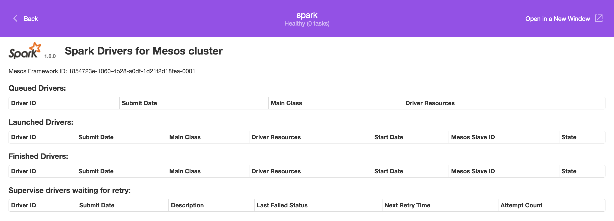

[Apache Spark](https://spark.apache.org/) is a general-purpose data processing engine. It supports batch and stream processing and comes with built-in APIs for SQL, machine learning and graph workloads. Spark is storage-layer agnostic, meaning it doesn't come with its own storage system but provides connectors to read data from and write data into, for example, the local filesystem, HDFS, Kafka, Cassandra, Elasticsearch, and HBase.

**Terminology**:

- Application ... A program built on Spark, consisting of a driver program and executors in the cluster.
- Driver ... A process running the `main()` function of the application (and providing the SparkContext).
- Executor ... A process launched for an application on a worker node.
- Mesos run modes ... Spark can run in Mesos using two modes: `coarse-grained` (default) and `fine-grained`. The `coarse-grained` mode has a lower startup overhead and is good for interactive sessions; it launches one long-running Spark task on each worked node at the cost of reserving the resources for the complete duration of the application. The `fine-grained` mode shows better resource utilization and is good for batch and certain streaming jobs; it launches each Spark task as a separate Mesos task.

**Scope**:

In the following tutorial you will learn about how to use Spark on DC/OS, from the simple first steps
of how to launch a Spark job to using Spark interactively with [Apache Zeppelin](https://zeppelin.incubator.apache.org/).

# Installing

Assuming you have a DC/OS cluster up and running, the first step is to install Spark. The minimum cluster size recommended for this tutorial is at least three nodes with 2 CPUs and 2 GB of RAM available, each:

```bash
$ dcos package install spark
Note that the Apache Spark DC/OS Service is beta and there may be bugs, incomplete features, incorrect documentation or other discrepancies.
We recommend a minimum of two nodes with at least 2 CPU and 2GB of RAM available for the Spark Service and running a Spark job.
Note: The Spark CLI may take up to 5min to download depending on your connection.
Continue installing? [yes/no] yes
Installing Marathon app for package [spark] version [1.6.0]
Installing CLI subcommand for package [spark] version [1.6.0]
New command available: dcos spark
The Apache Spark DC/OS Service has been successfully installed!

	Documentation: https://spark.apache.org/docs/latest/running-on-mesos.html
	Issues: https://issues.apache.org/jira/browse/SPARK
```

While the DC/OS command line interface (CLI) is immediately available it takes a few minutes until Spark is actually running in the cluster. Let's first check the DC/OS CLI and its new subcommand `spark`:

```bash
$ dcos spark
Usage:
    dcos spark --help
    dcos spark --info
    dcos spark --version
    dcos spark --config-schema
    dcos spark run --help
    dcos spark run --submit-args=<spark-args>
                   [--docker-image=<docker-image>]
                   [--verbose]
    dcos spark status <submissionId> [--verbose]
    dcos spark log <submissionId>
                   [--follow]
                   [--lines_count=<lines_count>]
                   [--file=<file>]
    dcos spark kill <submissionId> [--verbose]
    dcos spark webui
```

Now, we check if Spark is running and healthy, in the cluster itself. For this, go to the DC/OS dashboard and you should see Spark there:

By clicking on the `Open Service` button, you can access the Spark drivers page where you will see the jobs listed in the next steps; alternatively you can get to this page by using the `dcos spark webui` command:



# Executing a Spark job

Now that you've set up Spark, it's time to launch your first Spark job. We will use one of the [existing examples](https://github.com/apache/spark/blob/master/examples/src/main/scala/org/apache/spark/examples/SparkPi.scala) that comes with Spark.
Also, note that when you execute the `dcos spark run` command the first time, DC/OS downloads the necessary assets to your local machine and that can take (depending on your connection) some 10 mins or more.

```bash
$ dcos spark run --submit-args='-Dspark.mesos.coarse=true --driver-cores 1 --driver-memory 1024M --class org.apache.spark.examples.SparkPi https://downloads.mesosphere.com/spark/assets/spark-examples_2.10-1.4.0-SNAPSHOT.jar 30'
Spark distribution spark-1.6.0 not found locally.
It looks like this is your first time running Spark!
Downloading http://downloads.mesosphere.io.s3.amazonaws.com/spark/assets/spark-1.6.0.tgz...
Extracting spark distribution /Users/mhausenblas/.dcos/subcommands/spark/env/lib/python2.7/site-packages/dcos_spark/data/spark-1.6.0.tgz...
Successfully fetched spark distribution http://downloads.mesosphere.io.s3.amazonaws.com/spark/assets/spark-1.6.0.tgz!
Run job succeeded. Submission id: driver-20160310064921-0001
```

Note the submission id in the last line, above (in my case `driver-20160310064921-0001`): this allows to track the job via the CLI as we will see below. When you look at the Spark drivers page you should see the job as well (in my case the finished job, since it took less than a minute to execute):


Alternatively, you can use the CLI to verify the job status:

```bash
$ dcos spark status driver-20160310064921-0001
Submission ID: driver-20160310064921-0001
Driver state: FINISHED
Last status: task_id {
  value: "driver-20160310064921-0001"
}
state: TASK_FINISHED
message: ""
slave_id {
  value: "1854723e-1060-4b28-a0df-1d21f2d18fea-S1"
}
timestamp: 1.45759263282857E9
executor_id {
  value: "driver-20160310064921-0001"
}
source: SOURCE_EXECUTOR
```

Now let's run the same job again and use `dcos spark log` to watch the execution on the CLI. While this is probably not that useful for very short-running batch jobs, it's beneficial for long-running jobs as well as Spark Streaming jobs:

```bash
$ dcos spark run --submit-args='-Dspark.mesos.coarse=true --driver-cores 1 --driver-memory 1024M --class org.apache.spark.examples.SparkPi https://downloads.mesosphere.com/spark/assets/spark-examples_2.10-1.4.0-SNAPSHOT.jar 30'
Run job succeeded. Submission id: driver-20160310070130-0002
```

```bash
$ dcos spark log driver-20160310070130-0002
--container="mesos-1854723e-1060-4b28-a0df-1d21f2d18fea-S2.7e81a48a-bbc1-489a-b499-34f7131b5a35" --docker="docker" --docker_socket="/var/run/docker.sock" --help="false" --initialize_driver_logging="true" --launcher_dir="/opt/mesosphere/packages/mesos--be838ff64133ce38545b7d06f43c6348e5963188/libexec/mesos" --logbufsecs="0" --logging_level="INFO" --mapped_directory="/mnt/mesos/sandbox" --quiet="false" --sandbox_directory="/var/lib/mesos/slave/slaves/1854723e-1060-4b28-a0df-1d21f2d18fea-S2/frameworks/1854723e-1060-4b28-a0df-1d21f2d18fea-0001/executors/driver-20160310070130-0002/runs/7e81a48a-bbc1-489a-b499-34f7131b5a35" --stop_timeout="0ns"
--container="mesos-1854723e-1060-4b28-a0df-1d21f2d18fea-S2.7e81a48a-bbc1-489a-b499-34f7131b5a35" --docker="docker" --docker_socket="/var/run/docker.sock" --help="false" --initialize_driver_logging="true" --launcher_dir="/opt/mesosphere/packages/mesos--be838ff64133ce38545b7d06f43c6348e5963188/libexec/mesos" --logbufsecs="0" --logging_level="INFO" --mapped_directory="/mnt/mesos/sandbox" --quiet="false" --sandbox_directory="/var/lib/mesos/slave/slaves/1854723e-1060-4b28-a0df-1d21f2d18fea-S2/frameworks/1854723e-1060-4b28-a0df-1d21f2d18fea-0001/executors/driver-20160310070130-0002/runs/7e81a48a-bbc1-489a-b499-34f7131b5a35" --stop_timeout="0ns"
Registered docker executor on 10.0.2.157
Starting task driver-20160310070130-0002
Pi is roughly 3.1412853333333333
```

After all, it turns out to be useful to use the `dcos spark log` command: we get the result of the computation (an approximation for Pi) without having to dig into the logs.

You can learn about further options on how to run a Spark job via the [DC/OS docs](https://docs.mesosphere.com/1.8/usage/services/spark/).

# Using Spark Interactively

To interactively work with Spark, you can use [Apache Zeppelin](https://zeppelin.incubator.apache.org/) and here's what you need to do to install it.

You typically want to access Zeppelin via a web browser outside of the DC/OS cluster. To access the Zeppelin UI from outside of the DC/OS cluster you have a number of options available: from launching it on a public node to [using Marathon-LB](/docs/1.8/usage/service-discovery/marathon-lb/).

The following section will show you how to launch Zeppelin on a public node. This is fine for testing but be aware that this is going to make Zeppelin available on the public Internet (i.e. access from `0.0.0.0`) and with it, everyone out there can access your data and launch Spark jobs on your DC/OS cluster.

To launch Zeppelin on a public node, create a JSON file `options.json` with the following content:

```bash
$ cat options.json
{
  "zeppelin": {
    "role": "slave_public"
  }
}
```

Then, you can install Zeppelin like so:

```bash
$ dcos package install --options=options.json zeppelin
Installing Marathon app for package [zeppelin] version [0.5.6]
Zeppelin has been successfully installed!
Note that the service is experimental and there may be bugs, incomplete features, incorrect documentation or other discrepancies.
```

After this, you should see Zeppelin running via the DC/OS dashboard.

Since Zeppelin is launched, as all long-running applications, via Marathon you need to look up the port it has been scheduled on first. You will want the first (lower) port that you can either glean from the Marathon UI or via the following commands using the DC/OS CLI (ignore the IPs shown below, these are just the cluster-internal ones):

```bash
$ dcos marathon task list
APP        HEALTHY          STARTED              HOST     ID
/spark       True   2016-03-11T08:36:15.291Z  10.0.3.213  spark.30fb27f8-e764-11e5-957c-024211f85596
/zeppelin    True   2016-03-11T10:28:28.343Z  10.0.4.239  zeppelin.cac2fe3a-e773-11e5-957c-024211f85596
```

```bash
$ dcos marathon task show zeppelin.cac2fe3a-e773-11e5-957c-024211f85596
{
  "appId": "/zeppelin",
  "healthCheckResults": [
    {
      "alive": true,
      "consecutiveFailures": 0,
      "firstSuccess": "2016-03-11T10:29:01.386Z",
      "lastFailure": null,
      "lastSuccess": "2016-03-11T10:36:01.525Z",
      "taskId": "zeppelin.cac2fe3a-e773-11e5-957c-024211f85596"
    }
  ],
  "host": "10.0.4.239",
  "id": "zeppelin.cac2fe3a-e773-11e5-957c-024211f85596",
  "ipAddresses": [],
  "ports": [
    31753,
    31754
  ],
  "servicePorts": [
    10002,
    10003
  ],
  "slaveId": "8fd384b3-e15c-4e73-bfca-83584c10d11a-S5",
  "stagedAt": "2016-03-11T10:27:01.371Z",
  "startedAt": "2016-03-11T10:28:28.343Z",
  "version": "2016-03-11T10:27:01.314Z"
}
```

In this case the lower port was `31753` and together with the public node IP this gives `http://52.10.197.225:31753/`:


To get started with Zeppelin, check out the Zeppelin [docs](http://zeppelin.incubator.apache.org/docs/0.5.6-incubating/tutorial/tutorial.html) or simply walk through the built-in tutorial in form of a notebook called `Zeppelin Tutorial`:


**Further resources**:

- [DC/OS Spark Official Documentation](http://docs.mesosphere.com/1.8/usage/service-guides/spark)
- [Mesos-specific](https://spark.apache.org/docs/latest/running-on-mesos.html#configuration) configuration options for Spark
- [Mesos run modes](https://spark.apache.org/docs/latest/running-on-mesos.html#mesos-run-modes) for Spark
- A gentle introduction into [Spark on Mesos](http://www.slideshare.net/Typesafe_Inc/how-to-deploy-apache-spark-to-mesosdcos) by Lightbend


