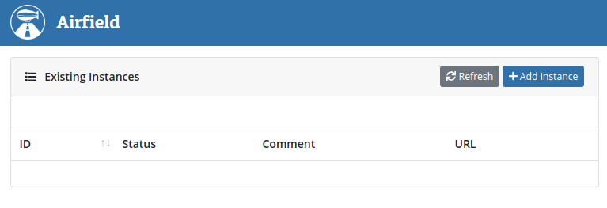
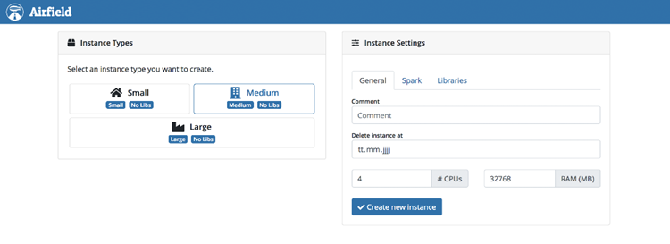
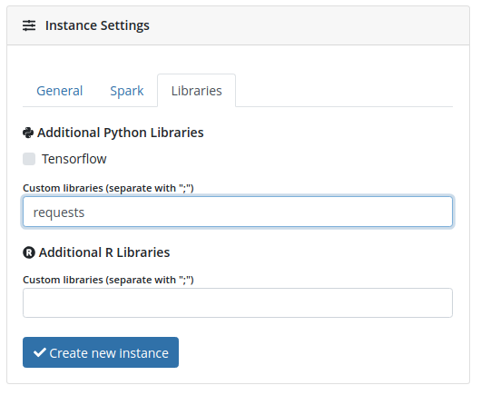
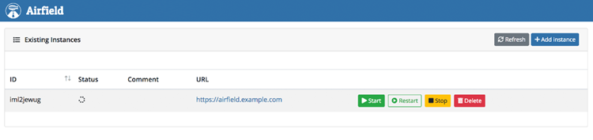

# Airfield

Airfield is an open source tool for the DC/OS ecosystem that enables teams to easily collaborate with shared [Apache Zeppelin](https://zeppelin.apache.org/) instances.

## Requirements

* DC/OS 1.11 or later
* Marathon-LB
* A wildcard DNS entry pointing at the loadbalancer. Each zeppelin instance will be available using a random name as a subdomain of your wildcard domain. As an example we will be using `*.zeppelin.mycorp`.
* A Key-Value-Store to store the list of existing zeppelin instances. Currently supported are either [consul](https://www.consul.io/) or [etcd](https://coreos.com/etcd/). If you have neither installed we recommend [consul](https://github.com/MaibornWolff/dcos-consul) which is available in the [universe](https://universe.dcos.io/#/package/consul/version/latest). Check the [consul example](../../consul/1.11/README.md) in this repo for details on how to install it.
* Enough available resources to run both Airfield and one Zeppelin instance (minimum: 3 cores, 10GB RAM).

## Installation

Airfield requires access to the Marathon API to manage zeppelin instances. If you are running DC/OS Enterprise you first need to create a serviceaccount for airfield:

```bash
dcos security org service-accounts keypair private-key.pem public-key.pem
dcos security org service-accounts create -p public-key.pem -d "Airfield service account" airfield-principal
dcos security secrets create-sa-secret --strict private-key.pem airfield-principal airfield/account-secret
dcos security org groups add_user superusers airfield-principal
```

Then create a file `options.json`.
For DC/OS EE clusters you need at least the following (change values to fit your cluster):

```json
{
  "service": {
    "marathon_lb_vhost": "airfield.mycorp",
    "service_account_secret": "airfield/account-secret"
  },
  "airfield": {
    "marathon_lb_base_host": ".zeppelin.mycorp",
    "consul_endpoint": "http://api.aconsul.l4lb.thisdcos.directory:8500/v1"
  }
}
```

For DC/OS Open Source you need at least the following (change values to fit your cluster):

```json
{
  "service": {
    "marathon_lb_vhost": "airfield.mycorp"
  },
  "airfield": {
    "marathon_lb_base_host": ".zeppelin.mycorp",
    "consul_endpoint": "http://api.aconsul.l4lb.thisdcos.directory:8500/v1",
    "dcos_base_url": "http://leader.mesos"
  }
}
```

The following config parameters are optional:

* `service.virtual_network_enabled` and `service.virtual_network_name` if you want to run airfield in a virtual network
* `airfield.etcd_endpoint` if you want to use etcd instead of consul
* `airfield.app_group` if you want airfield to put the zeppelin instances into a different marathon app group
* `airfield.config_base_key` if you want airfield to use a different key prefix for consul/etcd

Make sure the airfield vhost (`airfield.mycorp` in this example) and the wildcard domain (`*.zeppelin.mycorp` in this example) both have DNS entries that point to your marathon-lb instance. Also make sure either consul or etcd are installed and accessible via the provided endpoint.

Then you can install airfield using the following commands:

```bash
dcos package install airfield --options=options.json
```

Wait for it to finish installing, then access airfield via the vhost you provided (`airfield.mycorp` in the example).

## Usage

On first accessing airfield you will be greeted by the overview page.



The list is empty as no instances have been created yet. To do so, click the `Add instance` button on the top right side. In the dialog that follows you must select an instance size on the left (go with `Small` for your first instance).



On the right side you can change the preconfigured defaults to better fit your needs. If you want to use python or R you can install additional libraries via the `Libraries` tab. In the screenshot below we have added the python-requests library.



Once you are satisfied with the configuration click on `Create new instance`. Then go back to the overview by clicking on the airfield logo on the top left side. There you can now see your newly created zeppelin instance. Wait a few minutes until the instance is running (use the refresh button on the right to check the status, the first instances will take longer to start because DC/OS has to pull the zeppelin docker image which is quite big).



Once the zeppelin instance is running click on the provided link to open it. You can now use Zeppelin however you like. As a starting point you can use the [zeppelin example](../../zeppelin/1.11/README.md) in this repo.

If you no longer need your instance you can either stop it (and start it again later) or delete it from the airfield overview page.

Please be aware that the zeppelin instances have no persistent storage. That means if you restart, stop or delete an instance all notebook data will be lost. So you need to export you notebooks before that.