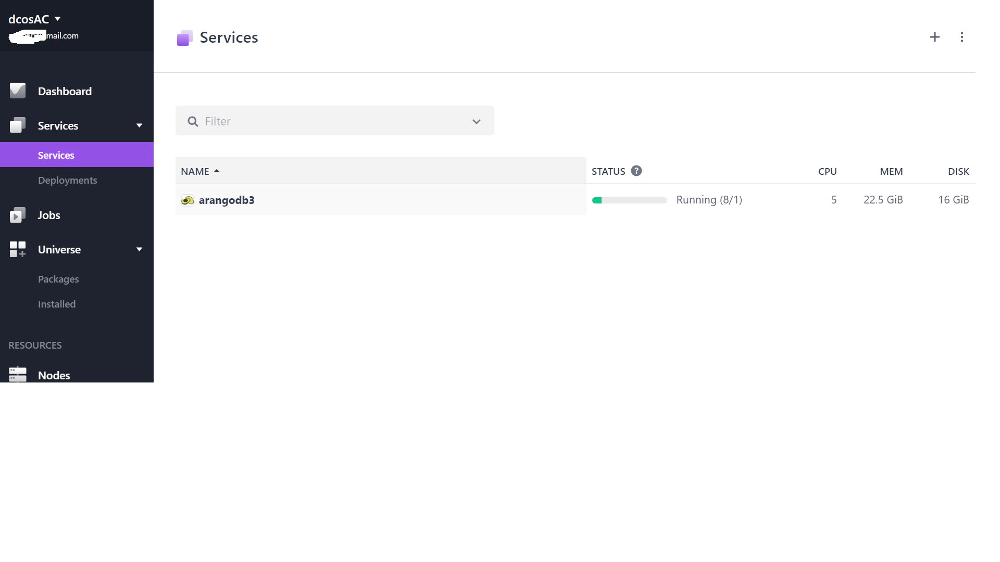
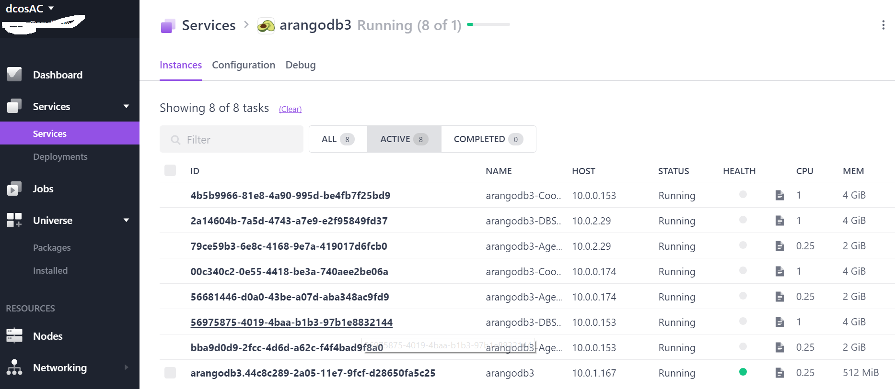
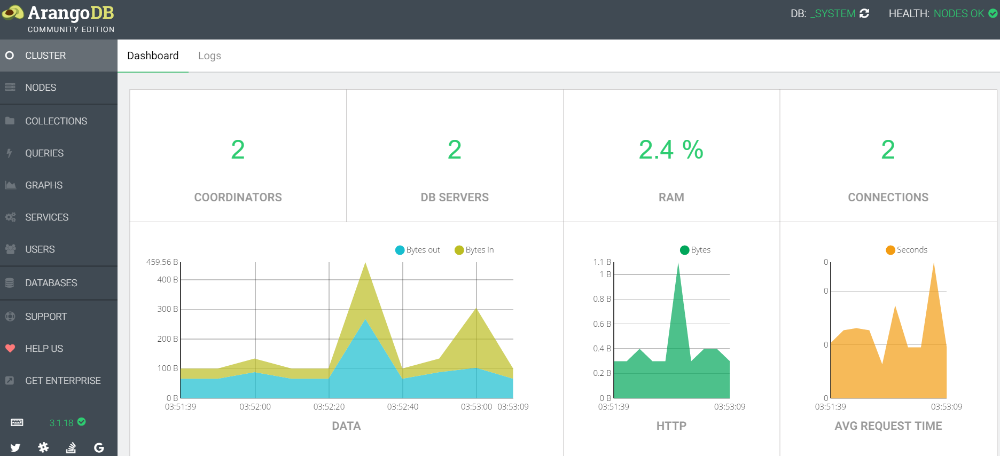
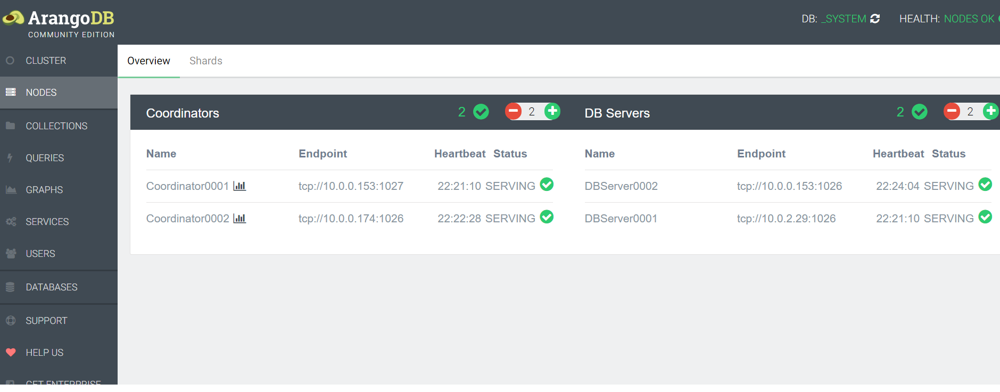

# How to use ArangoDB on DC/OS

[ArangoDB](https://www.arangodb.com/) is a distributed, multi-model database featuring JSON
documents, graphs, and key/value pairs. It has a unified query language (AQL) that allows you
to mix all three data models and supports joins and transactions.

- Estimated time for completion: 5 minutes
- Target audience: Anyone who wants to deploy a distributed multi-model database on DC/OS. Beginner level.
- Scope: Covers the basics in order to get you started with ArangoDB on DC/OS.

## Prerequisites

- A running DC/OS 1.9 cluster with at least 3 nodes having 4.75 CPU, 22GB of memory and 20GB of persistent disk storage in total.
- [DC/OS CLI](https://dcos.io/docs/1.9/usage/cli/install/) installed.

## Install ArangoDB

The DC/OS CLI provides a convenient way to deploy applications on your DC/OS cluster:

```bash
$ dcos package install arangodb3
The default configuration requires at least 3 nodes having 4.75 CPU, 22GB of memory and 20GB of persistent disk storage in total.
Continue installing? [yes/no] yes
Installing Marathon app for package [arangodb3] version [1.0.4]
Installing CLI subcommand for package [arangodb3] version [1.0.4]
New command available: dcos arangodb3
The ArangoDB DCOS Service has been successfully installed!

	Documentation: https://github.com/arangodb/arangodb3-dcos
	Issues: https://github.com/arangodb/arangodb3-dcos/issues
```

This command installs the `arangodb3` DC/OS CLI subcommand and starts an instance of the ArangoDB service with its default configuration under its default name, `arangodb3`. Now click on the Services tab in the DC/OS UI to watch ArangoDB start up:



Click on the ArangoDB service to reveal the tasks that the framework has started:



Click `Open Service` in the right upper corner to open the ArangoDB web interface.



Congratulations, you now have ArangoDB running on DC/OS!

To play around a bit more select `Collection` and add a new collection `example`. For more information see the [documentation](https://docs.arangodb.com/3.1/Manual/Administration/WebInterface/Collections.html).

Click on the newly created collection. It does not have any content, yet. Click on the green plus sign, set the key to `lovedcos` and enter a JSON object.

    { "arangodb": "running on DC/OS" }

Click on `Save` to store it.

See the [documentation](https://docs.arangodb.com/3.1/Manual/Administration/WebInterface/Document.html) for more details.

## Scaling

In order to scale ArangoDB switch to the `Nodes` UI view. You will see a list of Coordinators and DB servers. They can be scaled independently.

- Add more DB servers for more data.
- Add more Coordinators for more computing power.

See the [documentation](https://docs.arangodb.com/3.1/Manual/Scalability/Architecture.html) for an in-depth explanation.



## Use ArangoDB

Now that ArangoDB is running you can fill it with some data and use it as a data store for your applications.

To get started, talk to the `Coordinators` of your ArangoDB cluster. Note that you should not hardcode the `Coordinators` IP addresses and ports in your applications because they can move or change at any time throughout your cluster lifetime, for example because a tasks fails or due to scaling it up.

To connect to ArangoDB from the inside deploy the [ArangoDB Mesos HAProxy](https://github.com/arangodb/arangodb-mesos-haproxy).

Clone the repository and start the proxy:

```bash
$ git clone https://github.com/arangodb/arangodb-mesos-haproxy
$ cd arangodb-mesos-haproxy
$ dcos marathon app add marathon.json
```

To make your proxy highly available or scale it, you can simply add a few more instances via the Marathon UI.

## Further reading

### Uninstall

Use the following commands to shut down and delete your ArangoDB service and the
command line tool:

```bash
$ dcos arangodb3 uninstall; dcos package uninstall arangodb3
```

The first command uses the `arangodb` subcommand to gracefully shut down and delete all instances of your ArangoDB service. The framework scheduler
itself will run in silent mode for another 120 seconds. This enables the second command to remove the `arangodb` subcommand and the entry in
Marathon that would otherwise restart the framework scheduler automatically.

### Configuration options

There are a number of configuration options, which can be specified in the following
way:

```bash
$ dcos package install --config=<JSON_FILE> arangodb3
```

where `JSON_FILE` is the path to a JSON file. For a list of possible
attribute values and their documentation see

```bash
$ dcos package describe --config arangodb3
```

#### Config options in detail

* arangodb.framework-name[=arangodb3]

	Identifier for the cluster.

	This is a unique name for your arangodb cluster within DC/OS. If you want to deploy multiple clusters make sure this identifier is unique

* arangodb.zk[=zk://master.mesos:2181/arangodb3]

	ZooKeeper URL for storing state. Format: zk://host1:port1,host2:port2,.../path. Please note that the id is appended to the path.

	This must be unique per arangodb instance as well.

* arangodb.webui-host[=""]

	For debugging: use this host for WEBUI request.

* arangodb.proxy-port[=0]

	Proxy port, use '0' to let Mesos select a port for you.

	This configures the port on which the proxy will bind on the slave. This should generally be left untouched unless you are debugging.

* arangodb.framework-port[=0]

	Framework port, use '0' to let Mesos select a port for you.

	This configures the port on which the framework will bind on the slave. This should generally be left untouched unless you are debugging.

* arangodb.framework-cpus[=0.25]

	cpus resources needed for each framework instance.

	Controls how much cpus the framework is allowed to consume.

* arangodb.framework-mem[=512]
	
	mem resources needed for each framework instance.

	Controls how much memory the framework is allowed to consume.

* arangodb.framework-instances[=1]

	number of instances of the framework to run.

	Controls the number of framework instances DC/OS should start

* arangodb.framework-user[=""]

	user under which to run the framework tasks

	Used when Mesos authentication is enabled.

* arangodb.principal[=arangodb3]
	
	Principal for persistent volumes

	Check the Mesos documentation for details on how persistent volumes are working

* arangodb.mode[=cluster]

	Mode for framework, possible values: "standalone", "cluster"

	"standalone" will deploy a single instance of ArangoDB. Whereas "cluster" will spawn a fully fledged cluster.

* arangodb.async-replication[=false]

    Whether we do asynchronous replication

	If enabled Secondary DBServers will be deployed which will asynchronously replicate all data. The number of Secondaries will be aligned to the number of DBServers

* arangodb.role[=arangodb3]

	Role for framework

	Mesos role for the framework to use. Check the Mesos documentation for details.

* arangodb.minimal-resources-agent[=mem(*):2048;cpus(*):0.25;disk(*):2048]

	Minimal mesos resources for an agent

	Amount of resources specified in mesos resource format to use. Check the mesos documentation for details. An agent will need at least 1GB of RAM and 2GB of disk.

* arangodb.minimal-resources-coordinator[=mem(*):4096;cpus(*):1;disk(*):1024]

	Minimal mesos resources for a coordinator

	Amount of resources specified in mesos resource format to use. Check the mesos documentation for details. A coordinator will need at least 2GB of RAM and 1GB of disk. It is not necessary to assign more diskspace unless you plan to hold many foxx applications. Coordinators do not contain any data. They however need proper computing power as most of the query work will be done on the coordinators.

* arangodb.minimal-resources-dbserver[=mem(*):4096;cpus(*):1;disk(*):4096]

	Minimal mesos resources for a DBserver

	Amount of resources specified in mesos resource format to use. Check the mesos documentation for details. A DBServer will need mostly diskspace (all your data will be stored there) but also memory. The cluster will try to execute some of the data processing on the DBServer directly. So depending on your workload you might have to put more CPUs to it.


* arangodb.minimal-resources-secondary[=mem(*):4096;cpus(*):1;disk(*):4096]

	Minimal mesos resources for a secondary DBserver

	Amount of resources specified in mesos resource format to use. Check the mesos documentation for details. A Secondary will need as much memory and diskspace as the DBServer but uses slightly less CPU.

* arangodb.nr-agents[=3]
    
	Number of Agents

	This should be an odd number stating how many agents you want to start. 1 is minimum (but not failsafe!). 3 will make the cluster fail safe.

* arangodb.nr-dbservers[=2]

	Initial number of DBservers

	You may increase and decrease this number later.

* arangodb.nr-coordinators[=2]
	
	Initial number of coordinators

	You may increase and decrease this number later.

* arangodb.failover-timeout[=604800]

	Timeout after which an automatic failover is done.
	
	Mesos framework failover timeout. Check the mesos documentation for details. Should generally be left untouched and MUST be set to a high value!

* arangodb.mesos-authenticate[=false]

	If true use authentication with Mesos master.

	Enable mesos authentication. Check mesos documentation for details.

* arangodb.secret[=""]

	Secret for authentication with Mesos.

	Secret to use when doing authentication. Check mesos documentation for details.

* arangodb.secondaries-with-dbservers[=false]

	Flag, if each secondary must run on a node with a DBServer

	If set to true secondaries will be spawned on the same machine as the DBServers. This makes deployment much more static but can improve performance slighly.


* arangodb.coordinators-with-dbservers[=false]

	Flag, if each coordinator must run on a node with a DBServer

	If set to true coordinators will be spawned on the same machine as the DBServers. This makes deployment much more static but can improve performance slighly.

* arangodb.arangodb-docker-image[=arangodb/arangodb-mesos:3.1]

	Docker image to run ArangoDB.

	This is the image which will be used to start ArangoDB instances. Please note that this is NOT the default arangodb image but rather an image which is has a special mesos start script (https://github.com/arangodb/arangodb-mesos-docker). Also note that the default is refering to the branch image meaning that any task will be started with the newest image in that branch. If you want to pin down the version use the full version (like 3.1.0).

* arangodb.arangodb-privileged-image[=false]

	Run arangodb image in privileged mode.

	Mainly used for debugging purposes (allows using gdb within the image).

* arangodb.arangodb-force-pull-image[=true]

    Forcefully pull arangodb image. This overrides the docker cache and will make sure that you always get the latest image (will take some bandwidth though).

* arangodb.arangodb-ssl-keyfile[=""]

	Enable SSL using this base64 encoded SSL keyfile (see ArangoDB docs for keyfile specification)

	Once you have created a keyfile as stated in the ArangoDB docs base64 encode the whole file and paste it here as a string to enable SSL in the cluster.

* arangodb.arangodb-enterprise-key[=""]

    Use enterprise edition using the following key

	If you purchased the enterprise edition you will be provided with a key to use the enterprise edition instead of the community edition.

* arangodb.arangodb-additional-agent-args[=""]

    Additional arangod arguments to use when starting an agent (see arangod --help)

	Customize the startup options of the agents. Anything pasted here will be appended to the agent command line.

* arangodb.arangodb-additional-dbserver-args[=""]

	Additional arangod arguments to use when starting a dbserver (see arangod --help)

	Customize the startup options of the DBServers. Anything pasted here will be appended to the DBServer command line.

* arangodb.arangodb-additional-secondary-args[=""]

	Additional arangod arguments to use when starting a secondary dbserver (see arangod --help)

	Customize the startup options of the secondaries. Anything pasted here will be appended to the secondary command line.


* arangodb.arangodb-additional-coordinator-args[=""]
	
	Additional arangod arguments to use when starting a coordinator (see arangod --help)",
    
	Customize the startup options of the coordinators. Anything pasted here will be appended to the coordinator command line.

### Further Information

For further information, visit the GitHub repo [arangoDB/arangodb-mesos-framework](https://github.com/arangodb/arangodb-mesos-framework). Note that the ArangoDB service is also distributed as a Docker image (`arangodb/arangodb-mesos-framework`).

See the [README.md](https://github.com/arangodb/arangodb-mesos-framework) in the framework repository for details on how the framework scheduler is
configured.

### Support and bug reports

The ArangoDB Mesos framework and the DC/OS subcommand are supported by ArangoDB GmbH, the company behind ArangoDB. If you get
stuck, need help or have questions, just ask via one of the following channels:

- [Slack](http://slack.arangodb.com)
- [Google Group](https://groups.google.com/forum/#!forum/arangodb)
- `hackers@arangodb.com`: developer mailing list of ArangoDB
- `max@arangodb.com`: direct email to Max Neunhöffer
- `frank@arangodb.com`: direct email to Frank Celler
- `mop@arangodb.com`: direct email to Andreas Streichardt

Additionally, we track issues, bug reports, and questions via the GitHub
issue trackers at

- [arangodb-dcos](https://github.com/ArangoDB/arangodb3-dcos/issues): The DC/OS subcommand
- [arangodb-mesos](https://github.com/arangodb/arangodb-mesos-framework/issues): The ArangoDB service
- [arangodb-mesos-haproxy](https://github.com/arangodb/arangodb-mesos-haproxy/issues): The ArangoDB Mesos Proxy
