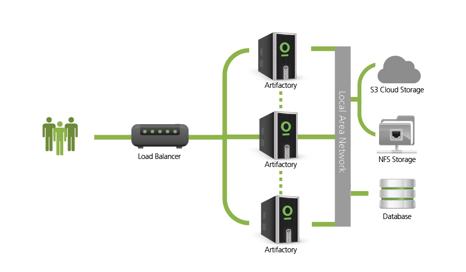
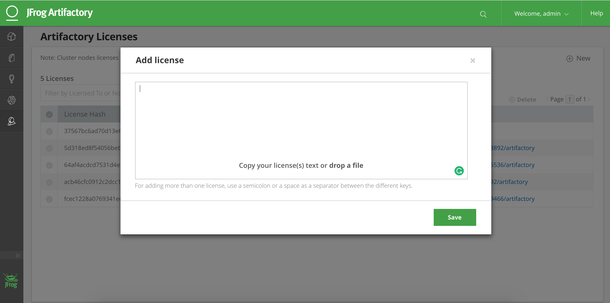

# Setting up Artifactory Enterprise on DC/OS

[Artifactory Enterprise](https://www.jfrog.com/artifactory/versions/#High-Availability) is a highly available installation of Artifactory. It does this by using a load balancer to balance requests across multiple Artifactory instances.



## Prerequisites

- DC/OS 1.11 or later with at least one public agent
- [DC/OS CLI installed](https://docs.mesosphere.com/1.11/cli/install/) and
  configured to use your cluster
- Database (MySQL, Oracle, MS SQL Server or Postgres)
- Artifactory Enterprise license
- NFS directory mounted to each node

## Setting up Artifactory Enterprise

### Set up storage on each node (required for high availability)

All nodes need to be able to read and write to the same file share. We recommend
using NFS (or an equivalent like [Amazon's EFS](https://aws.amazon.com/efs/)).

For example, using the default location of `/var/artifactory`, mount an example
file share on each DC/OS private agent using the following command:

```
sudo mount artifactoryha.mount.com:/artifactory /var/artifactory/
```

You must ensure this mount is writeable.

### Setting up Artifactory Enterprise

1. Create a new file called `artifactory-enterprise-options.json` with the
   following content.

Be sure to:

- replace `service.licenses` with your own license string. Note: Licenses can be configured in the Artifactory UI.
- replace `service.database.user` and `service.database.password` with the
  correct credentials if you have customised these values.
- replace `artifactory` within `service.database.url` with the correct database name
  if you have used a different one.
- replace `enterprise.master_key` with your own master key value.

```
{
  "service": {
    "name": "artifactory",
    "licenses": "replaceme",
    "host-volume": "/var/artifactory",
    "database": {
      "type": "postgresql",
      "host": "postgresql.marathon.mesos",
      "port": 5432,
      "url": "jdbc:postgresql://postgresql.marathon.mesos:5432/artifactory",
      "user": "jfrogdcos",
      "password": "jfrogdcos"
    }
  },
  "enterprise": {
    "enabled": true,
    "master_key": "replaceme"
  }
}
```


2. Run the following DC/OS CLI command to install Artifactory Enterprise:

```
dcos package install --options=artifactory-enterprise-options.json artifactory
```

3. Check that Artifactory is up and running successfully by checking the "Services" tab of DC/OS.

## Install Artifactory-lb

Once Artifactory is up and running, [follow this guide to set up
Artifactory-lb](artifactory-lb.md).

## Scaling Artifactory Enterprise

To make Artifactory Enterprise highly available, you need to add licenses via
the UI and install a "secondary":

1. Add more licenses for secondary nodes in Artifactory UI:




2. Create a new file called `artifactory-enterprise-secondary-options.json` with
   the following content.

Be sure to:

- replace `service.licenses` with your own license string (only one node's
  license is required here, the rest can be configured in the Artifactory UI)
- replace `service.database.user` and `service.database.password` with the
  correct credentials if you have customised these
- replace `artifactory` within `service.database.url` with the correct database name
  if you have used a different one
- replace `enterprise.master_key` with key specified for primary artifactory instance.

```
{
  "service": {
    "name": "artifactory",
    "licenses": "replaceme",
    "host-volume": "/var/artifactory-secondary",
    "database": {
      "type": "postgresql",
      "host": "postgresql.marathon.mesos",
      "port": 5432,
      "url": "jdbc:postgresql://postgresql.marathon.mesos:5432/artifactory",
      "user": "jfrogdcos",
      "password": "jfrogdcos"
    }
  },
  "enterprise": {
    "enabled": true,
    "master_key": "replaceme",
    "secondary" : {
      "enabled": true
    }
  }
}
```

3. Run the following DC/OS CLI command to install a single secondary instance of
   Artifactory Enterprise:

```
dcos package install --options=artifactory-enterprise-secondary-options.json artifactory
```

4. Run the following DC/OS CLI command to scale the number of secondary
   Artifactory Enterprise instances to 2:

```
dcos marathon app update artifactory-secondary instances=2
```
