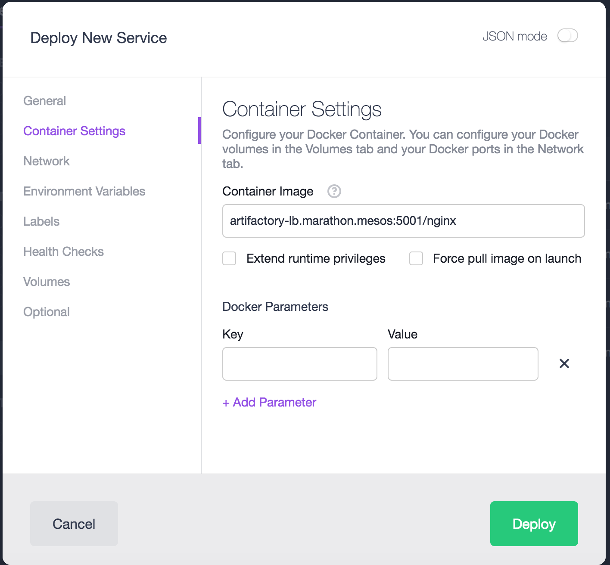
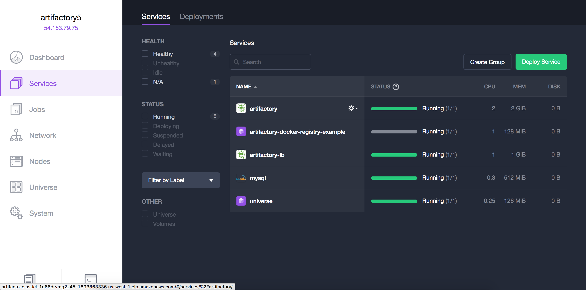
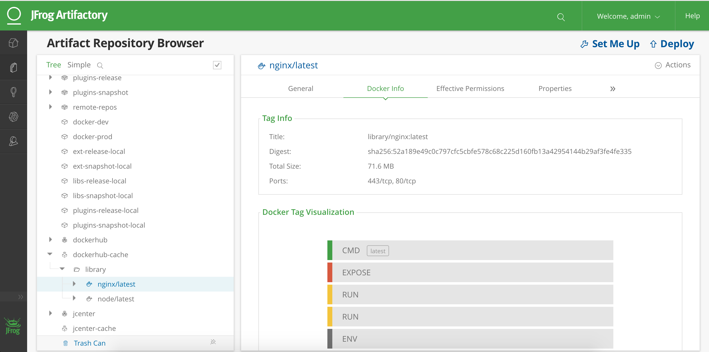

## How to use Artifactory on DC/OS as a Docker Registry


## Prerequisites

- [DC/OS CLI installed](https://docs.mesosphere.com/1.11/cli/install/) and configured to use your cluster
- A running installation of [Artifactory Pro](artifactory-pro.md) or
  [Artifactory Enterprise](artifactory-enterprise.md) on DC/OS
- [Artifactory-lb](artifactory-lb.md) installed with appropriate certificates
  (or configured as an insecure registry, see below)
- Ports 5000 to 5010 open on the public agent where Artifactory-lb is running.

### (Optional) Configuring Artifactory as an insecure registry

In case you'd like to run an insecure registry without using any TLS
certificates, you can configure the nodes in your DC/OS cluster to work without
certificates or security.

This basically tells the Docker engine in each node to entirely disregard
security for your registry. While this is relatively easy to configure the
daemon in this way, it is very insecure. It does expose your registry to trivial
MITM. Only use this solution for isolated testing or in a tightly controlled,
air-gapped environment.

Run this in all agent nodes of your cluster:

```
sudo cp /usr/lib/systemd/system/docker.service /etc/systemd/system/docker.service

sudo vim /etc/systemd/system/docker.service

add this line: Environment="DOCKER_OPTS=--insecure-registry artifactory-lb.marathon.mesos:5001”

sudo systemctl daemon-reload

sudo systemctl restart docker.service
```
IMPORTANT: Above setup needs to be done on all agent nodes of your cluster where Artifactory containers can run. 

WARNING: Restarting docker service will shutdown your containers, which DC/OS will respawn. Containers that are not
pinned to a node can come back in any node and that could cause problems. 

We recommend to do this setup before running other services.

## Pushing a Docker image to Artifactory

First, you'll need to login to the registry:

```
docker login artifactory-lb.marathon.mesos:5001
```

Then build an image and push it to the registry:

```
docker build . --tag artifactory-lb.marathon.mesos/<image name>
docker push artifactory-lb.marathon.mesos:5001/<image name>
```

## Deploying a Docker image from Artifactory

The Docker registry at `artifactory-lb.marathon.mesos:5001` is now available for
use in your Marathon applications. It can be used to launch applications from
the GUI or the CLI interfaces.

### From the Marathon UI

Simply use ```artifactory-lb.marathon.mesos:5001``` as a prefix in the
`Container Settings`/`Container Image` field of the `Services` form:



Launch your application normally and check it’s working correctly in the “Services” tab:



Check cached image in Artifactory UI



#### From the CLI

Write a JSON file that uses the image from Artifactory:

```
$cat registry-example-app.json
{
  "id": "/artifactory-registry-docker-example",
  "cmd": null,
  "cpus": 1,
  "mem": 128,
  "disk": 0,
  "instances": 1,
  "executor": null,
  "fetch": null,
  "constraints": null,
  "acceptedResourceRoles": null,
  "user": null,
  "container": {
    "docker": {
      "image": "artifactory-lb.marathon.mesos:5001/nginx",
      "forcePullImage": false,
      "privileged": false,
      "portMappings": [
        {
          "containerPort": 80,
          "protocol": "tcp",
          "name": "http"
        }
      ],
      "network": "BRIDGE"
    }
  },
  "labels": null,
  "healthChecks": null,
  "env": null
}
```

Load that JSON into Marathon:

```
dcos marathon app add registry-example-app.json
```

Check that the application is running properly:

```
$ dcos marathon app list
ID                                    MEM   CPUS  TASKS  HEALTH  DEPLOYMENT  WAITING  CONTAINER  CMD
/artifactory                          2048   2     1/1    1/1       ---      False      DOCKER   N/A
/artifactory-lb                       1024   1     1/1    1/1       ---      False      DOCKER   apt...
/artifactory-registry-docker-example  1024   1     1/1    1/1       ---      False      DOCKER   N/A
/postgresql                           512   0.5    1/1    1/1       ---      False      DOCKER   N/A
/universe                             128   0.25   1/1    1/1       ---      False      DOCKER   N/A
```
