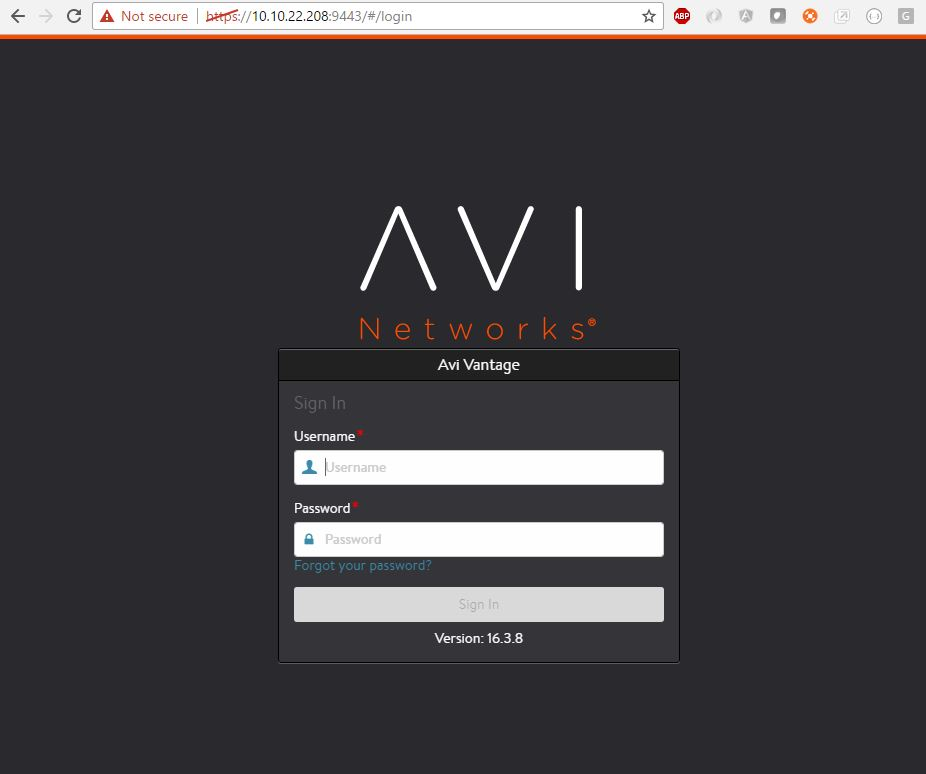

# Installing AviVantage with DC/OS

[AviVantage](https://www.avinetworks.com) is an Elastic Application Services Fabric that provides per-app load balancing, predictive autoscaling, application insights, security, and automation in any data center or cloud.

- Estimated time for completion: 10 minutes
- Target audience: Anyone interested in running a load-balancer or ADC
- Scope: Learn how to install AviVantage on DC/OS

## Prerequisites

- A running DC/OS 1.9 cluster with at least 1 node having at least 1 CPUs and 1 GB of RAM available.
- [DC/OS CLI](https://dcos.io/docs/1.8/usage/cli/install/) installed.

## Install AviVantage

Assuming you have a DC/OS cluster up and running, we install AviVantage using DC/OS CLI.

To view all the options available for installation:

```bash
dcos package describe avi
```
Next, we install AviVantage using default values for all options.

```bash
$ dcos package install avi --options=options.json
```

Normally, the defaults are sufficient. To customize any options, create a file called `options.json` with specific options to override as contents:

```json
{
  "avi": {
    "cpus": 2,
    "mem": 8192,
  }
}
```

The above `options.json` file configures AviVantage as follows:

- `cpus`: This parameter configures the number of CPU share to allocate to AviVantage.
- `mem`: This parameter configures the amount of RAM to allocate to AviVantage.
- all other options are defaults

To install AviVantage using this `options.json` file:

```bash
$ dcos package install avi --options=options.json
```

To verify that our AviVantage instance is up and running, we can use `dcos task` command:

```bash
$ dcos task
NAME                HOST          USER  STATE  ID
avi-vantage         10.10.22.208  root    R    avi-vantage.0039ee9b-09b0-11e7-91a5-70b3d5800001
```

## Access AviVantage

To access AviVantage, launch `https://<DCOS-HOST>:9443`, where `DCOS-HOST` is the `HOST` field from `dcos task avi-vantage` output. In this example the HOST IP address is 10.10.22.208 and when we navigate there, we see something like the following:



## Uninstall AviVantage

To uninstall AviVantage, run the following CLI command:

```bash
dcos package uninstall avi
```

## References
[AviVantage KB for DCOS](https://kb.avinetworks.com/installing-avi-vantage-with-open-dcos-or-enterprise-dcos)
