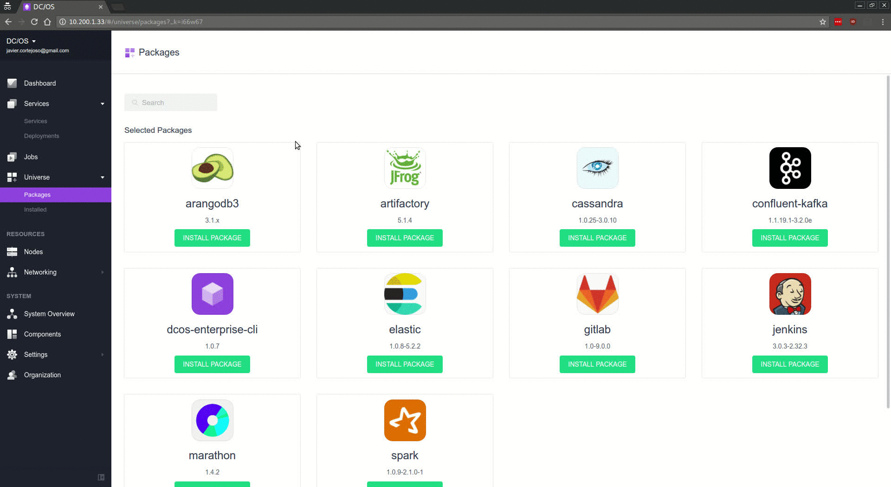
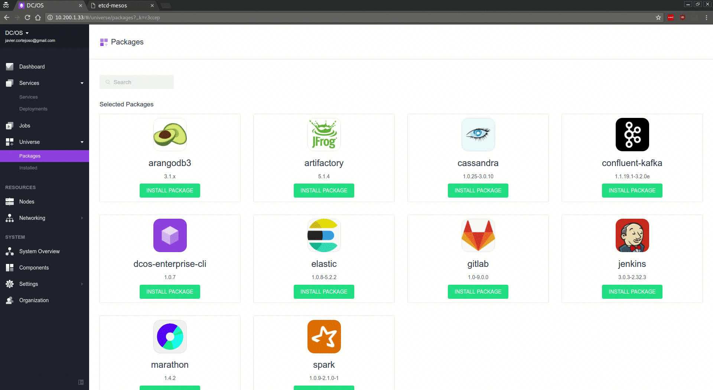

# How to Use Calico in DC/OS

[Calico](https://projectcalico.org) is a networking plugin for DC/OS. It enables
multi-host networking for tasks by assigning each its own IP address and
isolated networking namespace, which can then be configured with highly flexible
policy configurations.

The Calico Universe Package simplifies the installation of Calico and its dependencies on a DC/OS cluster.

- Estimated time for completion: 5 minutes / agent
- Target audience: Those interested in securing tasks in DC/OS
- Scope: Learn how to install Calico on DC/OS

## Prerequisites

- A running DC/OS 1.9 cluster

#### Warning: Note rp_filter in DC/OS

Containers with permission `CAP_NET_RAW` can spoof their IP address if the
`rp_filter` kernel setting is set to 'loose'. Typically, `rp_filter` is
configured to 'strict', preventing this behavior.
[DC/OS, however, arbitrarily sets `rp_filter` to 'loose' across all interfaces](https://dcosjira.atlassian.net/browse/DCOS-265), including the interfaces
Calico creates and uses. By default, [Felix notices this and refuses to launch](https://github.com/projectcalico/calicoctl/issues/1082#issue-168163079). In DC/OS, however, we configure Felix to ignore this by setting
[IgnoreLooseRPF](https://github.com/projectcalico/felix/blob/ab8799eaea66627e5db7717e62fca61fd9c08646/python/calico/felix/config.py#L198) to true. As a result, be cautious when granting containers `CAP_NET_RAW` since, if compromised, these
containers will be able to spoof their IP address, potentially allowing them to bypass firewall restrictions.

#### Installing etcd

To get started, first install etcd from Universe:



#### Installing Calico

Then install Calico from Universe.



It will take a few minutes for Calico to finish
installing on your cluster. You can check the status of the installation by
visiting Calico's web status interface:

 - Go to the **Services** tab
 - Select "calico-install-framework" in the list of running services
   (note that it may take a few minutes for Calico
    to appear).
 - Once the Calico service is `Healthy`,
   Select the "calico-install-framework" task.
 - Click the Endpoint URL to open the Calico status page in a new tab.


This concludes the installation of Calico for DC/OS! Before you start
launching IP-per-container applications with Calico policy,
review the following information which may apply to your deployment.

#### AWS

DC/OS users on Amazon Web Services should view
[Calico's AWS reference](reference/public-cloud/aws)
for information on how to configure AWS networking for use with Calico.

#### Note on Cluster Impact

The Installation method detailed above will affect availability of all Agents
in the cluster in order to work around two limitations in DC/OS 1.9:

1. [Mesos-Agents require a restart to detect newly added CNI networks](https://issues.apache.org/jira/browse/MESOS-6567).
2. [DC/OS does not configure Docker with a Cluster-Store](https://dcosjira.atlassian.net/browse/DCOS-155)
a [requirement for Multi-host docker networking](https://docs.docker.com/engine/userguide/networking/get-started-overlay/#/overlay-networking-with-an-external-key-value-store).

Because of these two limitations, Calico-DC/OS will restart each agent process
and restart each docker daemon. Learn how to handle this installation steps manually
and prevent cluster availability impact by viewing the [Custom Install Guide](custom).

#### Deploying Applications

Once installed, see Calico's usage guides for
[Docker Containerizer](http://docs.projectcalico.org/v2.0/getting-started/mesos/tutorials/docker)
and
[Unified Containerizer](http://docs.projectcalico.org/v2.0/getting-started/mesos/tutorials/unified).

The the Calico Universe Framework includes customization options which support
more stable deployments when users

#### Custom etcd

By default, Calico will run etcd in proxy mode on every agent, forwarding requests
to `http://localhost:2379` to the running etcd cluster launched by Universee,
accessible via an SRV entry.

The Calico Universe framework alternatively can be configured to directly connect
to an etcd instance launched outside of universe, removing
the need for etcd-proxy:

1. Run an etcd cluster across your masters. Follow the
   [official etcd clustering guide](https://coreos.com/etcd/docs/latest/clustering.html#static)
   for information on how to run a HA etcd cluster.

   For demo purposes, we'll run one single instance of etcd on our first master
   (available at http://m1.dcos:2379):

   ```shell
   docker run -d --net=host --name=etcd quay.io/coreos/etcd:v2.0.11 \
   --advertise-client-urls "http://m1.dcos:2379" \
   --listen-client-urls "http://m1.dcos:2379,http://127.0.0.1:2379" \
   ```

2. Launch the Calico Universe Framework with the following configuration:

   ```json
   {
     "Etcd Settings": {
       "run-proxy": false,
       "etcd-endpoints": "http://m1.dcos:2379"
     }
   }
   ```

#### Configure Docker with Cluster-Store

The Docker engine must be restarted after

Users who want to minimize impact on cluster availability during installation
can perform the docker cluster-store configuration manually.

1. On each agent, create or modify `/etc/docker/daemon.json` with the following content:

   ```json
   {
    "cluster-store": "etcd://m1.dcos:2379"
   }
   ```

2. Restart docker:

   ```
   systemctl restart docker
   ```

   Ensure it has picked up the changes:

   ```
   docker info | grep -i "cluster store"
   ```

3. When launching the Calico Universe Framework, disable the Docker Cluster-Store configuration step:

   ```json
   {
     "Configure Docker Cluster-Store": {
       "enable": false
     }
   }
   ```

#### Install the Calico CNI Plugins

Installation of CNI plugins requires a restart of the Mesos-Agent process.
Users who want to minimize impact on cluster availability during installation
can install the Calico plugin manually by performing the following steps
on each agent:

1. Download Calico's CNI plugin binaries:

   ```shell
   curl -L -o /opt/mesosphere/active/cni/calico  https://github.com/projectcalico/calico-cni/releases/download/v1.5.5/calico
   curl -L -o /opt/mesosphere/active/cni/calico-ipam https://github.com/projectcalico/calico-cni/releases/download/v1.5.5/calico-ipam
   ```

2. Create a standard Calico CNI network configuration:

   ```shell
   cat <<EOF > /opt/mesosphere/etc/dcos/network/cni/calico.conf
   {
       "name": "calico",
       "type": "calico",
       "ipam": {
           "type": "calico-ipam"
       },
       "etcd_endpoints": "http://m1.dcos:2379"
   }
   ```

3. When launching the Calico Universe Framework, disable the CNI plugin installation step:

   ```json
   {
     "Install CNI": {
       "enable": false
     }
   }
   ```
