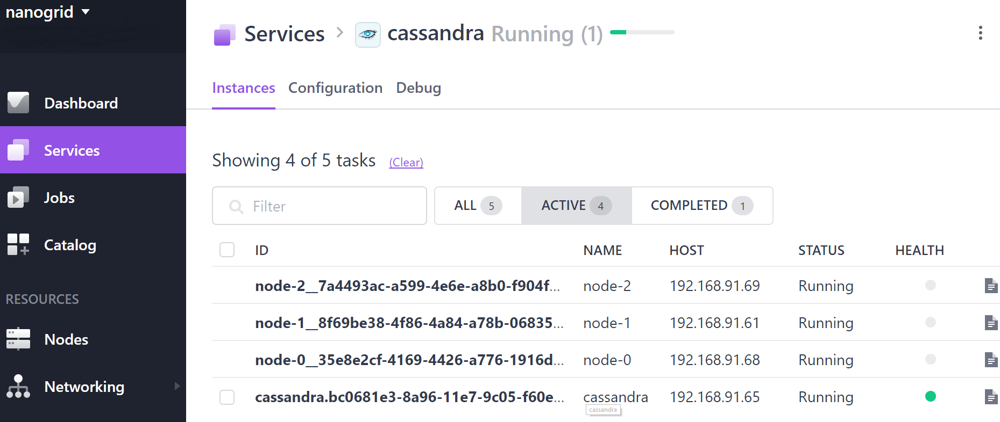

# How to use Apache Cassandra on DC/OS

[Apache Cassandra](https://cassandra.apache.org/) is a distributed, structured storage system. Cassandra clusters are highly available, scalable, performant, and fault tolerant. DC/OS Cassandra allows you to quickly configure, install, and manage Apache Cassandra. Multiple Cassandra clusters can also be installed on DC/OS and managed independently, so you can offer Cassandra as a managed service to your organization.

- Estimated time for completion: 10 minutes
- Target audience: Anyone who wants to deploy a distributed database on DC/OS. Beginner level.
- Scope:
 - Install the DC/OS Cassandra service.
 - Use the enhanced DC/OS CLI operations for Cassandra.
 - Validate that the service is up and running.
 - Connect to Cassandra and perform CRUD operations.

**Terminology**:

- **Node**: A running Cassandra instance.
- **Cluster**: Two or more Cassandra instances that communicate over gossip protocol.
- **Keyspace**: A namespace that defines how data is replicated on nodes.

**Table of Contents**:

- [Prerequisites](#prerequisites)
- [Install Cassandra](#install-cassandra)
  - [Typical installation](#typical-installation)
  - [Custom manual installation](#custom-manual-installation)
  - [Validate installation](#validate-installation)
- [CRUD operations](#perform-crud-operations)
- [Uninstall](#uninstall)

## Prerequisites

- A running DC/OS 1.10 cluster with 3 nodes each with 1.5 CPU shares, 5376MB of memory and 11264MB of disk for running Cassandra nodes and 1 node with 0.5 CPU shares, 2048MB of memory for running the service scheduler.
- [DC/OS CLI](https://dcos.io/docs/1.10/cli/install/) installed and configured for the running cluster.

## Install Cassandra

Assuming you have a DC/OS cluster up and running, the first step is to [install Cassandra](https://docs.mesosphere.com/service-docs/cassandra/).

### Typical installation

Install Cassandra using the DC/OS CLI:

```bash
$ dcos package install cassandra
By Deploying, you agree to the Terms and Conditions https://mesosphere.com/catalog-terms-conditions/#certified-services
DC/OS Cassandra Service default configuration requires 3 nodes each with 1.5 CPU shares, 5376MB of memory and 11264MB of disk for running Cassandra Nodes. And, 1 node with 0.5 CPU shares, 2048MB of memory for running the service scheduler.
Continue installing? [yes/no] yes
Installing Marathon app for package [cassandra] version [1.0.25-3.0.10]
Installing CLI subcommand for package [cassandra] version [1.0.25-3.0.10]
New command available: dcos cassandra
DC/OS Apache Cassandra has been successfully installed!

        Documentation: https://docs.mesosphere.com/current/usage/service-guides/cassandra/
        Issues: https://dcosjira.atlassian.net/projects/CASSANDRA/issues
```

Note that while the DC/OS CLI subcommand `cassandra` is immediately available, it takes a few moments for Cassandra to start running in the cluster.

### Custom manual installation

1. Verify existing DC/OS repositories:

    ```bash
    $ dcos package repo list
    Universe: https://universe.mesosphere.com/repo
    ```

1. Identify available versions for the Cassandra service.

    You can either list all available versions for Cassandra:

    ```bash
    $ dcos package list cassandra
    ```

    Or you can search for a particular one:

    ```bash
    $ dcos package search cassandra
    ```

1. Install a specific version of the Cassandra package:

    ```bash
    $ dcos package install --yes --force --package-version=<package_version> cassandra
    ```

### Validate installation

Validate that the installation added the enhanced DC/OS CLI for Cassandra:

```bash
$ dcos cassandra --help-long
usage: cassandra [<flags>] <command> [<args> ...]

Deploy and manage Cassandra clusters

Flags:
  -h, --help              Show context-sensitive help (also try --help-long and
                          --help-man).
      --version           Show application version.
  -v, --verbose           Enable extra logging of requests/responses
      --info              Show short description.
      --force-insecure    Allow unverified TLS certificates when querying
                          service
      --custom-auth-token=DCOS_AUTH_TOKEN
                          Custom auth token to use when querying service
      --custom-dcos-url=DCOS_URI/DCOS_URL
                          Custom cluster URL to use when querying service
      --custom-cert-path=DCOS_CA_PATH/DCOS_CERT_PATH
                          Custom TLS CA certificate file to use when querying
                          service
      --name="cassandra"  Name of the service instance to query

Commands:
  help [<command>...]
    Show help.


  plan list
    Show all plans for this service


  plan show [<plan>]
    Display the deploy plan or the plan with the provided name


  plan start <plan> [<params>]
    Start the plan with the provided name, with optional envvars to supply to
    task


  plan stop <plan>
    Stop the plan with the provided name


  plan continue [<plan>]
    Continue the deploy plan or the plan with the provided name


  plan interrupt [<plan>]
    Interrupt the deploy plan or the plan with the provided name


  plan restart <plan> <phase> <step>
    Restart the plan with the provided name


  plan force <plan> <phase> <step>
    Force complete the plan with the provided name


  seeds
    Retrieve seed node information


  connection [<flags>]
    Provides Cassandra connection information

    --address  Provide addresses of the Cassandra nodes
    --dns      Provide dns names of the Cassandra nodes

  node describe [<task_name>]
    Describes a single node


  node list
    Lists all nodes


  node replace [<task_name>]
    Replaces a single node job, moving it to a different agent


  node restart [<task_name>]
    Restarts a single node job, keeping it on the same agent


  node status [<task_name>]
    Gets the status of a single node


  backup start [<flags>]
    Perform cluster backup via snapshot mechanism

    --backup_name=BACKUP_NAME      Name of the snapshot
    --external_location=EXTERNAL_LOCATION
                                   External location where the snapshot should
                                   be stored
    --s3_access_key=S3_ACCESS_KEY  S3 access key
    --s3_secret_key=S3_SECRET_KEY  S3 secret key
    --azure_account=AZURE_ACCOUNT  Azure storage account
    --azure_key=AZURE_KEY          Azure secret key

  backup stop
    Stops a currently running backup


  backup status
    Displays the status of the backup


  restore start [<flags>]
    Restores cluster to a previous snapshot

    --backup_name=BACKUP_NAME      Name of the snapshot to restore
    --external_location=EXTERNAL_LOCATION
                                   External location where the snapshot is
                                   stored
    --s3_access_key=S3_ACCESS_KEY  S3 access key
    --s3_secret_key=S3_SECRET_KEY  S3 secret key
    --azure_account=AZURE_ACCOUNT  Azure storage account
    --azure_key=AZURE_KEY          Azure secret key

  restore stop
    Stops a currently running restore


  restore status
    Displays the status of the restore


  cleanup start [<flags>]
    Perform cluster cleanup of deleted or moved keys

    --nodes="*"              A list of the nodes to cleanup or * for all.
    --key_spaces=KEY_SPACES  The key spaces to cleanup or empty for all.
    --column_families=COLUMN_FAMILIES
                             The column families to cleanup.

  cleanup stop
    Stops a currently running cleanup


  repair start [<flags>]
    Perform primary range anti-entropy repair

    --nodes="*"              A list of the nodes to repair or * for all.
    --key_spaces=KEY_SPACES  The key spaces to repair or empty for all.
    --column_families=COLUMN_FAMILIES
                             The column families to repair.

  repair stop
    Stops a currently running repair
```

In addition, you can go to the DC/OS UI to validate that the Cassandra service is running and healthy:



Furthermore, you can retrieve the connection info from the CLI:

```bash
$ dcos cassandra endpoints node
{
  "address": [
    "10.0.3.228:9042",
    "10.0.3.230:9042",
    "10.0.3.227:9042"
  ],
  "dns": [
    "node-0.cassandra.mesos:9042",
    "node-1.cassandra.mesos:9042",
    "node-2.cassandra.mesos:9042"
  ],
  "vip": "node.cassandra.l4lb.thisdcos.directory:9042"
}
```

## Perform CRUD operations

We will use cql interactively, so we will start a cassandra-client task:

```
$ vi cassandra-client.json
{
 "id": "/cassandra-client",
 "instances": 1,
 "container": {
 "type": "MESOS",
 "docker": {
 "image": "cassandra:3.0.10"
 }
 },
 "cpus": 0.5,
 "mem": 256,
 "cmd": "while true; do sleep 10000000; done"
 }

$ dcos marathon app add cassandra-client.json
Created deployment 933a3fc0-0712-448d-8156-1f9cfa76a823
```

Start a cqlsh session in the previously started container:

```
$ dcos task exec -it cassandra-client cqlsh --cqlversion="3.4.0" node.cassandra.l4lb.thisdcos.directory
Connected to cassandra at node.cassandra.l4lb.thisdcos.directory:9042.
[cqlsh 5.0.1 | Cassandra 3.0.14 | CQL spec 3.4.0 | Native protocol v4]
Use HELP for help.
cqlsh>
```

You are now connected to your Cassandra cluster. Let's create a sample keyspace called `demo`:

```sql
cqlsh> CREATE KEYSPACE demo WITH REPLICATION = { 'class' : 'SimpleStrategy', 'replication_factor' : 3 };
```

Next, create a sample table called `map` in the `demo` keyspace:

```sql
cqlsh> CREATE TABLE demo.map (key varchar, value varchar, PRIMARY KEY(key));
```

Insert some data in your table:

```sql
cqlsh> INSERT INTO demo.map(key, value) VALUES('Cassandra', 'Rocks!');
cqlsh> INSERT INTO demo.map(key, value) VALUES('StaticInfrastructure', 'BeGone!');
cqlsh> INSERT INTO demo.map(key, value) VALUES('Buzz', 'DC/OS is the new black!');
```

Query the data back to make sure it's persisted correctly:

```sql
cqlsh> SELECT * FROM demo.map;

 key                  | value
----------------------+-------------------------
            Cassandra |                  Rocks!
 StaticInfrastructure |                 BeGone!
                 Buzz | DC/OS is the new black!

(3 rows)
```

Next, delete some data:

```sql
cqlsh> DELETE FROM demo.map where key = 'StaticInfrastructure';
```

Query again to ensure that the row was deleted successfully:

```sql
cqlsh> SELECT * FROM demo.map;

 key       | value
-----------+-------------------------
 Cassandra |                  Rocks!
      Buzz | DC/OS is the new black!

(2 rows)
```

## Uninstall

To uninstall Cassandra:

```bash
$ dcos package uninstall cassandra
WARNING: This action cannot be undone. This will uninstall [cassandra] and delete all of its persistent data (logs, configurations, database artifacts, everything).
Please type the name of the service to confirm: cassandra
Uninstalled package [cassandra] version [1.0.25-3.0.10]
DC/OS Apache Cassandra service has been uninstalled.
Please follow the instructions at https://docs.mesosphere.com/current/usage/service-guides/cassandra/uninstall to remove any persistent state if required.
```

Use the [framework cleaner](https://docs.mesosphere.com/1.10/deploying-services/uninstall/#framework-cleaner) script to remove your Cassandra instance from ZooKeeper and to destroy all data associated with it. The script requires several arguments, the values for which are derived from your service name:

```bash
# connect to the leader if you are not already
dcos node ssh --master-proxy --leader

docker run mesosphere/janitor /janitor.py -r cassandra-role -p cassandra-principal -z dcos-service-cassandra
```
- `framework-role` is `cassandra-role`
- `framework-principal` is `cassandra-principal`
- `zk_path` is `dcos-service-cassandra`

## Further resources

1. [DC/OS Cassandra Official Documentation](https://docs.mesosphere.com/service-docs/cassandra/v1.0.25-3.0.10)
1. [DataStax Cassandra Documentation](http://docs.datastax.com)
