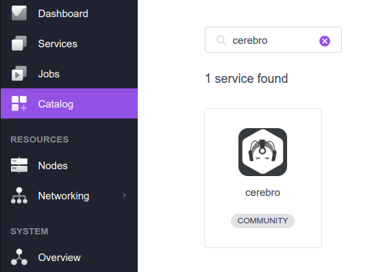
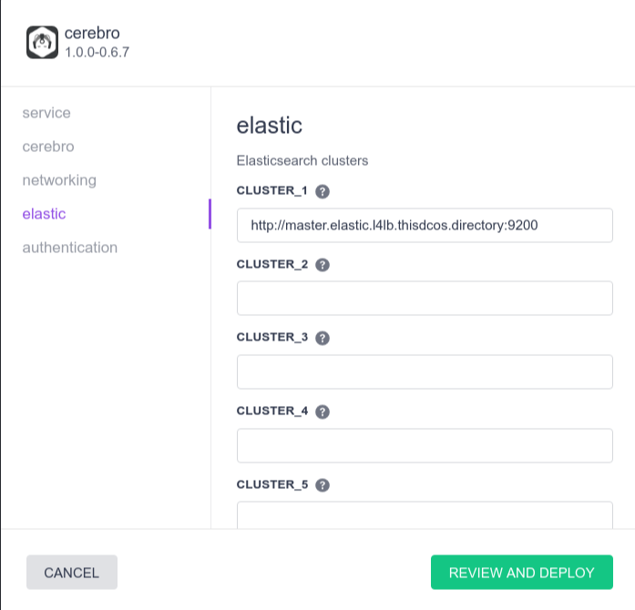
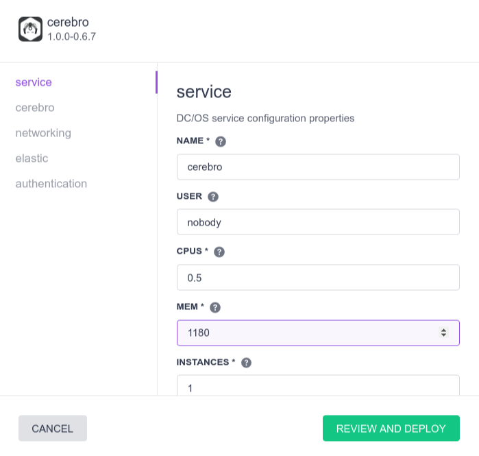
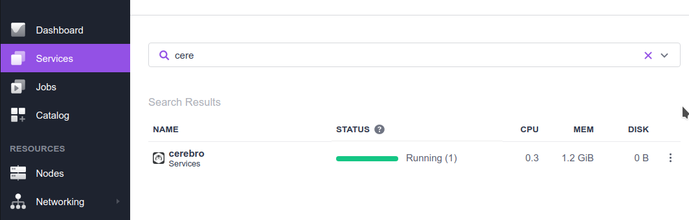
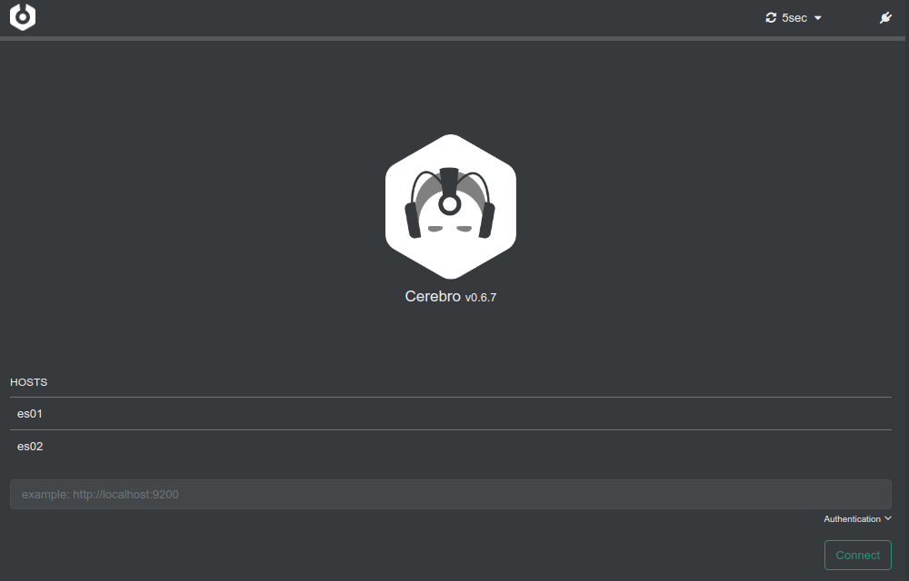
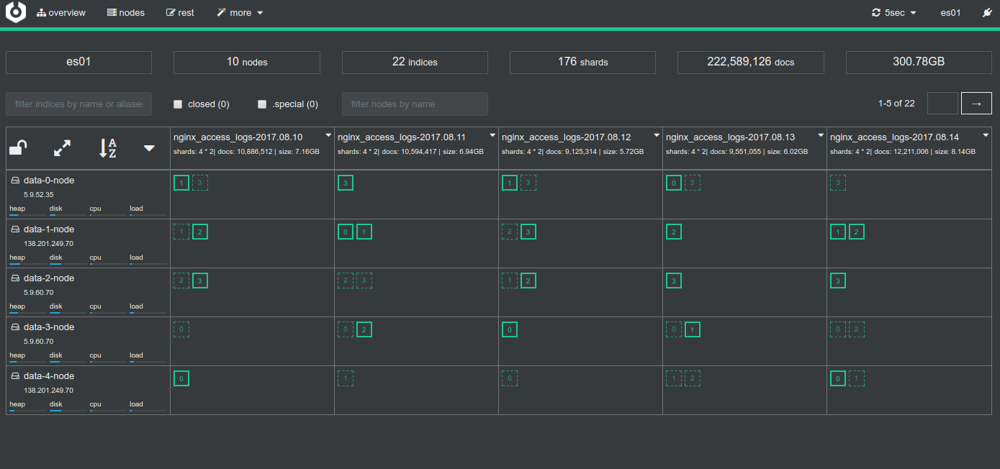

# How to use Cerebro on DC/OS

[Cerebro](https://github.com/lmenezes/cerebro) is a web admin tool for managing Elastic clusters.

- Estimated time for completion: 5 minutes
- Target audience: Elastic clusters administrators.
- Scope: Install and use Cerebro.

**Table of Contents**:

- [Prerequisites](#prerequisites)
- [Install Cerebro](#install-cerebro)
- [Cerebro configuration](#cerebro-configuration)
- [Using Cerebro](#using-cerebro)
- [Uninstall Elasticsearch](#uninstall-cerebro)

## Prerequisites

- A running DC/OS 1.10 cluster with least one agent with 0.5 CPU, 1.5 GB RAM and 1 GB of disk space available.

## Install Cerebro

To install Cerebro, you can either use DC/OS CLI:

```bash
$ dcos package install cerebro
```

optionally you can provide extra options:
```
$ dcos package install cerebro --options=cerebro.json
```
where `cerebro.json` would contain advanced configuration, with e.g. predefined Elastic clusters:
```
{
  "service": {
    "name": "cerebro",
    "user": "nobody",
    "cpus": 0.5,
    "mem": 1180,
    "instances": 1,
    "heap": 1024
  },
  "elastic": {
    "cluster_1": "http://master.es01.l4lb.thisdcos.directory:9200",
    "cluster_2": "http://master.es02.l4lb.thisdcos.directory:9200"
  },
  "authentication": {
    "type": "none",
  }
}
```

Or install from Cerebro from DC/OS Catalog (Universe):



If you hit the "Configure" button you can adjust Cerebro's configuration the same way as with CLI. You can define up to 5 Elastic clusters (later you can define even more):



All configuration options can be altered later, thus you don't have to worry about this now.



After pressing "Deploy" button, you should see the Cerebro service running via the `Services` tab of the DC/OS UI:



## Using Cerebro

We can use the DC/OS [Admin Router](https://dcos.io/docs/1.10/developing-services/#-a-name-adminrouter-a-admin-router-and-web-interface-integration) to provide access to the Cerebro UI: use the URL `http://$DCOS_DASHBOARD/service/cerebro/` and replace `$DCOS_DASHBOARD` with the URL of your DC/OS UI:



Optionally you can access Cerebro via Marathon-LB, in that case it might be good idea to configure some authentication mechanism.



## Cerebro configuration

Cerebro offers various configuration options exposed via `ENV` variables. You can pre-define several Elastic clusters by using `ES_{n}` variables. For each cluster you can define following:

* `ES_1` URI to master node, e.g. `http://localhost:9200`
* `ES_1_NAME` human readable name of cluster (shown on Cerebro home page)
* `ES_1_USER` username
* `ES_1_PASS` password

### LDAP authentication

In order to authenticate user via LDAP set `CEREBRO_AUTH` to `ldap`. And define following variables with approprite value:

* `CEREBRO_LDAP_URL` connection URL, e.g. `ldap://host:port`
* `CEREBRO_LDAP_BASE` LDAP base `ou=active,ou=Employee`
* `CEREBRO_LDAP_METHOD` `simple`
* `CEREBRO_LDAP_DOMAIN` `example.com`


## Uninstall Cerebro

To uninstall Cerebro:

```bash
$ dcos package uninstall cerebro
```

## Further resources

1. [Cerebro project](https://github.com/lmenezes/cerebro)
1. [Cerebro DC/OS packing](https://github.com/deric/dcos-cerebro)

