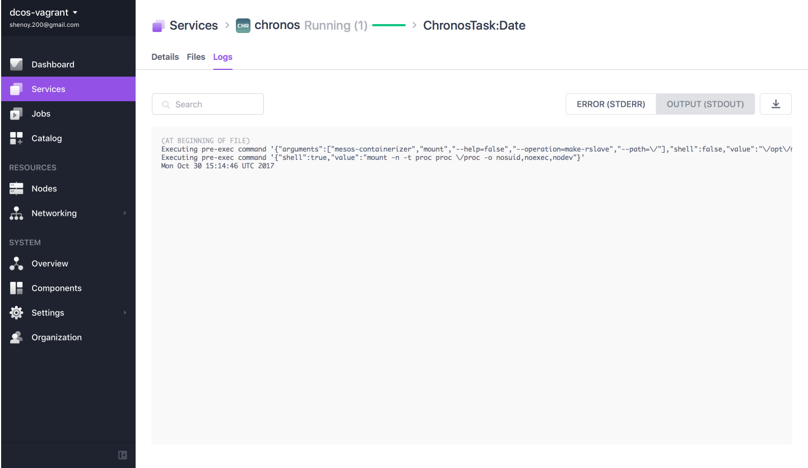

# How to use Chronos on DC/OS

Note: DC/OS now includes a built-in [job scheduler](https://dcos.io/docs/1.10/usage/jobs/), which is the preferred way to schedule batch jobs.

[Chronos](http://mesos.github.io/chronos/) is still available on DC/OS, representing the original way to run batch jobs. It is a highly-available, distributed job scheduler, providing the a robust way to run batch jobs. Chronos schedules jobs across the DC/OS cluster and manages dependencies between jobs in an intelligent way.


- Estimated time for completion: 15 minutes
- Target audience:
  - Data engineers
  - Data scientists
  - DevOps engineers
- Scope: Setup and usage of a batch scheduler for DC/OS.

**Table of Contents**:

- [Prerequisites](#prerequisites)
- [Install Chronos](#install-chronos)
- [Create a scheduled job](#create-a-scheduled-job)
- [Uninstall Chronos](#uninstall-chronos)

## Prerequisites

- A running DC/OS 1.10 cluster with 1 nodes with at least 2.5GB of RAM and 2 CPUs available in the cluster.
- [DC/OS CLI](https://dcos.io/docs/1.10/usage/cli/install/) installed.

## Install Chronos

From Packages in Universe menu, click on Chronos install button:


And wait for success message:


Alternatively, you can install from the command line, entering this command:

```bash
$ dcos package install chronos
By Deploying, you agree to the Terms and Conditions https://mesosphere.com/catalog-terms-conditions/#certified-services
We recommend a minimum of one node with at least 1 CPU and 2GB of RAM available for the Chronos Service.
Continue installing? [yes/no] yes
Installing Marathon app for package [chronos] version [2.5.0]
Chronos DCOS Service has been successfully installed!

	Documentation: http://mesos.github.io/chronos
	Issues: https://github.com/mesos/chronos/issues
```

Note that you can specify a JSON configuration file along with the Chronos installation command to customize the setup, like so: `dcos package install chronos --options=<config_file>`. For more information, see the DC/OS CLI [command reference](https://dcos.io/docs/1.10/usage/cli/command-reference/).

Next, validate that Chronos is successfully installed. Go to the `Services` tab of the DC/OS UI and check if Chronos shows up in the list as `Healthy`:


In addition, run this command to view installed services:

```bash
$ dcos package list
NAME     VERSION  APP       COMMAND  DESCRIPTION                                                
chronos  2.5.0    /chronos  ---      A fault tolerant job scheduler for Mesos which handles...
```

## Create a scheduled job

Open the Chronos UI from the DC/OS UI via the `Open Service` button and click the `New Job` link to bring up the form for creating jobs.


Next, fill in the following values in the form:

- `NAME`: "Date"
- `SCHEDULE`: Enter `T10S` in the `P` field
- `COMMAND`: `/bin/date`


Note that Chronos uses [ISO 8601 Interval Notation](https://en.wikipedia.org/wiki/ISO_8601#Time_intervals) to describe job schedules, so `T10S` means run this job every 10 seconds.

Now click the `Create` button at the top of the form to submit the job.

Let's verify that our job ran successfully. Run the following CLI command to view all completed tasks:

```bash
$ dcos task --completed ct*
NAME              HOST            USER  STATE  ID                        MESOS ID                                 
ChronosTask:Date  192.168.65.111  root    F    ct:1509055284000:0:Date:  f99ad98b-cc45-42c8-b7a2-d4c96ade99f4-S2  
ChronosTask:Date  192.168.65.111  root    F    ct:1509055344000:0:Date:  f99ad98b-cc45-42c8-b7a2-d4c96ade99f4-S2  
ChronosTask:Date  192.168.65.111  root    F    ct:1509055354000:0:Date:  f99ad98b-cc45-42c8-b7a2-d4c96ade99f4-S2  
ChronosTask:Date  192.168.65.111  root    F    ct:1509055364000:0:Date:  f99ad98b-cc45-42c8-b7a2-d4c96ade99f4-S2  
ChronosTask:Date  192.168.65.111  root    F    ct:1509055374000:0:Date:  f99ad98b-cc45-42c8-b7a2-d4c96ade99f4-S2  
ChronosTask:Date  192.168.65.111  root    F    ct:1509055384000:0:Date:  f99ad98b-cc45-42c8-b7a2-d4c96ade99f4-S2  
ChronosTask:Date  192.168.65.111  root    F    ct:1509055394000:0:Date:  f99ad98b-cc45-42c8-b7a2-d4c96ade99f4-S2  
ChronosTask:Date  192.168.65.111  root    F    ct:1509055404000:0:Date:  f99ad98b-cc45-42c8-b7a2-d4c96ade99f4-S2  
ChronosTask:Date  192.168.65.111  root    F    ct:1509055414000:0:Date:  f99ad98b-cc45-42c8-b7a2-d4c96ade99f4-S2  
```
Note that the `--completed` argument includes tasks that have completed their execution. Chronos uses the prefix `ct` for all its tasks, so `ct*` filters out Chronos tasks.

To view the output of a task, copy one of the values under the `ID` column in the output of the previous command and use it as the argument to `dcos task log`:

```bash
$ dcos task log --completed ct:1509055574000:0:Date:  
Executing pre-exec command '{"arguments":["mesos-containerizer","mount","--help=false","--operation=make-rslave","--path=\/"],"shell":false,"value":"\/opt\/mesosphere\/active\/mesos\/libexec\/mesos\/mesos-containerizer"}'
Executing pre-exec command '{"shell":true,"value":"mount -n -t proc proc \/proc -o nosuid,noexec,nodev"}'
```

You can also see the status of the job you entered in the Chronos UI:


Or in the Services > chronos log output in DC/OS UI:



## Uninstall Chronos

To uninstall Chronos enter the following command:

```bash
$ dcos package uninstall chronos
WARNING: This action cannot be undone. This will uninstall [chronos] and delete all of its persistent data (logs, configurations, database artifacts, everything).
Please type the name of the service to confirm: chronos
Uninstalled package [chronos] version [2.5.0]
The Chronos DCOS Service has been uninstalled and will no longer run.
Please follow the instructions at https://docs.mesosphere.com/service-docs/chronos/#uninstall to clean up any persisted state.
```

Finally, to get rid of all traces of Chronos in ZooKeeper, follow the steps outlined in the [framework cleaner](https://docs.mesosphere.com/1.10/usage/managing-services/uninstall/#framework-cleaner).
