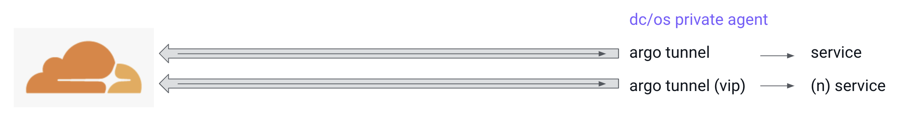
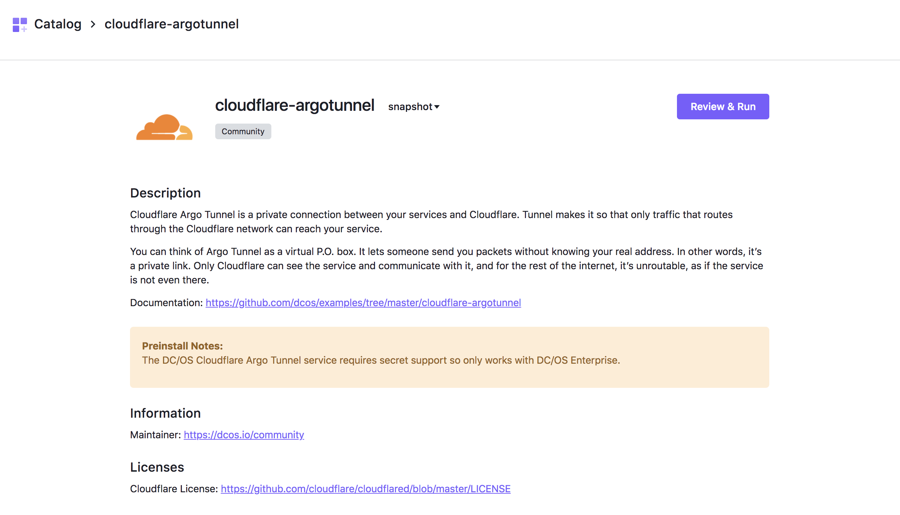
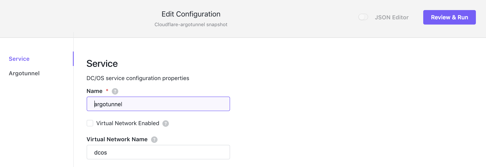
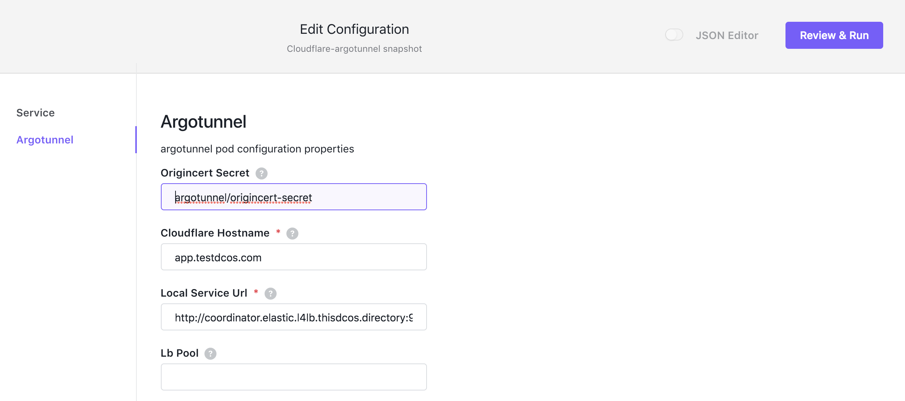
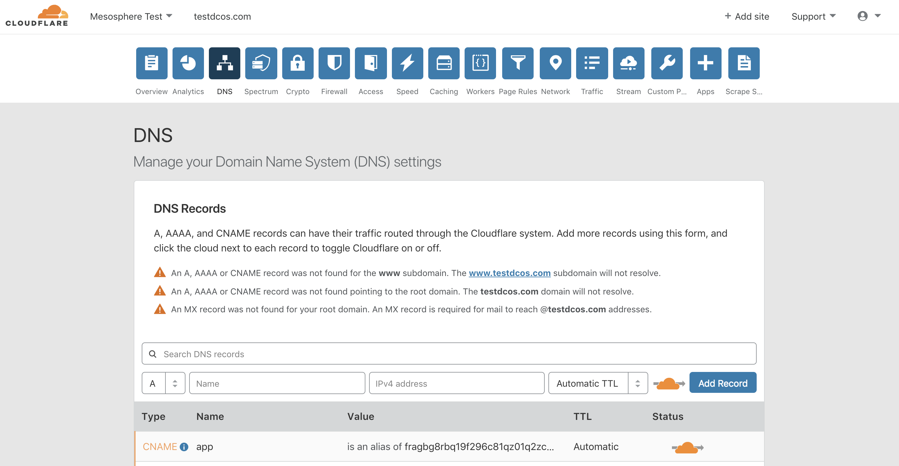
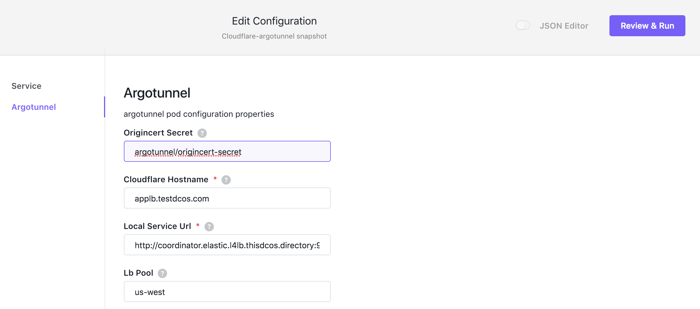
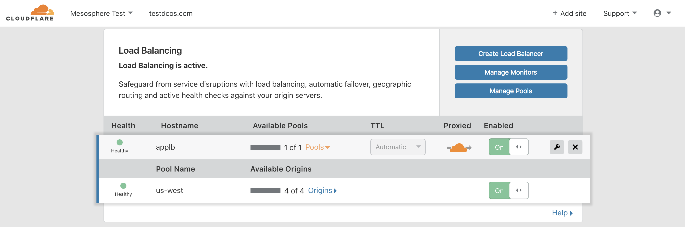
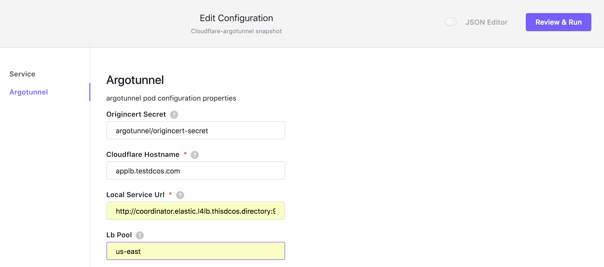
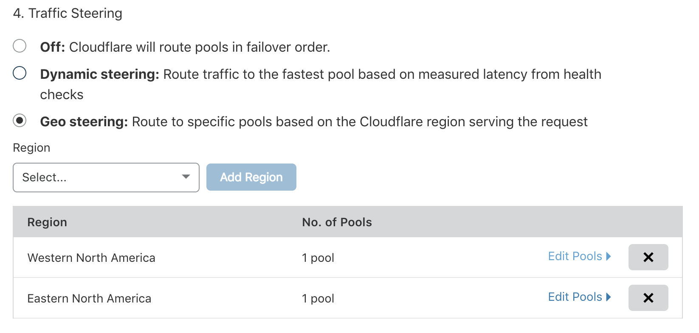

# DC/OS Cloudflare Argo Tunnel Service Guide

**Note: Work in progress, this service hasn't been released**

# Overview

[Cloudflare](https://www.cloudflare.com/) Argo Tunnel is the fastest way to make services that run on DC/OS private agents, that are only bound to the DC/OS interal network, accessible over the public internet. When you launch the tunnel for your service, it creates persistent outbound connections to the 2 closest Cloudflare PoPs over which the entire Cloudflare network will route through to reach the service associated with the tunnel. There is no need to configure DNS, update a NAT configuration, or modify firewall rules (connections are outbound). The argo tunnel exposed service gets all the QOS offered by the Cloudflare network, e.g. DDoS protection, Crypto, Firewall, WAF, Access, ... .



**Note:** The DC/OS Cloudflare Argo Tunnel Service only works with DC/OS Enterprise since it requires the secret capability.


# Quick Start

## Prereqs

* Cloudflare account
* Argo Tunnel enabled, its a priced feature, details you can find [here](https://www.cloudflare.com/plans/)
* Cloudflare certificate, used by argo tunnel to authenticate to cloudflare edge, here the [steps](https://developers.cloudflare.com/argo-tunnel/quickstart/)


## Install

First we use the `DC/OS cli` to create a secret to store the cloudflare certificate. The default name of the secret is `argotunnel/origincert-secret`.
```
dcos security secrets create -f ~/.cloudflared/cert.pem argotunnel/origincert-secret
```

**Note:** In the following we use elasticsearch as our target service, but you can use any of your favorite services as a target to play with argo tunnel.

Next we create an instance picking `cloudflare-argotunnel` from the DC/OS catalog.



The argo tunnel service has two configuration section, the following shows section to configure the general service aspects.



In the next two steps we show how you use the argotunnel configuration section to create a `dns record` or a `load balancer`.

### DNS confuguration

For creating a DNS record you have to fill in two fields, the `cloudflare hostname` and the `local service url`.


Once the service runs you will see the following in the `cloudflare console DNS section`.


Go to to your browser and use your new `hostname`.
```
https://app.testdcos.com/_cluster/health?pretty
```

Since we use elasticsearch in your sample you will see the following.
```
{
  "cluster_name" : "elastic",
  "status" : "green",
  "timed_out" : false,
  "number_of_nodes" : 5,
  "number_of_data_nodes" : 1,
  ...
}
```

### Load Balancer configuration

In the 2nd sample we have two DC/OS clusters one on the west coast and one on the east coast. They can be with different cloud providers.

**Note:** Using an elastic search cluster in each we call one `elatic-west`, and the other one `elastic-east`.

We start of in the west coast cluster.

For creating a Load Balancer you have to fill in three fields, the `cloudflare hostname`, `local service url`, and a `load balancer pool name`.


Once the service runs you will see the following in the `cloudflare console Traffic section`. Don't forget to add a health check for the 1st pool.


Next we sitch to the east coast DC/OS cluster.

Again we configure `cloudflare hostname`, `local service url`, and a `load balancer pool name`. The values for the 1st two are the same, but for the LB pool this time we enter `us-east`


Once the service runs you will see the following in the `cloudflare console Traffic section`. Don't forget to add a health check for the 2nd pool.


Lastly we configure `GEO steering` for the load balancer


Go to to your browser and use your new `hostname`.
```
https://applb.testdcos.com/_cluster/health?pretty
```

Depending on from where geographically you make the call you will get the response either  from the west or east cluster.
```
{
  "cluster_name" : "elastic-west",
  "status" : "green",
  "timed_out" : false,
  "number_of_nodes" : 5,
  "number_of_data_nodes" : 1,
  ...
}
```
