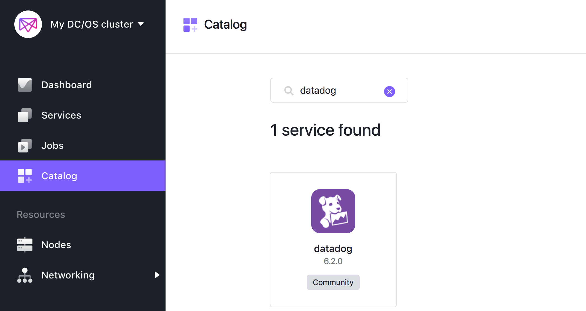
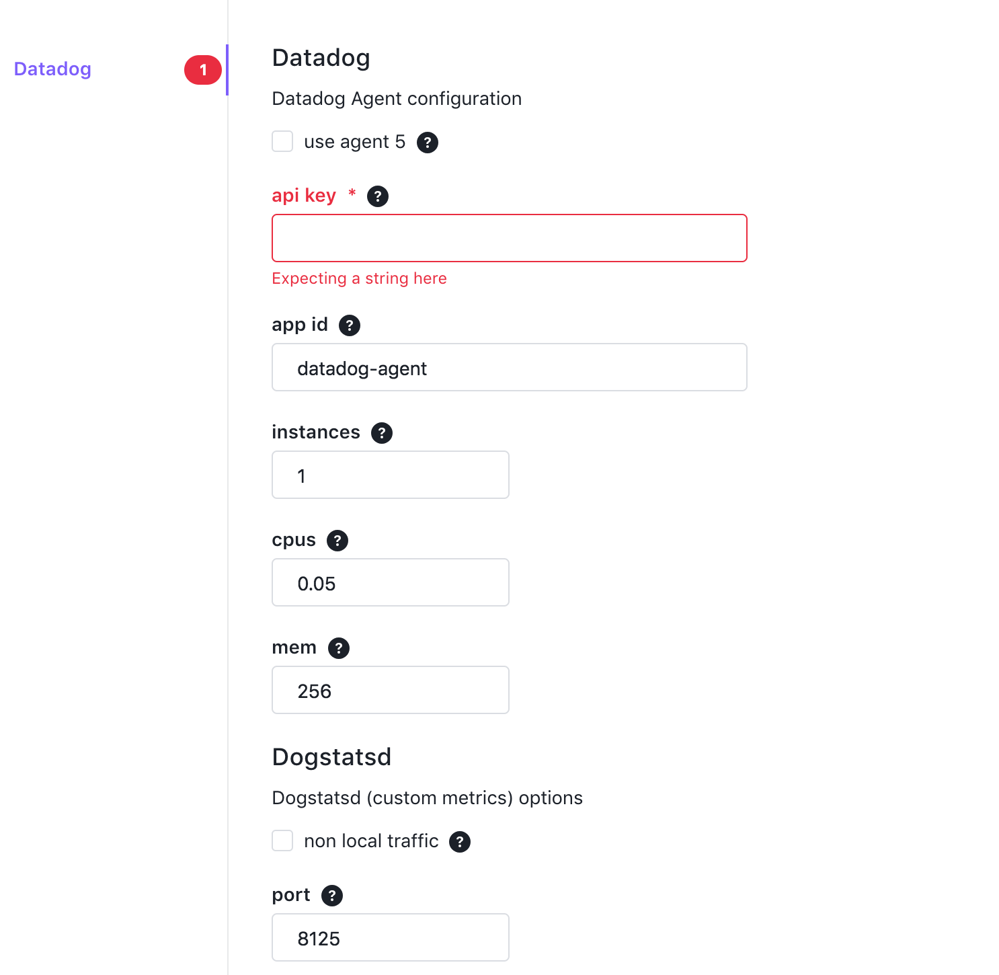
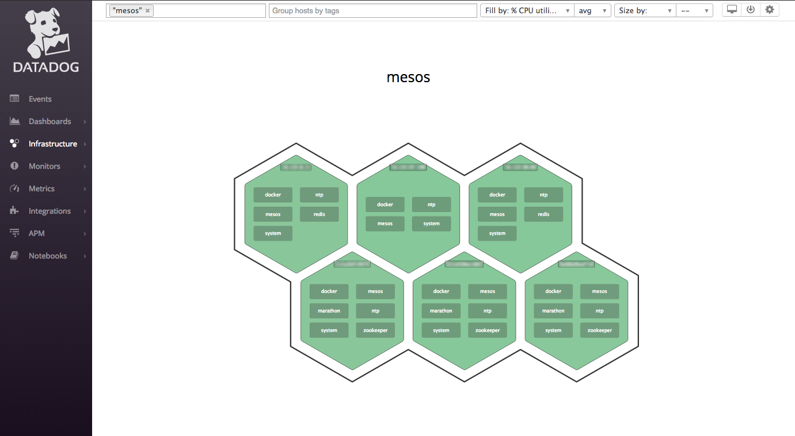
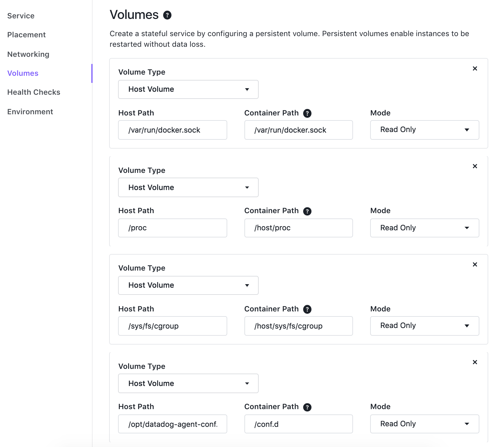

# How to use Datadog with DC/OS

[Datadog][datadog] is a hosted platform for monitoring infrastructure and applications. Datadog has built-in integrations for collecting health and performance data from more than 150 technologies for aggregation, analytics, graphing, and alerting.

DC/OS makes it very easy to deploy Datadog across all Mesos agent nodes in the cluster, and also configures Datadog to automatically collect metrics from Docker, Mesos, and other services running on those nodes.

* Estimated time for completion: 10-15 minutes
* Target audience: Anyone interested in monitoring a containerized environment
* Scope:
  * [Configure and install](#install-datadog) Datadog on your agent and master nodes
  * [Monitor](#monitor-metrics-from-your-dcos-cluster) system metrics, Docker, and Mesos in Datadog
  * Optional: [Use autodiscovery](#use-autodiscovery-to-monitor-additional-services) to automatically monitor services running on DC/OS

## Prerequisites

* A running DC/OS 1.11 cluster
* A Datadog account (free trial account available [here][signup])

## Install Datadog

You can deploy Datadog across all your agent nodes using [the DC/OS web interface](#installation-using-the-ui) or [the DC/OS CLI](#installation-using-the-cli). Datadog will automatically begin picking up metrics from both Mesos and Docker on your agent nodes.

Whether you use the DC/OS web UI or the command line interface to deploy Datadog, you will need to provide two parameters:

1. Your Datadog API key (available [here][api-key])
2. The number of instances (how many agent nodes you have in your cluster)

### Installation using the UI

You can install the Datadog package using the DC/OS web UI by clicking on the Universe tab and searching for "datadog":



Click the "Review & Run" button, and enter the two parameters mentioned above (API key and number of instances):



Once you install the Datadog package on the agent nodes, you can move on to [installing Datadog](#installation-on-master-nodes) on the master nodes.

### Installation using the CLI

To install Datadog using the [CLI][cli], first create a file called options.json with the following fields:

```json
{
  "datadog": {
    "api_key": $YOUR_API_KEY,
    "instances": $NUMBER_OF_INSTANCES
  }
}
```

Then run the install command:

```bash
dcos package install datadog --options=options.json
```

Once you install the Datadog package on the agent nodes, you can move on to [installing Datadog](#installation-on-master-nodes) on the master nodes.

### Installation on master nodes

Datadog also collects specialized metrics from Mesos master nodes. When you install Datadog on your master nodes, Datadog will automatically begin collecting and aggregating metrics from ZooKeeper and Marathon, in addition to monitoring Mesos and Docker (as is the case on agent nodes).

To install Datadog on Linux, log in to the leader node with:

```bash
dcos node ssh --master-proxy --leader
```

Then run the command below, providing your [Datadog API key][api-key] (see [the docs][dd-agent-docs] for an alternative command for Amazon Linux):

```bash
docker run -d --name datadog-agent \
  -v /var/run/docker.sock:/var/run/docker.sock:ro \
  -v /proc/:/host/proc/:ro \
  -v /sys/fs/cgroup/:/host/sys/fs/cgroup:ro \
  -e DD_API_KEY=$YOUR_API_KEY \
  -e MESOS_MASTER=yes \
  -e MARATHON_URL=http://leader.mesos:8080 \
  datadog/agent:latest
```

## Monitor metrics from your DC/OS cluster

Once you install Datadog, you can verify that your nodes are properly reporting metrics by opening up Datadog and viewing metrics from your nodes. You should be able to find your nodes on [the Datadog host map][host-map]. You can filter the map by hostname to spot check individual nodes or search "mesos" to drill down to your hosts running Mesos.



You'll also see metrics from your cluster flowing into the [Mesos dashboard][mesos-dash] and the [Docker dashboard][docker-dash] in Datadog, so you can immediately start to track your cluster resources and how they are being consumed. Similarly, you will see [ZooKeeper metrics][zk-dash] flowing into Datadog from your master nodes.

You can then build custom dashboards using any of the metrics or events being reported to Datadog; set alerts on performance metrics or task failures; or use the host map to look for hotspots in your infrastructure.

## Use Autodiscovery to monitor additional services

### Automatically monitored services

When you install the Datadog package on DC/OS, or use the command above to install Datadog on your master nodes, [Autodiscovery][autodiscovery] is enabled by default. This feature automatically detects which containerized services are running on which nodes, and configures the Datadog Agent on each node to connect to those services and report metrics back to Datadog.

For certain services, such as Redis, Elasticsearch, and Apache server (httpd), the Datadog Agent can connect without any additional setup in most cases. (See the [Autodiscovery docs][autodiscovery] for the full list.) If you're running one of those services, you should start seeing metrics in Datadog within minutes (on [the Redis dashboard][redis-dash], for instance).

### Monitoring services with custom configurations

For other services, you can create monitoring configuration templates that Datadog will apply whenever it detects the service running on a node in your cluster. For production use, you will likely want to [use a key-value store][autodiscovery] such as etcd or Consul to manage these templates for you. To demonstrate the basics of service discovery, though, here we'll walk through a simple example using configuration templates stored in a directory on the host that is mounted by the Datadog Agent container.

#### Create a config template

On your agent nodes, create a directory to house your custom configs and create a YAML file for the service you want to monitor (drawing on [the example YAML templates][yamls] that ship with the Datadog Agent). In this example we'll set up service discovery for MYSQL, which requires a password to access database metrics:

```bash
# get a node ID
dcos node
# connect to a node selected from the previous command's output
dcos node ssh --master-proxy --mesos-id=225ca9ef-f1bc-43c1-bf31-b9330f89bb50-S0
# create a config folder for the mysql integration
mkdir -p /opt/datadog-agent-conf.d/mysql.d/
# create a config file for AutoDiscovery in this folder
touch /opt/datadog-agent-conf.d/mysql.d/auto_conf.yaml
```

Open your newly created `auto_conf.yaml` file and paste in [the basic config][mysql-docs] template from the Datadog Agent, then add a `ad_identifiers` section at the top to tell Datadog which Docker images this template applies to (for this example we'll assume that your MySQL database already has [a `datadog` user created][mysql-docs] with the necessary permissions):

```yaml
ad_identifiers:
  - mysql

init_config:

instances:
  - server: "%%host%%"
    user: datadog
    pass: password_for_datadog_user_in_db

```

#### Apply the config template

In order to apply your newly created config template, you need to mount the config files on the DC/OS agent node into the Datadog container running on that host.

To pass custom volumes to the Datadog service you will need to create the service from scratch as Universe packages don't allow changing mounted volumes. In this new service, under "Volumes" add the following volume on top of the default ones (as shown on the image below):

* Container path: `/conf.d`
* Host path: `/opt/datadog-agent-conf.d`
* Mode: Read Only



Deploy the custom Datadog service. You can then verify that the configuration is correct by running the Datadog `status` command on your agent node. For MySQL the command and output should look something like the snippet below:

```bash
[agent-01]# docker ps
CONTAINER ID        IMAGE                                                             COMMAND                  CREATED             STATUS              PORTS                                                                NAMES
d37bf53a57d1        datadog/agent:latest   "/init"             3 hours ago         Up 3 hours (healthy)   8125/udp, 8126/tcp   datadog-agent
22bb4ef7de7e        mysql:5.7.12                                                      "docker-entrypoint.sh"   22 minutes ago      Up 22 minutes       0.0.0.0:3306->3306/tcp                                               mesos-xxx
[agent-01]# docker exec d37bf53a57d1 agent status

...
    mysql
    -----
      Total Runs: 757
      Metrics: 58, Total Metrics: 43906
      Events: 0, Total Events: 0
      Service Checks: 1, Total Service Checks: 757
      Average Execution Time : 16ms

    mesos_slave
    ------------
      Total Runs: 757
      Metrics: 34, Total Metrics: 25738
      Events: 0, Total Events: 0
      Service Checks: 1, Total Service Checks: 757
      Average Execution Time : 16ms

    disk
    ----
      Total Runs: 757
      Metrics: 130, Total Metrics: 98410
      Events: 0, Total Events: 0
      Service Checks: 0, Total Service Checks: 0
      Average Execution Time : 73ms

    docker
    ------
      Total Runs: 757
      Metrics: 16, Total Metrics: 12110
      Events: 0, Total Events: 2
      Service Checks: 1, Total Service Checks: 757
      Average Execution Time : 6ms
...
```

Assuming that your configuration template is working and Datadog is able to connect to your newly added service, you can then [head over to the Datadog app][dd-app] to graph your metrics, build dashboards, and set alerts.

[datadog]: https://www.datadoghq.com/
[signup]: https://app.datadoghq.com/signup
[api-key]: https://app.datadoghq.com/account/settings#api
[dd-agent-docs]: https://github.com/DataDog/docker-dd-agent
[cli]: https://github.com/dcos/dcos-cli
[host-map]: https://app.datadoghq.com/infrastructure/map
[mesos-dash]: https://app.datadoghq.com/screen/integration/mesos
[docker-dash]: https://app.datadoghq.com/screen/integration/docker
[zk-dash]: https://app.datadoghq.com/screen/integration/zookeeper
[mysql-docs]: http://docs.datadoghq.com/integrations/mysql/
[redis-dash]: https://app.datadoghq.com/screen/integration/redis
[autodiscovery]: https://docs.datadoghq.com/guides/autodiscovery/
[yamls]: https://github.com/DataDog/integrations-core
[dd-app]: https://app.datadoghq.com
