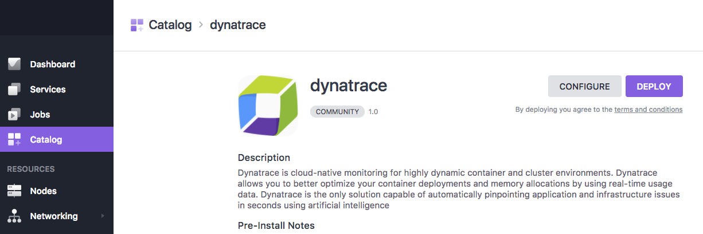
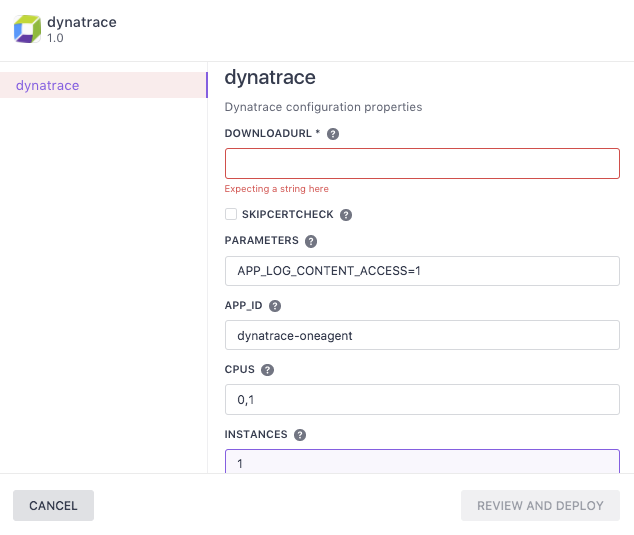
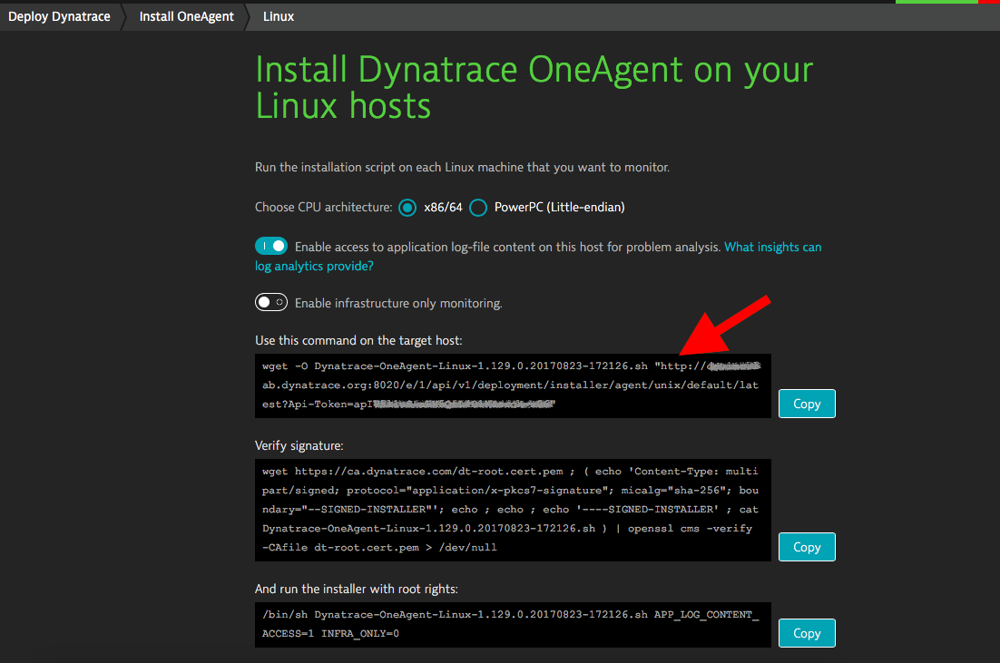

# How to use Dynatrace with DC/OS

[Dynatrace][dynatrace] is cloud-native monitoring for highly dynamic cluster and application environments. Dynatrace allows you to track performance of applications and microservices within containers and gives you deep visibility into your container landscape. Dynatrace is the only solution capable of automatically pinpointing application and infrastructure issues in seconds using artificial intelligence.

* Estimated time for completion: 5 minutes
* Target audience: Cluster operators and application teams
* Scope: Deploy Dynatrace for full-stack monitoring

## Prerequisites

* A running DC/OS 1.10 cluster
* A Dynatrace environment (try for free [here][freetrial])

## Install Dynatrace

To monitor cluster nodes and applications running in DC/OS simply deploy Dynatrace OneAgent to agent nodes by means of the DC/OS Dynatrace package. Dynatrace will automatically start monitoring of the nodes and applications.

You will need to provide two parameters:

1. The Installer URL of your Dynatrace environment
2. The number of agent nodes in your cluster

### Installation on DC/OS agent nodes

Go to the DC/OS universe/catalog web UI and search for "dynatrace". Click the tile and select "Configure" to enter the required parameters for connecting with Dynatrace.

Click the tile and select "Configure" to enter the required parameters for connecting with Dynatrace.

1. Get your Dynatrace OneAgent Download URL from your Dynatrace environment

2. Set the number of instances to the number of DC/OS agent nodes

### Installation on DC/OS master nodes

Marathon doesn't allow you to deploy applications to master nodes (except for nodes that are tagged as both master and agent). This is why you must manually install Dynatrace OneAgent on all DC/OS master nodes that aren't additionally configured as DC/OS agents. Please use the default [Linux installer][linuxinstaller] for this.

## Additional resources

The Dynatrace DC/OS integration is supported by Dynatrace.
In case of issues please consult Dynatrace Support.

* Guideline to deploy Dynatrace OneAgent as [Marathon service][marathoninstaller]
* Guideline to deploy Dynatrace OneAgent on [Linux hosts][linuxinstaller]

[dynatrace]: https://www.dynatrace.com/
[freetrial]: https://www.dynatrace.com/trial/
[linuxinstaller]: https://help.dynatrace.com/get-started/installation/how-do-i-install-dynatrace-oneagent/
[marathoninstaller]:  https://help.dynatrace.com/infrastructure/containers/how-do-i-run-oneagent-with-mesos-marathon/
