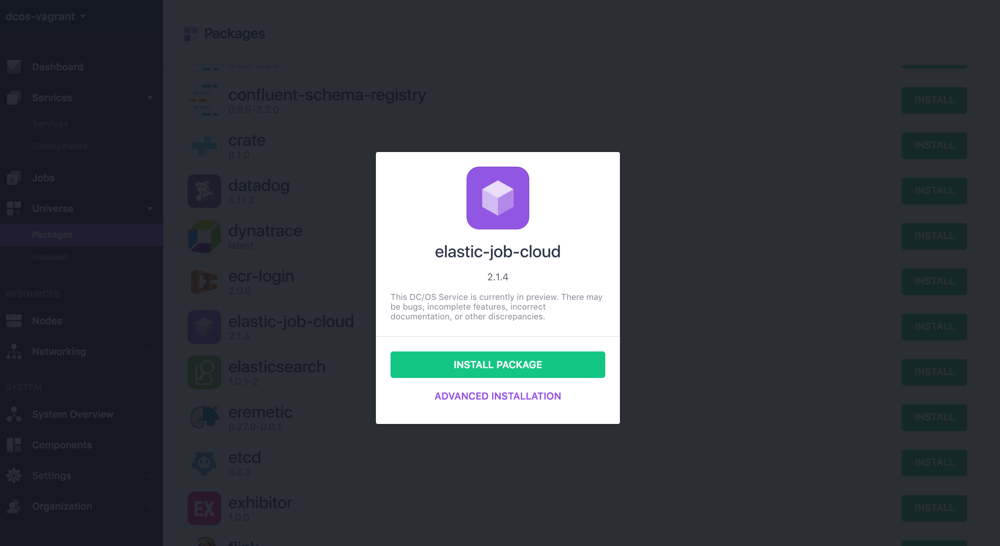
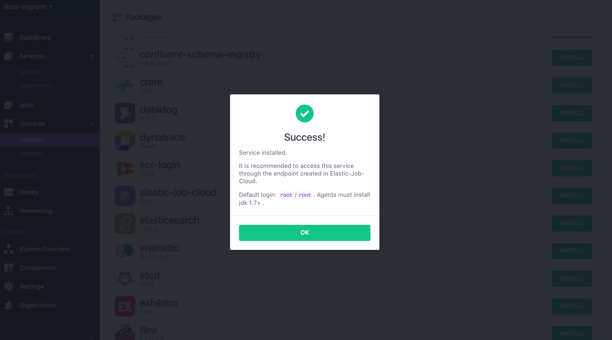
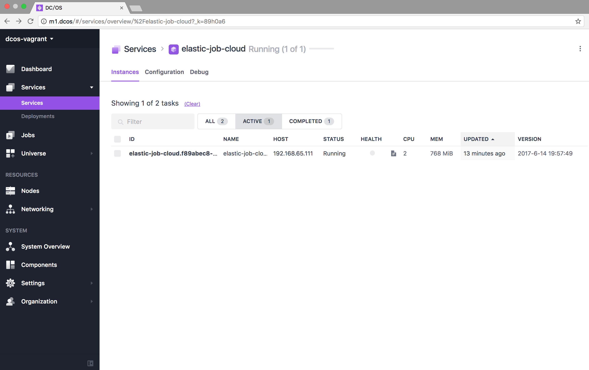
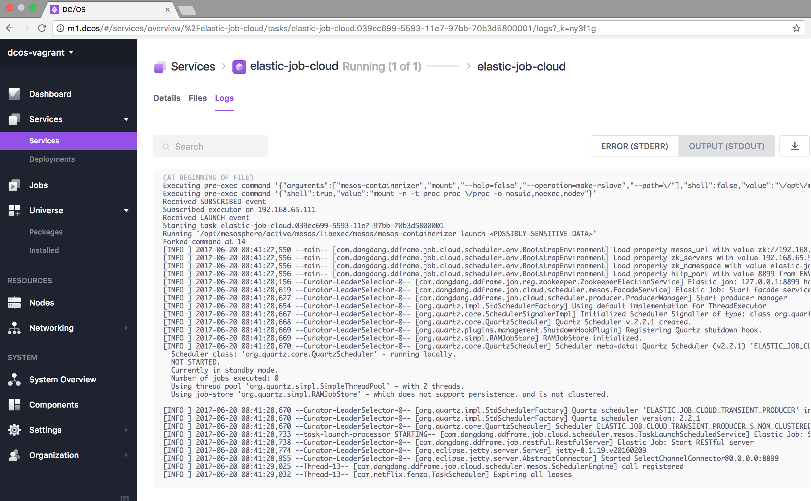
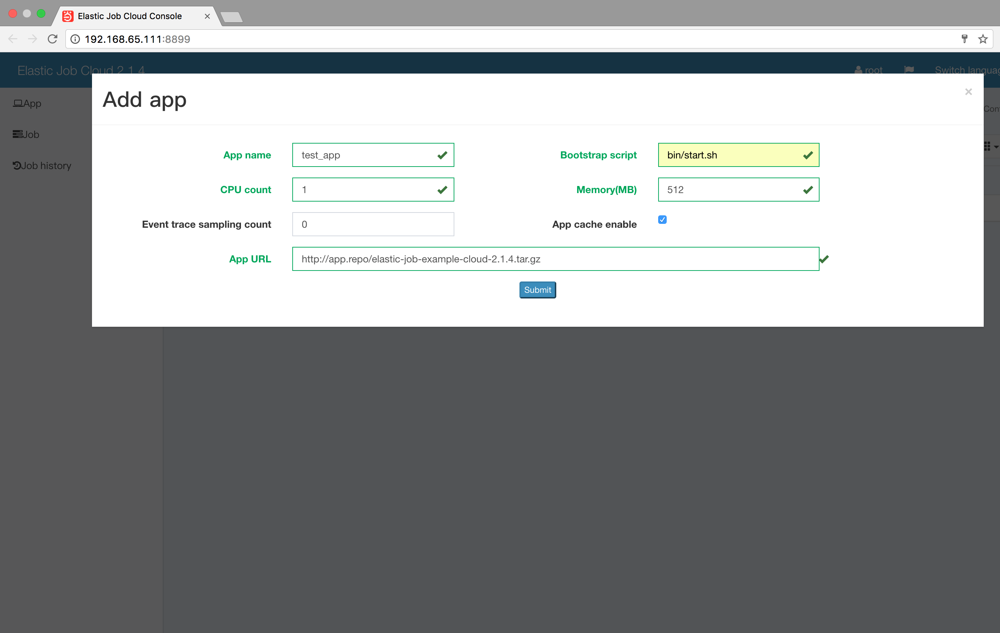
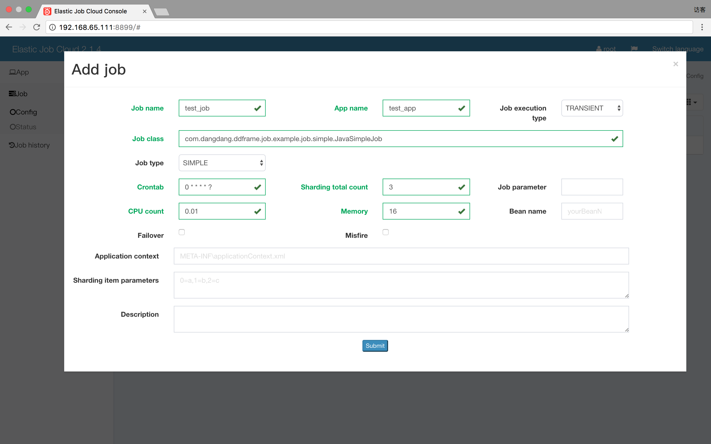
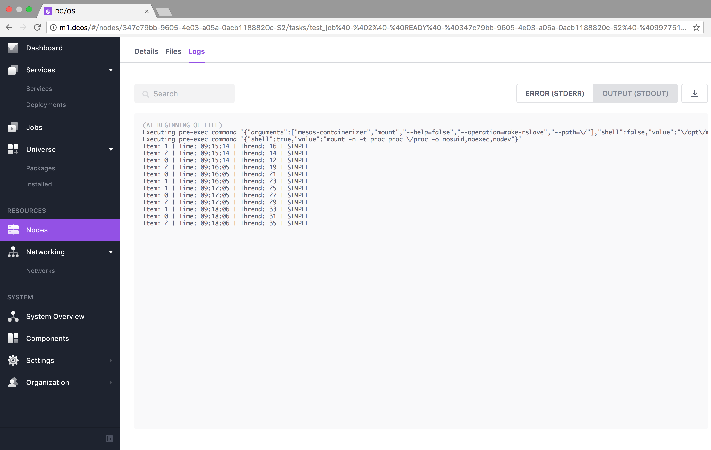

# How to use Elastic Job Cloud on DC/OS

[Elastic-Job-Cloud](https://github.com/dangdangdotcom/elastic-job/) is a distributed scheduled job cloud solution designed with HA and fault-tolerance in mind. It focuses on horizontal scaling, and provides transient and daemon jobs, event and schedule based job triggers, job dependencies, and job history..

- Estimated time for completion: 10 minutes
- Target audience: Developer and appops that want use distributed schedule job.
- Scope: Install and usage of a distributed scheduled job scheduler for DC/OS.

**Table of Contents**:

- [Prerequisites](#prerequisites)
- [Install Elastic Job Cloud](#install-elastic-job-cloud)
- [Use Elastic Job Cloud](#use-elastic-job-cloud)
- [Uninstall Elastic Job Cloud](#uninstall-elastic-job-cloud)

## Prerequisites

- A running DC/OS 1.9 cluster with 1 nodes with at least 256MB of RAM and 1 CPUs available in the cluster.
- [DC/OS CLI](https://dcos.io/docs/1.9/usage/cli/install/) installed.

## Install Elastic Job Cloud

From Packages in Universe menu, find `elastic-job-cloud` and click install button:



Note:
The configuration like mesos.master is just a variable, you should replace it with a real Zookeeper server ip address and port , such as 192.168.1.1:2181.

And wait for success message:



Alternatively, you can install from the command line, entering this command:

```bash
$ dcos package install elastic-job-cloud
This DC/OS Service is currently in preview. There may be bugs, incomplete features, incorrect documentation, or other discrepancies.
Continue installing? [yes/no] yes
Installing Marathon app for package [elastic-job-cloud] version [2.1.4]
Service installed.

It is recommended to access this service through the endpoint created in Elastic-Job-Cloud.

Default login: `root`/`root`. Agents must install jdk 1.7+ .
```

Next, validate that elastic-job-cloud is successfully installed. Go to the `Services` tab of the DC/OS UI and check if elastic-job-cloud shows up in the list:





In addition, run this command to view installed services:

```bash
$dcos package list
NAME               VERSION  APP                COMMAND   DESCRIPTION                        
elastic-job-cloud  2.1.4    /elastic-job-cloud  ---      Elastic-Job-Cloud is a distributed scheduled job cloud solution designed with HA and fault-tolerance in mind. It focuses on horizontal scaling, and provides transient and daemon jobs, event and schedule based job triggers, job dependencies, and job history.  
```

## Use Elastic Job Cloud

Open the Elastic Job Cloud UI from the DC/OS UI via the `Open Service` button and flowing these steps for creating app and job.



Note: app url needs to upload your business job tar file to an application server which can be downloaded by DC/OS.



Finally, verify that our job ran successfully. Run the following CLI command to view all completed tasks:

```bash
$ dcos task --completed
NAME                                                            HOST            USER    STATE   ID                        
test_job@-@0@-@READY@-@347c79bb-9605-4e03-a05a-0acb1188820c-S2  192.168.65.111  root    F       test_job@-@0@-@READY@-@347c79bb-9605-4e03-a05a-0acb1188820c-S2@-@78ad098c-966c-45ad-ac7f-b36fccbb0085  
test_job@-@0@-@READY@-@347c79bb-9605-4e03-a05a-0acb1188820c-S2  192.168.65.111  root    F       test_job@-@0@-@READY@-@347c79bb-9605-4e03-a05a-0acb1188820c-S2@-@8b7db175-e173-4487-9c60-2d6c2fb8f06f  
test_job@-@0@-@READY@-@347c79bb-9605-4e03-a05a-0acb1188820c-S2  192.168.65.111  root    F       test_job@-@0@-@READY@-@347c79bb-9605-4e03-a05a-0acb1188820c-S2@-@b0d38385-b557-4563-82c9-7c9ddfbd2cf0  
test_job@-@0@-@READY@-@347c79bb-9605-4e03-a05a-0acb1188820c-S2  192.168.65.111  root    F       test_job@-@0@-@READY@-@347c79bb-9605-4e03-a05a-0acb1188820c-S2@-@cb19c5bc-d7c6-48a9-b514-1a5f96eb00b8  
```
Note that the `--completed` argument includes tasks that have completed their execution.

To view the output of a task, copy one of the values under the `ID` column in the output of the previous command and use it as the argument to `dcos task log`:

```bash
$ dcos task log --completed test_job@-@0@-@READY@-@347c79bb-9605-4e03-a05a-0acb1188820c-S2@-@78ad098c-966c-45ad-ac7f-b36fccbb0085
Item: 0 | Time: 09:20:08 | Thread: 43 | SIMPLE
Item: 2 | Time: 09:20:08 | Thread: 45 | SIMPLE
Item: 1 | Time: 09:20:08 | Thread: 47 | SIMPLE
Item: 1 | Time: 09:21:08 | Thread: 49 | SIMPLE
Item: 0 | Time: 09:21:08 | Thread: 51 | SIMPLE
Item: 2 | Time: 09:21:08 | Thread: 53 | SIMPLE
Item: 1 | Time: 09:22:09 | Thread: 55 | SIMPLE
Item: 0 | Time: 09:22:09 | Thread: 57 | SIMPLE
Item: 2 | Time: 09:22:09 | Thread: 59 | SIMPLE
```

You can also see the tasks log in DC/OS UI:



## Uninstall Elastic Job Cloud

To uninstall Elastic Job Cloud enter the following command:

```bash
$ dcos package uninstall elastic-job-cloud
Uninstalled package [elastic-job-cloud] version [2.1.4]
The Elastic-Job-Cloud DC/OS Service has been uninstalled and will no longer run.
```
