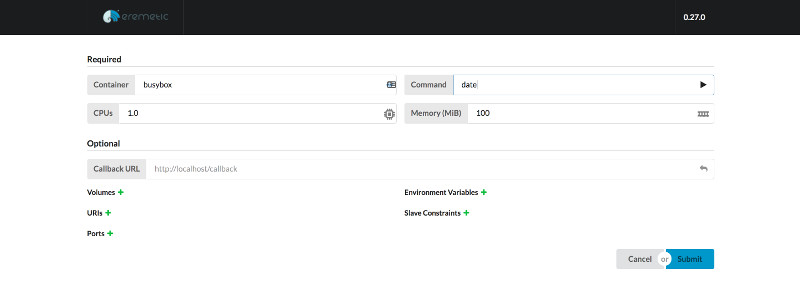
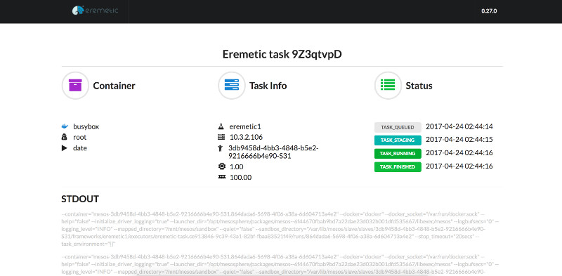

# How to use Eremetic on DC/OS

[Eremetic](https://github.com/klarna/eremetic) is a Mesos Framework to run one-shot tasks. The vision is to provide a
bridge between Applications that need to run tasks and Mesos. That way a developer creating an application that needs
to launch tasks into a cluster wouldn't need to manage Mesos resource offers directly.

- Estimated time for completion: 2 minutes
- Target audience: Anyone interested in running Docker containers as ad-hoc, on-demand tasks within DC/OS.
- Scope: Install Eremetic and try launching a job.

**Table of Contents**:

- [Install Eremetic](#install-eremetic)
- [Launch Eremetic task](#launch-eremetic-task)
- [Uninstall Eremetic](#uninstall-eremetic)

## Install Eremetic

Eremetic is very simple to install and can be installed via either the Universe UI or by using the DC/OS CLI. The
following command will launch the install via the DC/OS CLI:

```bash
dcos package install eremetic
```

## Launch Eremetic task

The Eremetic server exposes both a Web UI for launching tasks and an API. The Eremetic package is configured to support
accessing the server externally by way of the DC/OS Admin Router at `/service/<framework-name>` or internal to the
cluster via VIP at `<framework-name>.marathon.l4lb.thisdcos.directory:8000`.

A task can be launched with a curl'ed POST from any cluster node:

```bash
$ curl -H "Content-type: application/json" -X POST \
    -d '{"docker_image":"busybox","command":"date","task_cpus":0.1,"task_mem":100}' \
    http://eremetic.marathon.l4lb.thisdcos.directory:8000/task
"eremetic-task.4d068a24-57bc-41ae-ad53-e21e8d05a22d"
```

The response from the request is the unique ID of the task and its status can be tracked as follows:

```bash
$ curl http://eremetic.marathon.l4lb.thisdcos.directory:8000/task/eremetic-task.4d068a24-57bc-41ae-ad53-e21e8d05a22d
{"task_cpus":1,"task_mem":100,"command":"date","args":null,"user":"root","env":null,"masked_env":null,...}
```

Full JSON options to the `/task` endpoint can be found here:
https://github.com/klarna/eremetic/blob/master/README.md#usage

Alternatively, you can access the Web UI from the Admin Router endpoint at the default of
`https://<dcos-master>/service/eremetic`.



After a task has been submitted, the status page will give details on its task state and provide STDOUT / STDERR of
the task once launched.



## Uninstall Eremetic

Eremetic can be uninstalled either via the DC/OS Universe UI or from the CLI. The following command will uninstall
Eremetic via the DC/OS CLI:

```bash
$ dcos package uninstall eremetic
```

## Further resources

- [Eremetic Documentation](https://github.com/klarna/eremetic#usage)
- [Eremetic Issues](https://github.com/klarna/eremetic/issues)
