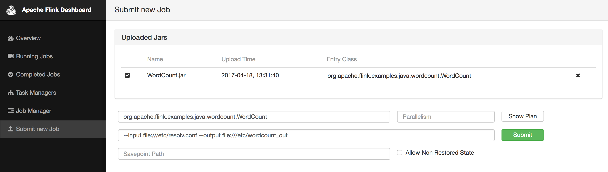

# How to use Apache Flink on DC/OS

[Apache Flink](https://flink.apache.org/) is an open source platform for distributed stream and batch data processing. Apache Flink comes with native Mesos support and can be also installed a DC/OS service

- Estimated time for completion: 5 minutes
- Target audience: Data engineers; basic knowledge of Apache Flink and DC/OS is helpful, but not required.
- Scope: Install and use Flink.

**Table of Contents**:

- [Prerequisites](#prerequisites)
- [Install Apache Flink](#install-flink)
- [Use Apache Flink](#use-flink)
- [Uninstall Apache Flink](#uninstall-flink)

## Prerequisites

- A running DC/OS 1.9 cluster with 1 agents with each 2 CPU and 2 GB of RAM available.
- [DC/OS CLI](https://dcos.io/docs/1.9/usage/cli/install/) installed.

## Install Flink

To install Apache Flink, do:

```bash
$ dcos package install flink
This DC/OS Service is currently in preview. There may be bugs, incomplete features, incorrect documentation, or other discrepancies. Flink requires by default 2 CPUs with 2GB of RAM on private nodes.
Continue installing? [yes/no] yes
Installing Marathon app for package [flink] version [1.3.1-1.0]
DC/OS Flink is being installed!

	Documentation: https://ci.apache.org/projects/flink/flink-docs-release-1.3/
```

After this, you should see the Flink service running via the `Services` tab of the DC/OS UI:


### Scala 2.11

Note, that the default build of Apache Flink and this universe package are both using Scala 2.10.

If you require Scala 2.11 please use the following install option from the UI (or via options.json when using the CLI):


## Use Flink

NOTE: In order to have better access to the input and output files, it makes sense to store those in HDFS.

### Upload Jar file via Flink UI
In the following we will use the DC/OS [Admin Router](https://dcos.io/docs/1.9/development/dcos-integration/#-a-name-adminrouter-a-admin-router) to provide access to the Flink UI: use the URL `http://$DCOS_DASHBOARD/service/flink/` and replace `$DCOS_DASHBOARD` with the URL of your DC/OS UI. Alternatively, you can also click `Open Service` in the DC/OS UI. The Flink dashboard UI looks like below.


Let us start our first job by going to `Submit new Job` in the Flink UI. We first need to add the respective jar file. For this example we will use the WordCount example jar file which can be found in `flink/build-target/examples/batch/WordCount.jar`.


### Run Jobs

#### Run Jobs via Flink UI

Next, we can define our job as shown below:



After the job has finished we should be able to see some details about the WordCount job:


#### Run Jobs via DC/OS Flink CLI

1. Submit the jar file via the CLI using `dcos flink upload`

```
$ dcos flink upload examples/WordCount.jar
{"status": "success", "filename": "59d5b54a-b3d3-483c-814f-63411115e017_WordCount.jar"}
```

2. Find the jar id of the jar file that you wish to run using `dcos flink jars`

```
$ dcos flink jars
{
  "address": "http://ip-10-0-0-11.us-west-2.compute.internal:4179",
  "files": [
    {
      "id": "59d5b54a-b3d3-483c-814f-63411115e017_WordCount.jar",
      "name": "WordCount.jar",
      "uploaded": 1501884181000,
      "entry": [
        {
          "name": "org.apache.flink.examples.java.wordcount.WordCount",
          "description": "No description provided"
        }
      ]
    }
  ]
}
```

3. Call `dcos flink run <jar id>`

```
$ dcos flink run 59d5b54a-b3d3-483c-814f-63411115e017_WordCount.jar
{
  "jobid": "7fa8e5f8f264785e85ef29dd9cba50ff"
}
```
If successful, the terminal will return a job id.

4. To verify that the job has finished, call `dcos flink list`

```
$ dcos flink list
{
  "jobs-running": [],
  "jobs-finished": [
    "7fa8e5f8f264785e85ef29dd9cba50ff"
  ],
  "jobs-cancelled": [],
  "jobs-failed": []
}
```
Notice that our job has successfully finished.

## Uninstall Flink

To uninstall Flink:

```bash
$ dcos package uninstall flink
```
## Troubleshooting

### AWS Specific Config

There is a situation which can occur where the JobMaster is not able to resolve its hostname.  This causes the TaskManager container that launches to never communicate with the JobManager and the cluster never enters the ready state.  This can be resolved by enabling "DNS Hostname" support in the VPC for the agents.

```
aws ec2 modify-vpc-attribute --vpc-id vpc-a01106c2 --enable-dns-hostnames "{\"Value\":true}"
```
