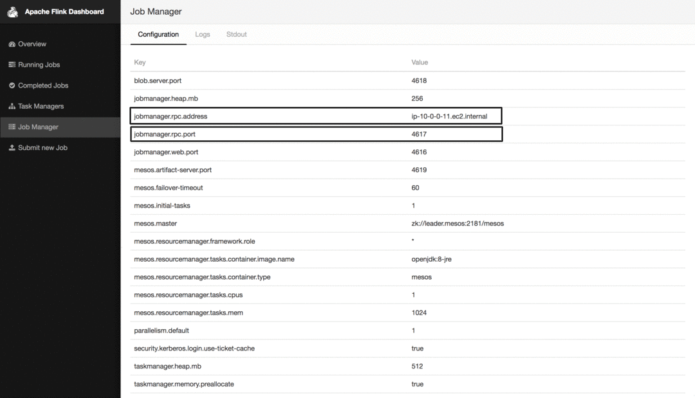

# How to use Apache Flink on DC/OS

[Apache Flink](https://flink.apache.org/) is an open source platform for distributed stream and batch data processing. Apache Flink comes with native Mesos support and can be also installed a DC/OS service

- Estimated time for completion: 5 minutes
- Target audience: Data engineers; basic knowledge of Apache Flink and DC/OS is helpful, but not required.
- Scope: Install and use Flink.

**Table of Contents**:

- [Prerequisites](#prerequisites)
- [Install Apache Flink](#install-flink)
- [Use Apache Flink](#use-flink)
- [Uninstall Apache Flink](#uninstall-flink)

## Prerequisites

- A running DC/OS 1.9 cluster with 1 agents with each 2 CPU and 2 GB of RAM available.
- [DC/OS CLI](https://dcos.io/docs/1.9/usage/cli/install/) installed.
- HDFS installed, as by default High Availability (HA) is enabled. See more in the specific section later on in this README as you need also to create an hdfs path for flink recovery metadata. To start without HA, disable it by un-checking the `ENABLED` option:


## Install Flink

To install Apache Flink, do:

```bash
$ dcos package install flink
This DC/OS Service is currently in preview. There may be bugs, incomplete features, incorrect documentation, or other discrepancies. Flink requires by default 2 CPUs with 2GB of RAM on private nodes.
Continue installing? [yes/no] yes
Installing Marathon app for package [flink] version [1.3.1-1.0]
DC/OS Flink is being installed!

	Documentation: https://ci.apache.org/projects/flink/flink-docs-release-1.3/
```

After this, you should see the Flink service running via the `Services` tab of the DC/OS UI:


### Scala 2.11

Note, that the default build of Apache Flink and this universe package are both using Scala 2.10.

If you require Scala 2.11 please use the following install option from the UI (or via options.json when using the CLI):


## Use Flink

NOTE: In order to have better access to the input and output files, it makes sense to store those in HDFS.

### Flink UI
In the following we will use the DC/OS [Admin Router](https://dcos.io/docs/1.9/development/dcos-integration/#-a-name-adminrouter-a-admin-router) to provide access to the Flink UI: use the URL `http://$DCOS_DASHBOARD/service/flink/` and replace `$DCOS_DASHBOARD` with the URL of your DC/OS UI. Alternatively, you can also click `Open Service` in the DC/OS UI. The Flink dashboard UI looks like below.


Let us start our first job by going to `Submit new Job` in the Flink UI. We first need to add the respective jar file. For this example we will use the WordCount example jar file which can be found in `flink/build-target/examples/batch/WordCount.jar`.

Next, we can define our job as shown below:


After the job has finished we should be able to see some details about the WordCount job:


### Flink CLI from container

We can alternatively use the native Flink CLI from a docker container.
Therefore we need to know the Jobmanager rpc adress and port which can be retrieved from the Flink UI:



```bash
$ dcos node ssh --master-proxy --leader

core@ip-10-0-6-55 ~ $ docker run -it mesosphere/dcos-flink:1.3.1-1.0 /bin/bash

root@178cdd4e4f70:/flink-1.3-SNAPSHOT# cd /flink-1.3.1/ && ./bin/flink run -m <jobmangerhost>:<jobmangerjobmanager.rpc.port> ./examples/batch/WordCount.jar --input file:///etc/resolv.conf --output file:///etc/wordcount_out
```

### Running with HA

There are several settings affecting HA mode which you could check at relevant configuration section. Default values are specified in order to launch the service automatically.
Before launching Flink service you need to create a directory on HDFS which must
have the same root path as the one specified in STORAGE-DIR property and as leaf folder the service name (default: hdfs://hdfs/flink/recovery/flink), the default service name is flink.

Login to a container as described previously:

Download the hadoop config files needed to access hdfs in dc/os:
root@ddfbaadb2094:/flink-1.3.1# wget http://api.hdfs.marathon.l4lb.thisdcos.directory/v1/endpoints/hdfs-site.xml

root@ddfbaadb2094:/flink-1.3.1# wget http://api.hdfs.marathon.l4lb.thisdcos.directory/v1/endpoints/core-site.xml

Add to the conf/flink-conf.yaml file th efollowing options:

high-availability: zookeeper
high-availability.zookeeper.quorum: master.mesos:2181
high-availability.zookeeper.storageDir: hdfs://hdfs/flink/recovery/flink
high-availability.zookeeper.path.root: /dcos-service-flink/flink
fs.hdfs.hadoopconf: /flink-1.3.1

Note: the above high availability options are also set in the flink service in the
ui and they must be a match. The baove values are the default ones.

Run a job:

root@ddfbaadb2094:/flink-1.3.1# ./bin/flink run -z /default-flink ./examples/batch/WordCount.jar --input file:///etc/resolv.conf --output file:///etc/wordcount_out

### DC/OS Flink CLI
Coming soon.


## Uninstall Flink

To uninstall Flink:

```bash
$ dcos package uninstall flink
```
