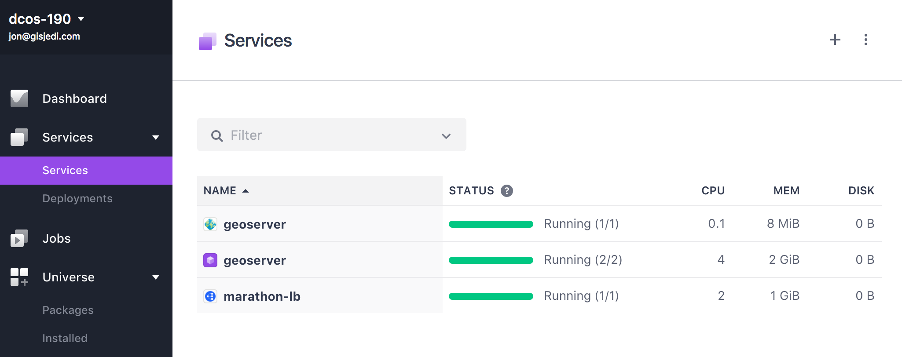

# How to use GeoServer on DC/OS

[GeoServer](http://geoserver.org/) is an open source server for sharing geospatial data.
The [DC/OS GeoServer](http://github.com/appliedis/dcos-geoserver) package provides a highly available configuration for
GeoServer that enables effortless scaling of GeoServer to meet demand. All GeoServer instances are running with a
complete server with all administrative capabilities. The servers are synchronized through a watchdog service that
monitors the shared configuration on disk for changes and then initiates a reload of all GeoServers.

It is worth noting that this installation comes pre-configured with optimal configuration as indicated by the GeoServer
team. This consists of JVM tuning and Marlin renderer usage that will be configured based on your allocated resources
to the instances.

- Estimated time for completion: 10 minutes
- Target audience: Teams that need a highly-available, pre-tuned GeoServer deployment.
- Scope: Install and use GeoServer.

**Table of Contents**:

- [Prerequisites](#prerequisites)
- [Configure Shared Storage](#configure-shared-storage)
- [Install GeoServer](#install-geoserver)
- [Use GeoServer](#use-geoserver)
- [Extensions](#extensions)
- [Uninstall GeoServer](#uninstall-geoserver)

## Prerequisites

- A running DC/OS 1.9 cluster with a total of 4.1 CPUs and 2 GB of RAM available within the cluster.
- Marathon-LB Universe package installed.
- DNS or access to local machine configuration for host resolution.
- [DC/OS CLI](https://dcos.io/docs/1.9/usage/cli/install/) installed for ease of access to cluster nodes.


## Configure Shared Storage

If your cluster already has some form of storage shared among all private nodes, this step can be skipped. This example
configuration sets up an NFS server on the master and connects all nodes to the master as NFS clients.

- Connect to the master using the CLI: `dcos node ssh --leader --master-proxy`
- The following commands must be executed on the master:

    ```bash
    sudo su -
    mkdir /shared
    mkdir -p /var/lib/nfs
    touch /var/lib/nfs/etab
    echo '/shared *(rw,sync,no_subtree_check,fsid=0,no_root_squash)' >> /etc/exports
    chmod 644 /etc/exports
    chmod 777 /shared
    iptables -A INPUT -p tcp -m tcp --dport 2049 -j ACCEPT
    iptables -A INPUT -p tcp -m tcp --dport 111 -j ACCEPT
    iptables -A INPUT -p udp -m udp --dport 111 -j ACCEPT
    systemctl restart nfsd.service
    systemctl restart rpcbind.service
    systemctl restart rpc-mountd.service
    ```

- Identify all slave IDs: `dcos node | tail +2 | awk '{print $3}'`
- Connect to each of the nodes: `dcos node ssh --master-proxy --mesos-id=ONE-OF-ABOVE-LISTED-IDS`
- The following commands must be executed on each of the nodes:

    ```bash
    sudo su -
    mkdir /shared
    mkdir /var/lib/nfs
    systemctl enable rpc-statd.service
    systemctl restart rpc-statd.service
    mount -t nfs master.mesos:/shared /shared
    ```

*Note*: The described configuration exports an NFS share on the master from the root volume. If there is going to be any
appreciable storage, this should be moved to a dedicated volume for this purpose. For the purposes of GeoServer
configuration storage, this space will be minimal (<10MiBs).


## Install GeoServer

To install GeoServer, navigate to Universe from the DC/OS UI and select GeoServer. Advanced Installation should be used
and your chosen address should be entered in to the `geoserver.virtual-host` configuration field. For this tutorial, we
will continue to reference the default in example URLs - be sure to substitute the appropriate value for your
environment.

After this, you should see the 2 `geoserver` services running via the `Services` tab of the DC/OS UI:



Once the installation is complete there are two ways to access GeoServer from outside the cluster. You can create an A
entry in DNS or edit your hosts file. In either case, the address must match your `geoserver.virtual-host` configuration
value. For this tutorial, we will cover configuration via hosts file. On OSX or Linux this can be done by editing the
`/etc/hosts` file. On Windows the file is located at `c:\windows\system32\drivers\etc\hosts`. In both cases, you will
need administrative credentials on the machine.

The following entry should be placed in the hosts file:

```
192.168.1.100 geoserver.marathon.mesos
```

The `192.168.1.100` IP should be replaced with the external IP of the public node of your DC/OS cluster where
Marathon-LB is running.

## Use GeoServer

Once the GeoServer services in DC/OS have gone green, you can access the GeoServer administrative page from
http://geoserver.marathon.mesos/geoserver/web/. The default user name is `admin` and password is `geoserver`. Refer to
the [GeoServer documentation](http://docs.geoserver.org/stable/en/user/) for further details on usage.

## Extensions

Do you have extensions or customizations that need to be made to the GeoServer web.xml? This package
provides support for injection of a tarball of extension jars, as well as a web.xml override. These
settings are exposed during the package install as `extension-tarball-uri` and `web-xml-uri`.

## Uninstall GeoServer

To uninstall GeoServer:

```bash
$ dcos package uninstall geoserver
```

This will only remove the GeoServer sync and bootstrap container. To fully remove all traces of GeoServer the following
commands should be run:

```bash
dcos marathon app remove geoserver-app
```

## Further resources

1. [GeoServer Home](http://geoserver.org/)
1. [GeoServer Official Documentation](http://docs.geoserver.org/stable/en/user/)
1. [DC/OS GeoServer Documentation](http://github.com/appliedis/dcos-geoserver)
