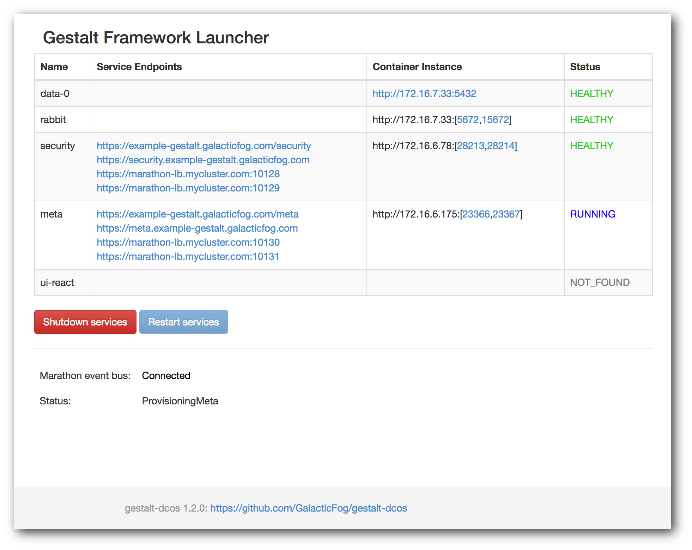

# How to use the Gestalt Framework on DC/OS

The Gestalt Framework is a set of microservices that create a platform for companies to build future-proofed cloud native applications.  The platform is comprised of three major components which include the meta service (a policy-enabled resource manager), the infrastructure layer (plug-able container and lambda engine), and the integration layer (a set of off the self microservices supporting enterprise integration).

- Estimated time for completion: 10 minutes
- Target audience: Anyone interested in running a HTTP (proxy) server
- Scope: Learn how to install NGINX on DC/OS and to serve a static website

## Installation

- Prerequisites: A running DC/OS cluster (1.8.5+)

- Recommended: marathon-lb on a public agent with a domain name redirected to the agent

### Install the Gestalt Framework from the DC/OS Universe

* In the DC/OS Universe tab, select `gestalt-framework` and click `Advanced Installation`

* Type `yes` into the `ACCEPT-EULA` box (EULA available [here](http://www.galacticfog.com/gestalt-eula.html))

* (Optional) Enter a domain name in the `TLD` box. This instructs the launcher to provision virtual hosts for the framework services.

* On the `security` tab, enter a username and strong password for the admin user. Note these for use later.

* On the `laser` tab, select the lambda runtimes that should be provisioned.

* Click `Review and install` and then `Install`

### Monitor the installation

* From the DC/OS Services tab, navigate to the application group `gestalt-framework`
* Click the URL popout next to the `dcos-launcher` task to view the launcher dashboard (this may take a minute to run and pass health checks)

* The launcher dashboard will report the convergence of the platform services as they are provisioned and initialized.

* When they are all healthy and the status is `AllServicesLaunched`, open the UI using one of the `Service Endpoints` for the `ui-react` service.

* Select one of the provided URLs for the `ui-react` service to access the Gestalt Framework UI.

## Using Gestalt

With DC/OS and Gestalt running, we want to setup our environment and launch some apps.  Login using the user credentials specified during in the install:

### Create an Organization

Our next step is to create an organization, or hierarchy of organizations.  An organization is a container for organizing our projects.  It is a hierarchical system so you can create sub-orgs to mirror departments as needed.  An implicit "root" organization always exists, but it is good to create your own organization. From the action dots  icon inside any org, click "Create SubOrganization" and complete the prompt:

### Create a Workspace

Next we need to create a workspace.  A workspace could be team or project focused and is again an entity for organizing our deployments.  Click the workspace icon (suitcase) on the left to view workspaces, and then "Create Workspace".  Workspaces support separate entitlements and providers to be configured.

Under the action bar for the current org, select "Create a Workspace": 

Then enter the desired name/short-name into the workspace creation dialog:

### Create an Environment

Once we have a workspace, we can create environments where we will actually deploy containers and/or lambdas.  Environments or also an organizational tool which are used for modeling project lifecycle.  For example, I could setup different CaaS providers in each environment to manage dev, test, and prod containers in separate clusters.  From any workspace, click on "Create Environment" and complete the prompt to create a development environment:

### Deploy a Container

You will be placed in the newly created environment and can now create a container.  This launches the configured container image in DC/OS.  Click on the "Containers" icon and then on "Deploy Container".  Once you select a provider you can set a name and choose a container image.

This shows the running container:

There are many more features you can use in Gestalt including lambdas, policies, entitlements, etc.
