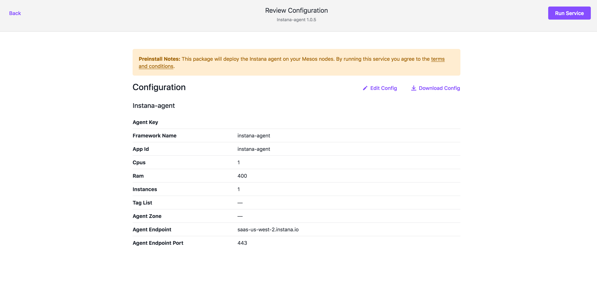

# Instana agent deployment on DC/OS

[Instana](https://www.instana.com "Instana") is the next generation Application Performance Management solution that automatically monitors dynamic modern applications, including scheduled environments. Instana comprehensively manages your application’s quality of service with zero to absolute minimal configuration effort.

The Instana agent package can be installed to DC/OS setups using the official package from the DC/OS universe.

* **Estimated time for completion**: 2 minutes
* **Scope**: Learn how to install the Instana agent on a DC/OS Cluster.

## Prerequisites

* A running DC/OS 1.11 cluster
* Your Instana agent key (obtainable via the UMP menu in the Instana WebUI)

## Deploying the Instana agent

In order to install the Instana agent, go to the Catalog tab in the DC/OS web UI, and **click on the "instana-agent"** icon in the list. Ensure 1.0.5 is selected from the drop-down menu then click Review & Run.

## Edit configuration

Provide your agent key in the form

If you're a SaaS customer, that is reporting to the US environment, the rest of the values can be left with the default values. EU - SaaS customers should **switch to the "saas-eu-west-1.instana.io" endpoint**. If you're an on-prem customer, please **enter your backend's host address** and **set the port** (default: 1444). 

If desired you can **set host tags** in the tag list (comma separated). 

At this point you'll want to review the configuration of the agent and click "Run Service." 

## Scaling the Instana agent

This is being taken care of by the deployment constraints. If you have, say, three hosts, and set the scaling to three, DC/OS will deploy exactly one Instana agent on each host. If you want different host tags for each and every machine, the Instana agent needs to be deployed separately.

Click edit and then scale

Select the desired number of instances

## Additional resources

The DC/OS integration of the Instana agent is supported by Instana, Inc. 

- Please refer to [the official Instana documentation](https://docs.instana.com) for more information how to configure and use Instana.
- Please reach out to our [Support](https://support.instana.com/) in case you need technical assistance.
