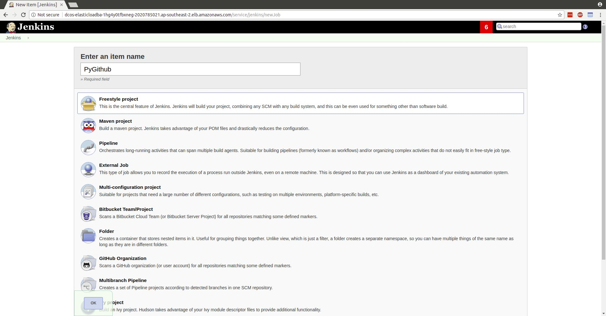

# How to use  Jenkins on DC/OS

[Jenkins](https://jenkins-ci.org/) is a popular Continuous Integration (CI) automation server and framework with hundreds of plugins (GitHub, Docker, Slack, etc.) available. Running Jenkins on DC/OS allows you to scale your CI infrastructure by dynamically creating and destroying Jenkins agents as demand increases or decreases, and enables you to avoid the statically partitioned infrastructure typical of a traditional Jenkins deployment.

- Estimated time for completion: Approximately 5 minutes
- Target audience: Anyone who wants to deploy Jenkins and use it to run automatable jobs
- Scope: You'll learn how to install Jenkins and how to use it

**Table of Contents**:

- [Prerequisites](#prerequisites)
- [Install Jenkins](#install-jenkins)
- [Use Jenkins](#use-jenkins)
- [Uninstall Jenkins](#uninstall-jenkins)

## Prerequisites

- A running DC/OS 1.11 cluster with at least 2 nodes with 2 CPUs and 3GB of RAM available.
- [DC/OS CLI](https://dcos.io/docs/1.11/usage/cli/install/) installed.

## Install Jenkins

Jenkins stores information directly on disk, therefore we have two options for deployment. We can pin it to a single node, or use a network file system to share files between multiple nodes. In this guide, we will pin Jenkins to a single node.

To do this via the web UI, navigate to the Catalog page, and click on the Jenkins icon. Click on "Review & Run" in the top right corner, and in the storage tab, enter an IP of an agent in the cluster.


Click "Review & Run" again, and then "Run Service" on the new page that loads.


If you'd rather use the `dcos` CLI tool, create a file `options.json` with the configuration below, modifying `pinned-hostname` to correspond to an agent IP in your DC/OS cluster (for example, via `dcos node`):

```bash
$ cat options.json
{
    "storage": {
        "pinned-hostname": "10.0.3.230"
    }
}
```

Once you've created `options.json`, you can then install Jenkins by running the following command:

```bash
$ dcos package install jenkins --options=options.json
By Deploying, you agree to the Terms and Conditions https://mesosphere.com/catalog-terms-conditions/#certified-services
WARNING: If you didn't provide a value for `storage.host-volume` (either using the CLI or via the Advanced Install dialog),
YOUR DATA WILL NOT BE SAVED IN ANY WAY.

Continue installing? [yes/no] yes
Installing Marathon app for package [jenkins] version [3.5.0-2.107.2]
Jenkins has been installed.
```

Once ready, Jenkins will appear as a service in the DC/OS dashboard.

Note that for a complete list of the configuration options available for the Jenkins package, see the [Jenkins package definition](https://github.com/mesosphere/universe/tree/version-3.x/repo/packages/J/jenkins) in the Universe Catalog.

## Use Jenkins

Jenkins can be used to automate many tasks, most commonly for CI/CD pipelines -- a Jenkins job can run tests against proposed code, merge it if the tests pass, upload artifacts, and even deploy that code to a development or production instance.

In this guide, we will set up a Jenkins job to build and run the test suite for PyGithub, a project to provide Python bindings for the GitHub API.


We'll create a PyGithub project using the Freestyle project template.



Set Git as the SCM, and use http://github.com/PyGithub/PyGithub.git as the repository location.


Add a Build Step, selecting "Execute Shell", and enter the command "python setup.py test". We're all done, hit Save!


Just to test this, click Build Now.


And the job is successful!


## Uninstall Jenkins

To uninstall Jenkins using the DC/OS CLI, run the following command:

```bash
$ dcos package uninstall jenkins
```

