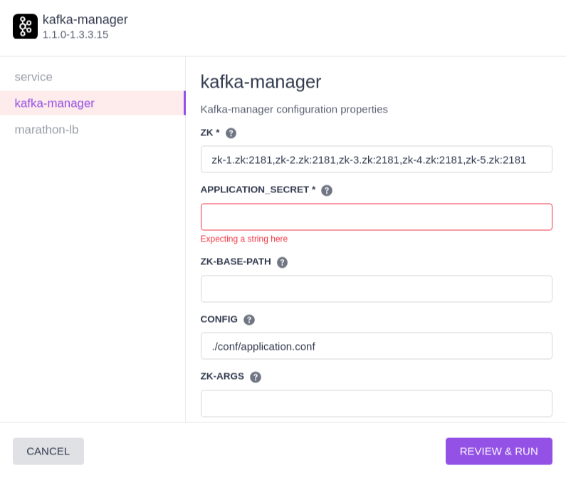
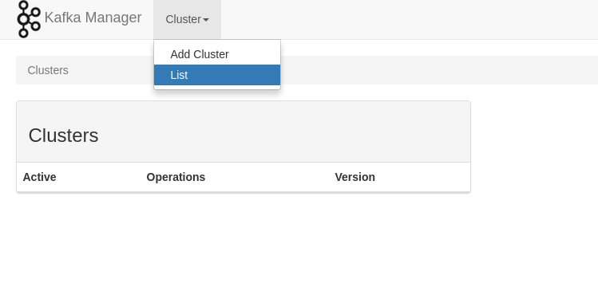
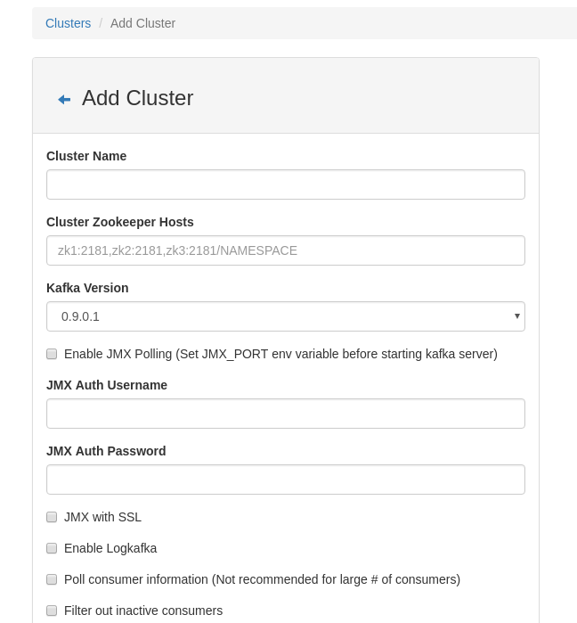

# How to use Kafka Manager on DC/OS

[Kafka Manager](https://github.com/yahoo/kafka-manager) web based management tool for Kafka clusters.

- Estimated time for completion: 5 minutes
- Target audience: Anyone interested in managing Kafka clusters
- Scope: Learn how to install and use Kafka Manager on DC/OS

For more details check out [Kafka Manager project page](https://github.com/yahoo/kafka-manager).

**Table of Contents**:

- [Quickstart](#quickstart)
- [Installation via CLI](#installation-via-cli)
- [Using Kafka Manager](#using-kafka-manager)
- [Further Reading](#further-reading)

## Quickstart

Prerequisites:

- A running DC/OS 1.10 cluster with at least 1 [public agent](https://dcos.io/docs/1.10/overview/concepts/#public-agent-node) node.
- Marathon-LB, Traefik, Edge LB or some other load-banacer.

Select `kafka-manager` package from DC/OS Catalog. Before deploying service make sure to set `APPLICATION_SECRET`.



Kafka Manager should be deployed on a virtual host (access via Admin Router from DC/OS doesn't work due to issue with URI prefix), the easiest way how to achieve this is to use Marathon-LB (Traefik or some other load-balancer). If you're using Marathon-LB simply fill the virtual host and continue with deploying.


## Installation via CLI

Prerequisites:

- A running DC/OS 1.10 cluster with at least 1 [public agent](https://dcos.io/docs/1.10/overview/concepts/#public-agent-node) if you expect to expose your site/API to the public.
- [DC/OS CLI](https://dcos.io/docs/1.10/cli/install/) installed.
- Marathon-LB, Traefik, Edge LB or some other load-banacer.

Create a `kafka-manager.json` that should look like this (see `dcos package describe kafka-manager --config` for description):
```json
{
  "service": {
    "name": "kafka-manager",
    "cpus": 1,
    "mem": 1024,
    "instances": 1
  },
  "kafka-manager": {
    "zk": "zk-1.zk:2181,zk-2.zk:2181,zk-3.zk:2181,zk-4.zk:2181,zk-5.zk:2181",
    "application_secret": "OThhZTc0NmIyNDNhNjI2MDlhMjEwNDkzODRmM2VhNDUxNjkwZGNlNjZjOTdlNWEx",
    "config": "./conf/application.conf",
    "loglevel": "INFO"
  },
  "marathon-lb": {
    "enable": true,
    "virtual_host": "kafka-manager.example.org"
  }
}
```
now check service definition:
```
dcos package describe kafka-manager --app --options=kafka-manager.json --render
```

and finally install the package:

```bash
dcos package install kafka-manager --options=kafka-manager.json
```

## Using Kafka Manager

Go to browser and enter your `{{kafka manager hostname}}`, you should be able to see Kafka Manager:



There's not much to see, so let's add some clusters: "Cluster > Add cluster":



Fill the name of your cluster and a ZooKeeper Hosts, e.g.
```
zk-1.zk:2181,zk-2.zk:2181,zk-3.zk:2181,zk-4.zk:2181,zk-5.zk:2181
```
if you've deployed Kafka cluster without custom prefix. That means that all Kafka's data (list of brokers, topics, etc.) are stored in ZooKeeper's root path (`/`).

With multiple Kafka clusters you should use prefixes (see `kafka.kafka_zookeeper_uri` in "Kafka" DC/OS package).
```
"kafka_zookeeper_uri":"zk-1.zk:2181,zk-2.zk:2181,zk-3.zk:2181,zk-4.zk:2181,zk-5.zk:2181/kafka01"
```
and the same connection string should be used as "ZooKeeper Hosts".

Make sure to select appropriate Kafka version and continue with saving cluster properties (you can modify properties any time later).

NOTE: Kafka Manager also stores all configuration in ZooKeeper (`kafka-manager.zk-base-path` defaults to your service name).

Now go to your cluster and checkout topics configuration:


## Further reading

For more details check out [Kafka Manager](https://github.com/yahoo/kafka-manager) or [kafka-manager-docker](https://github.com/deric/kafka-manager-docker) to check the runtime image.