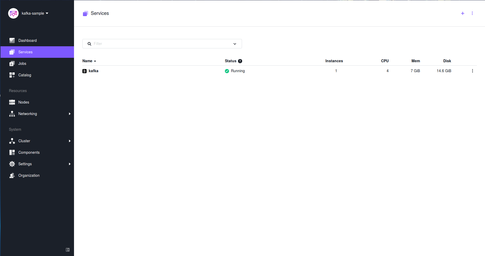

# How to use Apache Kafka on DC/OS

[Apache Kafka](https://kafka.apache.org/) is a distributed high-throughput publish-subscribe messaging system with strong ordering guarantees. Kafka clusters are highly available, fault tolerant, and very durable. The [DC/OS Kafka](https://docs.mesosphere.com/service-docs/kafka/) service gives you direct access to the Kafka API so that existing producers and consumers can interoperate. You can configure and install DC/OS Kafka in moments. Multiple Kafka clusters can be installed on DC/OS and managed independently, so you can offer Kafka as a managed service to your organization. Kafka is written in Scala and uses [Apache ZooKeeper](https://zookeeper.apache.org/) for coordination.

- Estimated time for completion: 20 minutes
- Target audience: Anyone interested in a pub-sub messaging system.
- Scope:
 - Install the DC/OS Kafka service.
 - Use the enhanced DC/OS CLI to create Kafka topics.
 - Use Kafka on DC/OS to produce and consume messages.

**Terminology**:

- **Broker:** A Kafka message broker that routes messages to one or more topics.
- **Topic:** A Kafka topic is message filtering mechanism in the pub/sub systems. Subscribers register to receive/consume messages from topics.
- **Producer:** An application that producers messages to a Kafka topic.
- **Consumer:** An application that consumes messages from a Kafka topic.

**Table of Contents**:

- [Prerequisites](#prerequisites)
- [Install Kafka](#install-kafka)
 - [Typical installation](#typical-installation)
 - [Minimal installation](#minimal-installation)
- [Topic Management](#topic-management)
- [Produce and consume messages](#produce-and-consume-messages)
 - [List Kafka client endpoints](#list-kafka-client-endpoints)
 - [Produce a message](#produce-a-message)
 - [Consume a message](#consume-a-message)
- [Uninstall Kafka](#uninstall-kafka)

## Prerequisites

- A running DC/OS 1.11 cluster with 4 private agents each with 2 CPUs and 2 GB of RAM available.
- [DC/OS CLI](https://dcos.io/docs/1.10/usage/cli/install/) installed.

## Install Kafka

Assuming you have a DC/OS cluster up and running, you have two options to install Kafka, described in the following.

### Typical installation

Install a Kafka cluster with 3 brokers using the DC/OS CLI:

```bash
$ dcos package install kafka
By Deploying, you agree to the Terms and Conditions https://mesosphere.com/catalog-terms-conditions/#certified-services
Default configuration requires 3 agent nodes each with: 1.0 CPU | 2048 MB MEM | 1 5000 MB Disk
Continue installing? [yes/no] yes
Installing Marathon app for package [kafka] version [2.2.0-1.0.0]
Installing CLI subcommand for package [kafka] version [2.2.0-1.0.0]
New command available: dcos kafka
The DC/OS Apache Kafka service is being installed.

        Documentation: https://docs.mesosphere.com/service-docs/kafka/
        Issues: https://docs.mesosphere.com/support/
```

Note that while the DC/OS CLI subcommand `kafka` is immediately available, it takes a few moments for Kafka to start running in the cluster.

To validate that the Kafka service is running and healthy you can go to the DC/OS UI:



### Minimal installation

To start a minimal cluster with a single broker, create a JSON options file named `kafka-minimal.json`:

```json
{
    "brokers": {
        "count": 1,
        "mem": 512,
        "disk": 1000
    }
}
```
Install the Kafka cluster:

```bash
$ dcos package install kafka --options=kafka-minimal.json
```

## Topic management

To add a topic, execute the following command, using the DC/OS CLI:

```bash
$ dcos kafka topic create topic1 --partitions 1 --replication 1
{
  "message": "Output: Created topic \"topic1\".\n"
}
```
## Produce and consume messages

### List Kafka client endpoints

To list available Kafka endpoints, do the following:

```bash
$ dcos kafka endpoints
[
  "broker",
  "zookeeper"
]
```

To get connection details for `broker` and `zookeeper` endpoints, execute the following 2 commands:

```bash
$ dcos kafka endpoints broker
{
  "address": ["10.0.1.208:1025"],
  "dns": ["kafka-0-broker.kafka.autoip.dcos.thisdcos.directory:1025"],
  "vip": "broker.kafka.l4lb.thisdcos.directory:9092"
}

$ dcos kafka endpoints zookeeper
master.mesos:2181/dcos-service-kafka
```

The above shows an example of what a Kafka client endpoint will look like. Note the address and ports will be different from cluster to cluster, since these services are dynamically provisioned. Record the `"address"` values from your cluster for use in the next step.

### Deploy kafka-client service to produce/consume messages

Follow the steps below to create an application definition for `kafka-client` service, and deploy as a Marathon app.
```bash
$ vi kafka-client.json
{
 "id": "/kafka-client",
 "instances": 1,
 "container": {
 "type": "MESOS",
 "docker": {
 "image": "mesosphere/kafka-client:latest"
 }
 },
 "cpus": 0.5,
 "mem": 256,
 "cmd": "sleep 100000"
 }

$ dcos marathon app add kafka-client.json
Created deployment 933a3fc0-0712-448d-8156-1f9cfa76a823
```

### Produce a message

To publish a message to the topic `topic1` we created in the previous step, carry out the following steps.

```bash
$ dcos task exec kafka-client bash -c "echo 'Hello, World.' | /bin/kafka-console-producer.sh --broker-list KAFKA_ADDRESS:PORT --topic topic1"
```

Replace the above `KAFKA_ADDRESS:PORT` with the Kafka client endpoint address from your cluster, in our case `kafka-console-producer.sh --broker-list broker.kafka.l4lb.thisdcos.directory:9092 --topic topic1`.

### Consume a message

To subscribe to the topic `topic1` and consume messages using kafka-client, execute the following:

```bash
$ dcos task exec kafka-client bash -c "/bin/kafka-console-consumer.sh --zookeeper master.mesos:2181/dcos-service-kafka --topic topic1 --from-beginning"
Hello, World.
^CProcessed a total of 1 messages
```

Note that in order to stop consuming messages, hit `CTRL-C`.

### Clean kafka-client

To remove the kafka-client from Marathon, you can use the following command:

```bash
$ dcos marathon app remove kafka-client
```

## Uninstall Kafka

To uninstall Kafka:

```bash
$ dcos package uninstall --app-id=kafka kafka
```

## Further resources

1. [DC/OS Kafka Documentation](https://github.com/mesosphere/dcos-kafka-service/blob/master/README.md)
1. [Kafka API Reference](https://kafka.apache.org/documentation.html)
