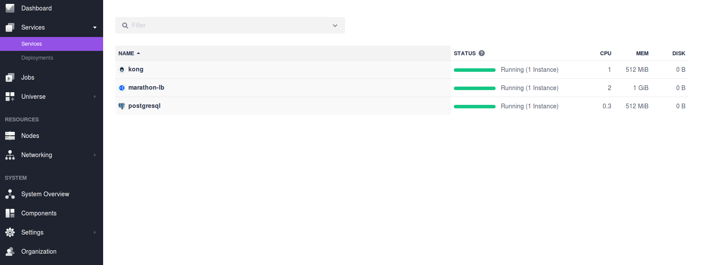
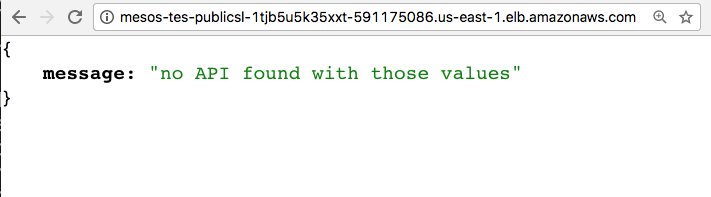

# [KONG][website-url]

[![][kong-logo]][website-url]

[Kong][website-url] is a scalable, open source API Layer
(also known as an API Gateway, or API Middleware). Kong runs in front of any
RESTful API and is extended through Plugins, which provide extra functionality
and services beyond the core platform.

- Estimated time for completion: 15 minutes
- Target audience: Anyone who wants to deploy an API Gateway on DC/OS. 
- This package requires an intermediate/advanced DC/OS skill set.

**Scope**:
 - Configure and launch the DC/OS cluster that will run the Kong instances.
 - Configure and launch the Marathon-LB package.
 - Configure and launch the Kong supported database.
 - Configure and launch the Kong package.

# How to use Kong package on DC/OS

Kong can be provisioned on a Mesosphere DC/OS cluster using following
steps:

The following steps use AWS for provisioning the DC/OS cluster and assumes you 
have basic knowledge of [DC/OS](https://dcos.io/docs/1.9/), 
[Marathon](https://mesosphere.github.io/marathon/), 
[VIPs](https://dcos.io/docs/1.9/networking/load-balancing-vips/virtual-ip-addresses/),
and [Marathon-LB](https://dcos.io/docs/1.9/networking/marathon-lb/).

1. **Initial setup**

    Download or clone the following repo:

    ```bash
    $ git clone git@github.com:Mashape/kong-dist-dcos.git
    $ cd kong-dist-dcos
    ```

    Skip to step 3 if you have already provisioned a DC/OS cluster.

2. **Deploy a DC/OS cluster**

    Following the [DC/OS AWS documentation](https://dcos.io/docs/1.9/installing/cloud/aws/),
    deploy a DC/OS cluster on which Kong will be provisioned
    
    Once your cluster is ready, Kong can be deployed using the
    [DC/OS CLI](https://dcos.io/docs/1.9/cli/) or the
    [DC/OS GUI](https://dcos.io/docs/1.9/gui/).

3. **Deploy Marathon-LB**

    We will use [Marathon-LB](https://dcos.io/docs/1.9/networking/marathon-lb/)
    for load balancing external traffic to cluster and
    [VIPs](https://dcos.io/docs/1.9/networking/load-balancing-vips/virtual-ip-addresses/)
    for load balancing internal traffic. Using the package `marathon-lb` deploy
    the Marathon-LB:

    ```bash
    $ dcos package install marathon-lb
    ```

4. **Deploy a Kong-supported database**

    Before deploying Kong, you need to provision a Cassandra or PostgreSQL
    instance.

    For Cassandra, use the `cassandra` package to deploy 3 nodes of Cassandra
    in the DC/OS cluster:

    ```bash
    $ dcos package install cassandra
    ```

    For PostgreSQL, use the `postgresql` package with following option:

    ```json
    {
      "service": {
        "name": "postgresql"
      },
      "postgresql": {
        "cpus": 0.3,
        "mem": 512
      },
      "database": {
        "username": "kong",
        "password": "kong",
        "dbname": "kong"
      },
      "storage": {
        "host_volume": "/tmp",
        "pgdata": "pgdata",
        "persistence": {
          "enable": true,
          "volume_size": 512,
          "external": {
            "enable": false,
            "volume_name": "postgresql",
            "provider": "dvdi",
            "driver": "rexray"
          }
        }
      },
      "networking": {
        "port": 5432,
        "host_mode": false,
        "external_access": {
          "enable": false,
          "external_access_port": 15432
        }
      }
    }
    ```

    It configures PostgreSQL as follows:

    - `username`: This parameter configures the username for the kong database.
    - `password`: This parameter configures the password for the kong database.
    - `dbname`: This parameter configures the name of the kong database.
    - `persistence`: This parameter enables persistent volumes for postgresql.

    After saving the above option to `postgres.json` run the following command
    to install postgresql package:

    ```bash
    $ dcos package install postgresql --options=postgres.json
    ```

5. **Deploy Kong**

    Now we have an external load balancer and Kong supported datastore
    running. Using the `kong` package from Universe repo, deploy Kong
    with following option:

    ```json
    {
      "service": {
        "name": "kong",
        "instances": 1,
        "cpus": 1,
        "mem": 512,
        "role": "*"
      },
      "configurations": {
        "log-level": "notice",
        "database": {
          "migrations": true,
          "use-cassandra": false
        },
        "postgres": {
          "host": "postgresql.marathon.l4lb.thisdcos.directory",
          "port": 5432,
          "database": "kong",
          "user": "kong",
          "password": "kong"
        },
        "cassandra": {
          "contact-points": "node-0.cassandra.mesos, node-1.cassandra.mesos, node-2.cassandra.mesos",
          "port": 9042,
          "keyspace": "kong"
        }
      },
      "networking": {
        "proxy": {
          "external-access": true,
          "vip-port": 8000,
          "vip-port-ssl": 8443,
          "virtual-host": "<vhost>",
          "https-redirect": true,
          "service-port": 10201
        },
        "admin": {
          "external-access": true,
          "vip-port": 8001,
          "vip-port-ssl": 8444,
          "https-redirect": false,
          "service-port": 10202
        }
      }
    }
    ```

    It configures Kong as follows:

    | Config  |     Description |
    |----------|:---------------|
    | `configurations.log_level`|Sets the Kong [`log_level`][configurations] configuration.|
    | `configurations.custom-envs`|A space-separated list of [Kong configurations][configurations].|
    | `configurations.database.use-cassandra`|If `true`, Cassandra is used as the Kong database.|
    | `configurations.database.migration`| If `true`, Kong will run migrations during start.|
    | `configurations.postgres.host`| PostgreSQL host name.|
    | `configurations.postgres.port`| PostgreSQL port.|
    | `configurations.postgres.database`| PostgreSQL database name.|
    | `configurations.postgres.user`| PostgreSQL username.|
    | `configurations.postgres.password`| PostgreSQL password.|
    | `configurations.cassandra.contact-points`|A comma-separated list of Cassandra contact points.|
    | `configurations.cassandra.port`| Port on which Cassandra listening for query.|
    | `configurations.cassandra.keyspace`| Keyspace to use in Cassandra. Will be created if doesn't exist.|
    | `networking.proxy.external-access`| If `true`, allows external access to Kong's proxy port.|
    | `networking.proxy.virtual-host`| The virtual host address to integrate Kong proxy port with Marathon-lb.|
    | `networking.proxy.https-redirect`| If `true`, Marathon-lb redirects HTTP traffic to HTTPS. This requires 'virtual-host' to be set.|
    | `networking.proxy.service-port`| Port number to be used for reaching Kong's proxy port from outside of cluster.|
    | `networking.proxy.vip-port`| Port number to be used for communication internally to the Proxy API. Default is 8000.|
    | `networking.proxy.vip-port-ssl`| Port number to be used for secure communication internally to the Proxy API. Default is 8443.|
    | `networking.admin.external-access`| If `true`, allows external access to Kong's admin port.|
    | `networking.admin.virtual-host`| The virtual host address to integrate Kong admin port with Marathon-lb.|
    | `networking.admin.https-redirect`| If `true`, Marathon-lb redirects HTTP traffic to HTTPS. This requires 'virtual-host' to be set.|
    | `networking.admin.service-port`| Port number to be used for reaching Kong's admin port from outside of cluster.|
    | `networking.admin.vip-port`| Port number to be used for communication internally to the Admin API. Default is 8001.|
    | `networking.admin.vip-port-ssl`| Port number to be used for secure communication internally to the Admin API. Default is 8444.|

    Note: Tweak the above configuration based on you datastore choice. 

    After saving the option to a file `kong.json` run the following command
    to install Kong package:
    
    ```bash
    $ dcos package install kong --options=kong.json
    ```

6. **Verify your deployments**

    To verify that our kong instance is up and running, we can use `dcos task`
    command:

    ```bash
    $ dcos task
    NAME         HOST        USER  STATE  ID
    kong         10.0.1.8   root    R    kong.af46c916-3b55-11e7-844e-52921ef4378d         
    marathon-lb  10.0.4.42  root    R    marathon-lb.d65c3cc3-3b54-11e7-844e-52921ef4378d  
    postgres     10.0.1.8   root    R    postgres.5b0a2635-3b55-11e7-844e-52921ef4378d   
    ```

    Kong in the DC/OS UI

    
  
7. **Using Kong**
    
    Now that Kong is installed, to test the configuration, SSH into one of the
    instances in the cluster (such as a master), and try curl-ing the endpoints:

    - Admin
    
      ```bash
      $ curl -i -X GET http://marathon-lb.marathon.mesos:10202
      HTTP/1.1 200 OK
      Date: Fri, 02 Jun 2017 18:35:58 GMT
      Content-Type: application/json; charset=utf-8
      Transfer-Encoding: chunked
      Connection: keep-alive
      Access-Control-Allow-Origin: *
      Server: kong/0.10.3
      ..

      {..}
      ```
    
    - Proxy

      ```bash
      $ curl -i -X GET http://marathon-lb.marathon.mesos:10201
      HTTP/1.1 404 Not Found
      Date: Fri, 02 Jun 2017 18:41:23 GMT
      Content-Type: application/json; charset=utf-8
      Transfer-Encoding: chunked
      Server: kong/0.10.3

      {"message":"no API found with those values"}
      ```

    - VHOST

      In this example, public DNS name used is `mesos-tes-PublicSl-1TJB5U5K35XXT-591175086.us-east-1.elb.amazonaws.com`
      for exposing the Kong's proxy port.

      

    Note: Kong returning 404 on proxy port is a valid response as no API
    registered yet with Kong.

    You can quickly learn how to use Kong with the 
    [5-minute Quickstart](https://getkong.org//docs/latest/getting-started/quickstart).

8.  **Uninstalling Kong**

    To uninstall Kong, run following command:

    ```bash
    $ dcos package uninstall kong
    ```

9.  **Example**

    For this demo, we created an app which returns `Hello world` on port `8080`.
    Using the `my_app.json` file from the kong-dist-dcos repo, deploy the app in
    the cluster which will act as a backend server to process requests received
    from Kong:

    ```bash
    $ dcos marathon app add my_app.json
    ```

    Create an API on Kong:

    ```bash
    $ curl -i -X POST marathon-lb.marathon.mesos:10202/apis \
    --data "name=myapp" \
    --data "hosts=myapp.com" \
    --data "upstream_url=http://myapp.marathon.l4lb.thisdcos.directory:8080"
    HTTP/1.1 201 Created
    ...

    ```

    Make a request to the API:

    ```bash
    $ curl -i -X GET marathon-lb.marathon.mesos:10201 \
    --header "Host:myapp.com"
    HTTP/1.1 200 OK
    ...

    Hello world
    ```

    Quickly learn how to use Kong with the
    [5-minute Quickstart](https://getkong.org//docs/latest/getting-started/quickstart).

## Enterprise Support

Support, Demo, Training, API Certifications and Consulting available
at http://getkong.org/enterprise.

[kong-logo]: http://i.imgur.com/4jyQQAZ.png
[website-url]: https://getkong.org/
[configurations]: https://getkong.org/docs/latest/configuration/
