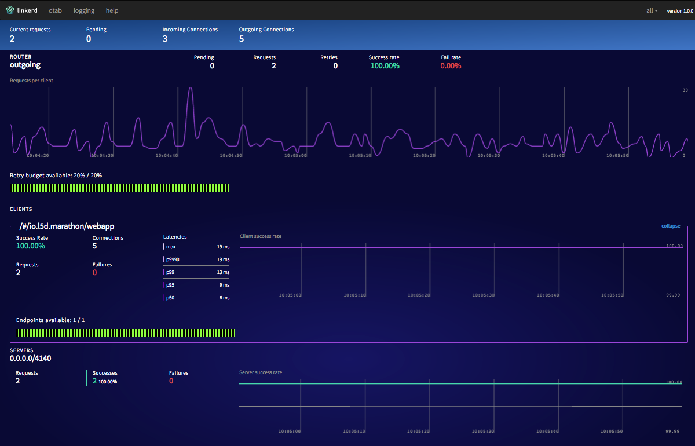
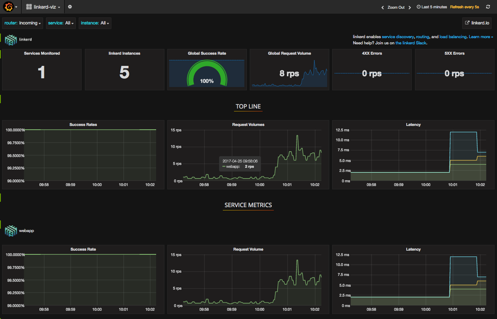

# How to use linkerd on DC/OS

[linkerd](https://linkerd.io) is a service mesh for DC/OS. It is installed on every agent, and acts as a transparent, load-balancing proxy, providing service discovery and resilient communication between services. DC/OS allows you to quickly configure, install, and manage linkerd. Once linkerd is set up, the [linkerd-viz](https://github.com/BuoyantIO/linkerd-viz) DC/OS package will provide immediate visibility and monitoring of services running in DC/OS.

- Estimated time for completion: 5 minutes
- Target audience: Anyone interested in inter-service communication and observability on DC/OS
- Scope: Learn how to install linkerd and linkerd-viz on DC/OS

**Table of Contents**:

- [Prerequisites](#prerequisites)
- [Install linkerd](#install-linkerd)
- [Install linkerd-viz](#install-linkerd-viz)
- [Further Reading](#further-reading)

## Prerequisites

- A running DC/OS 1.9 cluster with at least 1 [public agent](https://dcos.io/docs/1.9/overview/concepts/#public-agent-node) node.
- [DC/OS CLI](https://dcos.io/docs/1.9/cli/install/) installed.

## Install linkerd

The linkerd package in the DC/OS Universe repository installs linkerd on each agent node in the cluster. Applications can use their *node-local* linkerd instance to send traffic through the service mesh and take advantage service discovery, resilient communication, and top-line service metrics.

In order to use linkerd, applications must send traffic through it. Many HTTP applications (typically, those written in C, Go, Ruby, Python or PHP) can do this globally by setting an `http_proxy` environment variable to the address of their node-local linkerd instance. Other applications, including non-HTTP applications, will need to direct traffic to their local linkerd instances in other ways.

linkerd supports both Open Source DC/OS and Mesosphere Enterprise DC/OS. Mesosphere Enterprise DC/OS provides authenticated access to the Marathon API. Follow the appropriate section below depending on your DC/OS setup.

### Open Source DC/OS

#### Install linkerd

```bash
$ dcos package install --options=<(echo '{"linkerd":{"instances":<node count>}}') linkerd
```

Where `<node count>` is the number of agent nodes in your DC/OS cluster.

### Mesosphere Enterprise DC/OS

If authenticated Marathon API access is enabled, follow the steps below to set up a keypair, service account, and secret. More details available at https://docs.mesosphere.com/1.9/security/service-auth/custom-service-auth/.

#### Install Enterprise DC/OS CLI

```bash
$ dcos package install dcos-enterprise-cli
```

#### Generate a keypair
```bash
$ dcos security org service-accounts keypair private-key.pem public-key.pem
```

#### Modify keypair files for use in curl
```bash
$ PUBLIC_KEY=$(tr -d '\n' < public-key.pem | sed "s/BEGIN PUBLIC KEY-----/BEGIN PUBLIC KEY-----\\\\n/g" | sed "s/-----END PUBLIC KEY/\\\\n-----END PUBLIC KEY/g")
$ PRIVATE_KEY=$(tr -d '\n' < private-key.pem | sed "s/BEGIN PRIVATE KEY-----/BEGIN PRIVATE KEY-----\\\\\\\\n/g" | sed "s/-----END PRIVATE KEY/\\\\\\\\n-----END PRIVATE KEY/g")
```

##### Create a service account
```bash
$ curl -X PUT -H "Content-Type: application/json" -H "Authorization: token=$(dcos config show core.dcos_acs_token)" -d "{\"description\":\"linkerd test service\",\"public_key\":\"$PUBLIC_KEY\"}" $(dcos config show core.dcos_url)/acs/api/v1/users/linkerd-service-acct
```

#### Add permissions to service account
```bash
$ curl -X PUT -H "Authorization: token=$(dcos config show core.dcos_acs_token)" $(dcos config show core.dcos_url)/acs/api/v1/acls/dcos:superuser/users/linkerd-service-acct/full
```

#### Create secret
```bash
$ curl -v -X PUT -H "Content-Type: application/json" -H "Authorization: token=$(dcos config show core.dcos_acs_token)" -d "{\"value\":\"{\\\"scheme\\\": \\\"RS256\\\",\\\"uid\\\": \\\"linkerd-service-acct\\\",\\\"private_key\\\": \\\"$PRIVATE_KEY\\\",\\\"login_endpoint\\\": \\\"https://leader.mesos/acs/api/v1/auth/login\\\"}\"}" $(dcos config show core.dcos_url)/secrets/v1/secret/default/linkerd-secret
```

#### Install linkerd

Create an options file:

```bash
OPTIONS=$(cat <<EOF
{
  "linkerd": {
    "instances": <node count>,
    "marathon-host": "leader.mesos",
    "marathon-port": 80,
    "marathon-uri-prefix": "/marathon",
    "secret_name": "linkerd-secret"
  }
}
EOF
)
```

Where `<node count>` is the number of agent nodes in your DC/OS cluster, and `secret_name` matches the secret created in the previous step. The additional `marathon-*` options are typical of a DC/OS Enterprise installation.

```bash
$ dcos package install --options=<(echo $OPTIONS) linkerd
```

## Verify Installation

The linkerd service mesh will now be running on every agent node in your DC/OS cluster, ready to route requests by Marathon task name.

Open the linkerd dashboard with:

```bash
open $(dcos config show core.dcos_url)/service/linkerd
```

You should see an admin page like this:



You can now send traffic to a service by connecting to linkerd and using the service's Marathon task name. For example, a request for `http://myapp/` on any linkerd instance will be proxied to, and load-balanced over, all instances of the *myapp* Marathon task. As instances of *myapp* are scaled up or down, or as instances become slow or disabled, linkerd will automatically adjust the destinations of these requests.

If *myapp* is an HTTP application, a quick way of verifying that the service mesh is up and running is to use `http_proxy` in conjunction with `curl`. For example:

```bash
$ http_proxy=<public agent ip>:4140 curl http://linkerd/admin/ping
```

Note: To determine the value of `<public agent ip>`, see [Finding a Public Agent IP](https://dcos.io/docs/1.9/administration/locate-public-agent/).

## Install linkerd-viz

linkerd exports fine-grained metrics about the services that receive traffic on the mesh. We can use these to easily generate service dashboards by installing the *linkerd-viz* Universe package.

The linkerd-viz package is a bundle with Grafana and Prometheus, preconfigured to find linkerd instances and collect service metrics from them. This package will automatically display top-line service metrics for all services that are connected to by linkerd.

You can install the linkerd-viz package on your DC/OS cluster with this command:

```bash
$ dcos package install linkerd-viz
```

Open the linkerd-viz dashboard with:

```bash
open $(dcos config show core.dcos_url)/service/linkerd-viz
```

You should see the linkerd-viz dashboard:



The dashboard includes three sections:

* TOP LINE. Cluster-wide success rate and request volume.
* SERVICE METRICS. One section for each application deployed. Includes success rate, request volume, and latency.
* PER-INSTANCE METRICS. Success rate, request volume, and latency for each node in your cluster.

As you send traffic through your system, you can the dashboard will update automatically to capture service performance, without configuration on your end.

## Further Resources

* [linkerd Documentation](https://linkerd.io/documentation/)
* [linkerd Slack](http://slack.linkerd.io)
* [linkerd Mailing List](https://groups.google.com/forum/#!forum/linkerd-users)
* [Universe Package Maintainer Email](mailto:linkerd-users@googlegroups.com)
* [DC/OS Blog: Service Discovery and Visibility with Ease on DC/OS](https://dcos.io/blog/2016/service-discovery-and-visibility-with-ease-on-dc-os/index.html)
