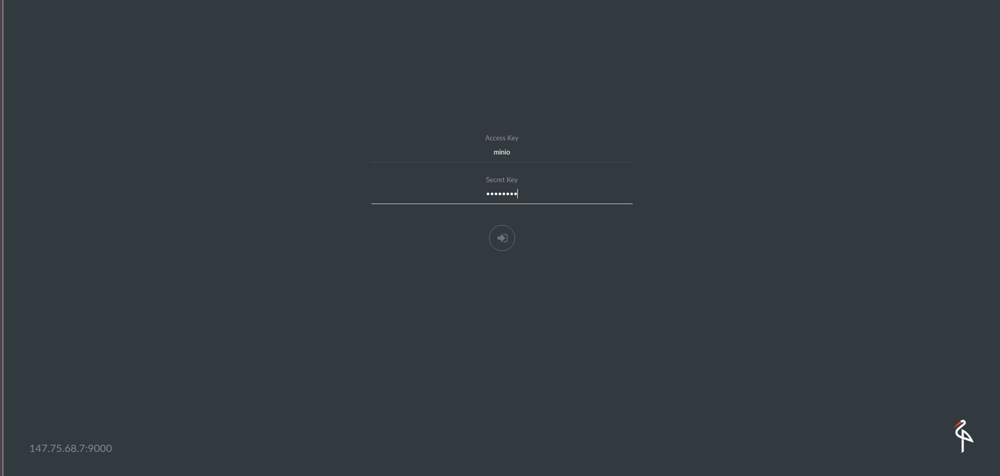

# Install and use Minio on DC/OS

[Minio](https://minio.io) is an object storage server released under Apache License v2.0. It is compatible with Amazon S3 cloud storage service. It is best suited for storing unstructured data such as photos, videos, log files, backups and container / VM images. Size of an object can range from a few KBs to a maximum of 5TB.

Minio server is light enough to be bundled with the application stack, similar to NodeJS, Redis and MySQL.

This installation uses the single node version of Minio (Minio FS), checkout the [Minio docs](https://docs.minio.io) for more details.

The instructions below use a pinned hostname constraint to ensure the application is always restarted on the same host by Marathon. This allows it to get back to its data but means that you could lose data if that agent goes down.

- Estimated time for completion: less than 5 minutes.
- Target audience:
    - Operators
    - Application admins
    - Developers
    - Devops Engineers
- Scope: Learn to install Minio on DC/OS and learn to use it using Minio command line tool `mc`.

**Table of Contents**:

- [Prerequisites](#prerequisites)
- [Minio Installation using GUI](#minio-installation-using-gui)
- [Access Minio Browser](#access-minio-browser)
- [Install Minio Client](#install-minio-client)
- [Configure Minio Client](#configure-minio-client)
- [Uninstalling Minio](#uninstalling-minio)
- [Explore Further](#explore-further)

## Prerequisites

- DC/OS 1.9 or later
- [Marathon-LB](https://dcos.io/docs/1.9/usage/service-discovery/marathon-lb/usage/) must be installed and running
- Identify [IP of the public agent](https://dcos.io/docs/1.9/administration/locate-public-agent/) where Marathon-LB or an available hostname configured to point to the public agent(s) where Marathon-LB is running.

## Minio installation using GUI

- Visit the DC/OS admin page, and click on Catalog on the left menu bar, then search for Minio, click on the ```Deploy``` button on the right hand side.


- Click on the `Install Package` button for the single-click default installation. You can reach your Minio server at `host:9000` where `host` is IP address or hostname of public-agent where Marathon-LB is installed.


- This installs Minio server instance with factory defaults


- To customize the storage and network configuration, click on `Services` and select the minio service, then select `CONFIGURE`.

- Service Name - Unique name for this Minio server instance.


- CPU & Memory


- Volume size


- Credentials - Access Key and Secret Key for this Minio server.


- Networking - Choose the port on which Minio server is available and whether it is available externally.


- We're ready to install! Verify your settings are correct and then click ```Review and Deploy``` green button and `Deploy`.


- This completes the install process. Once Minio has been deployed, navigate to the IP/hostname of Public Agent where Marathon-LB is installed and the port you specified. You should see the following login page.

## Access Minio Browser


- The default access key and secret key are `minio` and `minio123` respectively. This can be used to log in on Minio browser page.



- Once you have successfully loggedin you should see the following screen.


## Install Minio Client

Minio Client (mc) provides a modern alternative to UNIX commands like ls, cat, cp, mirror, diff etc. It supports filesystems and Amazon S3 compatible cloud storage service (AWS Signature v2 and v4).

[Click here](https://docs.minio.io/docs/minio-client-quickstart-guide) for instructions on installing mc.

## Configure Minio Client

- There are different ways to configure Minio Client for different S3 cloud storage providers.
- Refer to [Guide](https://docs.minio.io/docs/minio-client-complete-guide) for further configuration.

### Example - Minio Cloud Storage

```sh
mc config host add <ALIAS> <YOUR-MINIO-BROWSER-ADDRESS> <YOUR-ACCESS-KEY> <YOUR-SECRET-KEY> <API-SIGNATURE>(optional)
```

*Example: Create a new bucket named "mybucket" on http://54.255.206.228*

```sh
mc config host add minio-dcos http://54.255.206.228 ELVUN4CWOAIRWOT2AO9D 4e6CIFtWW1/YI91Pd6FONRJgssKiFO2Ea1d5fDwp S3v4
mc mb minio-dcos/mybucket
Bucket created successfully ‘minio-dcos/mybucket’.
```
Now switch to Minio Browser, you can see mybacket in left-side panel where all the backets are listed.

Last but not least I want you to see what Minio’s resource footprint looks like:


## Uninstalling Minio

```sh
dcos package uninstall minio
```

## Explore Further
- [Minio Erasure Code QuickStart Guide](https://docs.minio.io/docs/minio-erasure-code-quickstart-guide)
- [Use `mc` with Minio Server](https://docs.minio.io/docs/minio-client-quickstart-guide)
- [Minio Client SDK](https://docs.minio.io/categories/17)
- [Use `aws-cli` with Minio Server](https://docs.minio.io/docs/aws-cli-with-minio)
- [Use `s3cmd` with Minio Server](https://docs.minio.io/docs/s3cmd-with-minio)
- [Use `minio-go` SDK with Minio Server](https://docs.minio.io/docs/golang-client-quickstart-guide)
- [The Minio documentation website](https://docs.minio.io)
