# Install and use Minio on DC/OS

[Minio](https://minio.io) is an object storage server released under Apache License v2.0. It is compatible with Amazon S3 cloud storage service. It is best suited for storing unstructured data such as photos, videos, log files, backups and container / VM images. Size of an object can range from a few KBs to a maximum of 5TB.

Minio server is light enough to be bundled with the application stack, similar to NodeJS, Redis and MySQL.

This installation uses the single node version of Minio (Minio FS), checkout the [Minio docs](https://docs.minio.io) for more details.

The instructions below use a pinned hostname constraint to ensure the application is always restarted on the same host by Marathon. This allows it to get back to its data but means that you could lose data if that agent goes down.

- Estimated time for completion: less than 5 minutes.
- Target audience:
    - Operators
    - Application admins
    - Developers
    - Devops Engineers
- Scope: Learn to install Minio on DC/OS and learn to use it using Minio command line tool `mc`.

**Table of Contents**:

- [Prerequisites](#prerequisites)
- [Minio Installation using GUI](#minio-installation-using-gui)
- [Customize Minio using GUI](#customize-minio-using-gui)
- [Minio Installation using CLI](#minio-installation-using-cli)
- [Access Minio Browser](#access-minio-browser)
- [Install Minio Client](#install-minio-client)
- [Configure Minio Client](#configure-minio-client)
- [Uninstall Minio using CLI](#uninstall-minio-using-cli)
- [Explore Further](#explore-further)

## Prerequisites

- DC/OS 1.11 or later
- [Marathon-LB](https://docs.mesosphere.com/services/marathon-lb/) must be installed and running
- Identify [IP of the public agent](https://docs.mesosphere.com/1.11/administering-clusters/locate-public-agent/) where Marathon-LB or an available hostname configured to point to the public agent(s) where Marathon-LB is running.

## Minio installation using GUI

- Login to DC/OS admin, click on Catalog on the left menu bar, search `minio` and select the package with following logo.

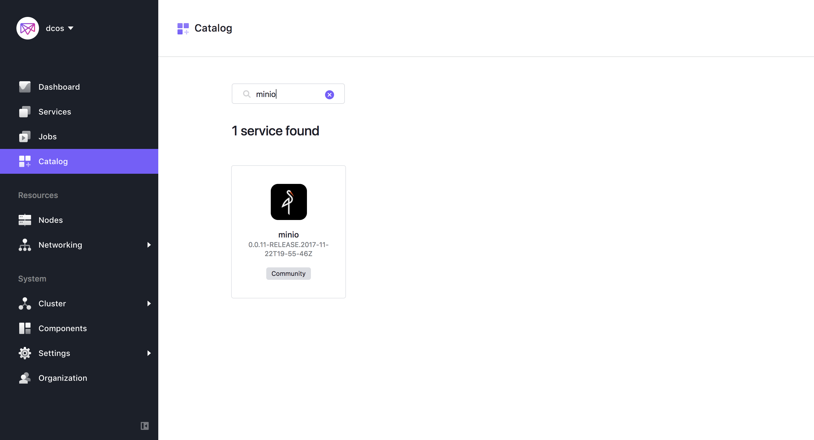

- Click on the `Review & Run` button for the single-click default installation. You can reach your Minio server at `host:9000` where `host` is IP address or hostname of public-agent where Marathon-LB is installed.

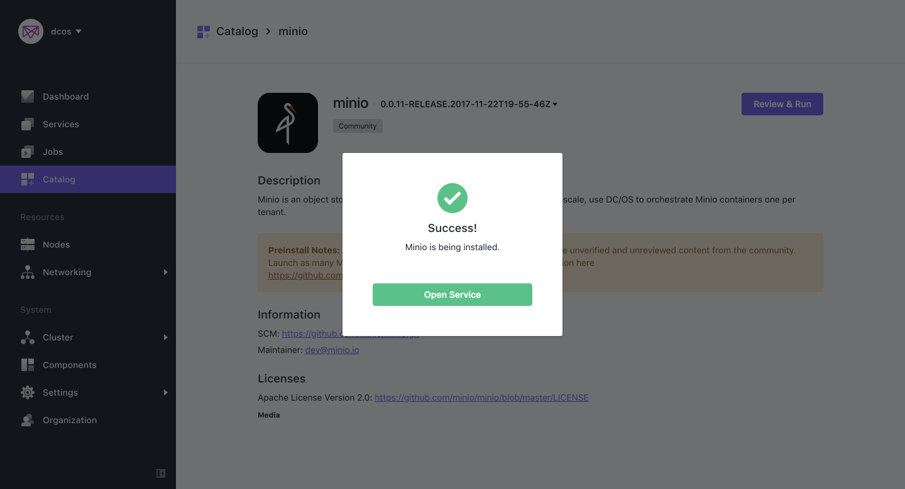

- This installs Minio server instance with factory defaults

- Go to `Services` from left menu bar and verify, minio service status should show `Running` or wait for the status update.

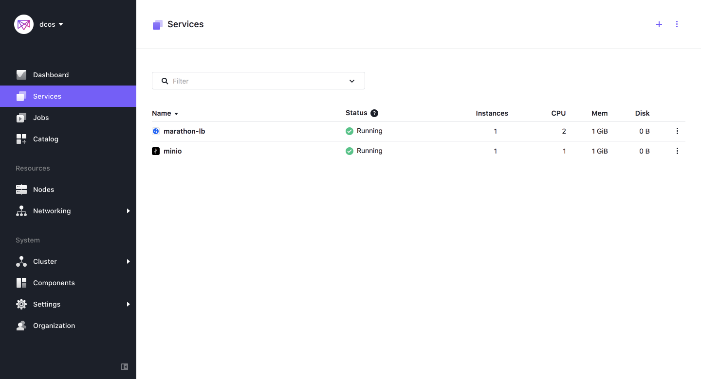

- Once Minio has been deployed, navigate to the IP/hostname of Public Agent where Marathon-LB is installed and the port you specified. To customize deployed minio server, continue reading or go to [Access Minio Browser](#access-minio-browser) section.

### Customize Minio using GUI

- To customize the storage and network configuration, select the minio service, then select `Edit`.

  - Service - You can specify how much memory you want to dedicate to minio service, which image version to deploy, CPUs and container runtime([Docker Runtime](https://docs.mesosphere.com/1.11/deploying-services/containerizers/docker-containerizer/) and [UCR](https://docs.mesosphere.com/1.11/deploying-services/containerizers/ucr/)).

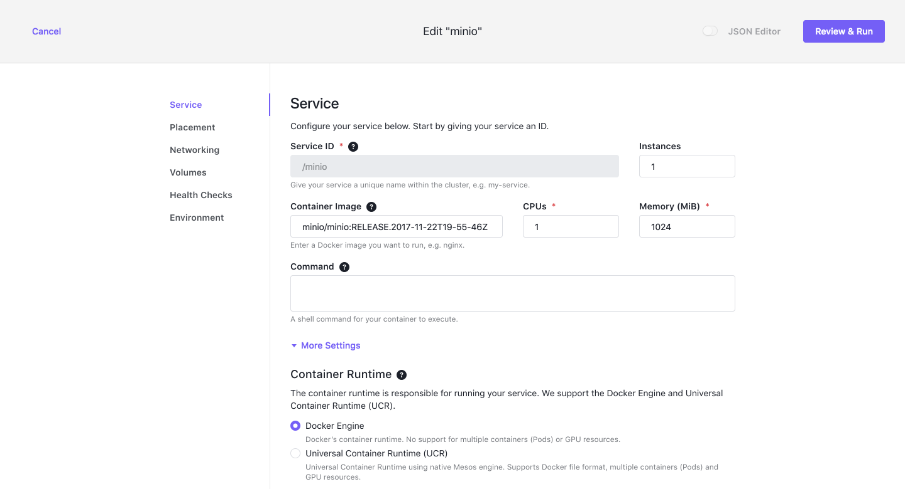

  - Networking - Choose the port on which Minio server is available and whether it is available externally.
  
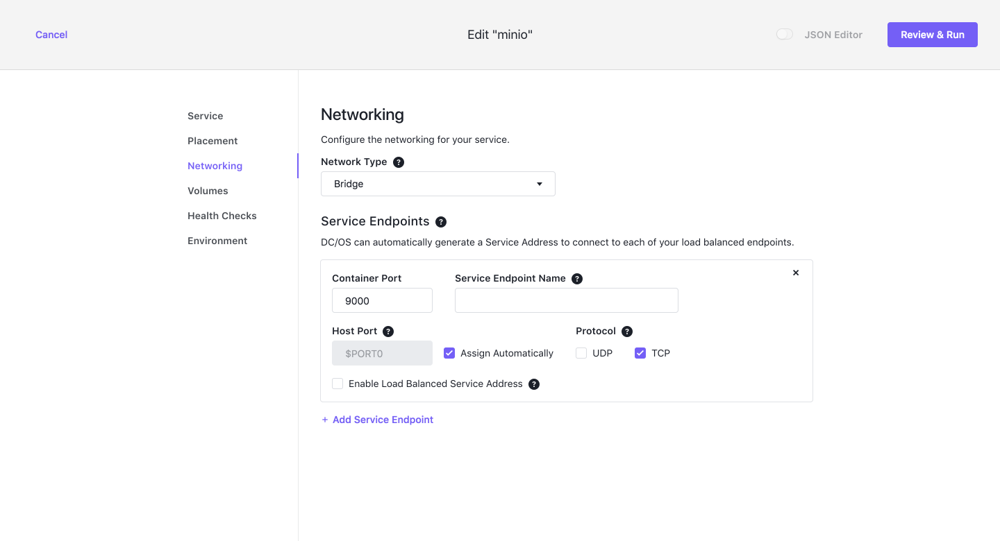

  - Volume - You can see and specify how much storage you want to allocate for minio data storage.
  
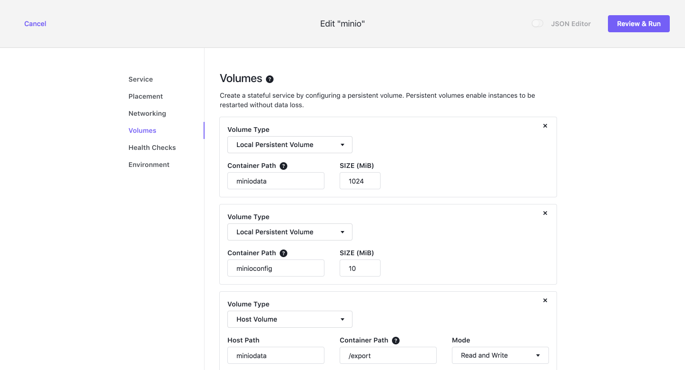

  - Health Checks - It is very important to check whether our minio service is working or not. DCOS will run this command to check our service health. You should keep it as it is if you don't know what are you doing.
  
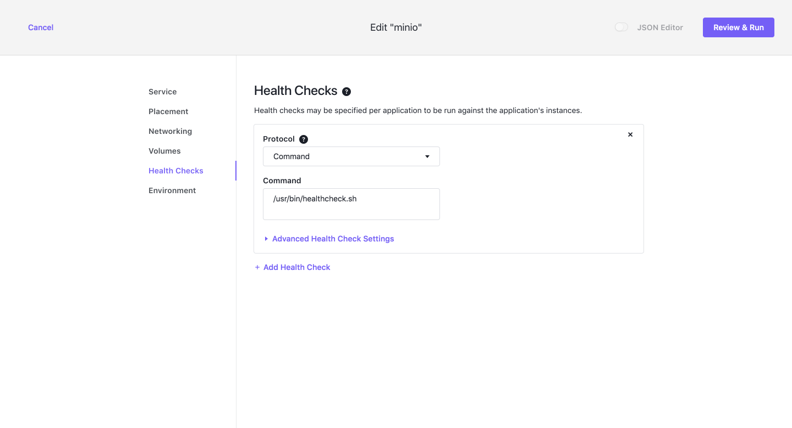

  - Environment - `MINIO_ACCESS_KEY` and `MINIO_SECRET_KEY` for this Minio server. We need this to login on our minio web server.
  
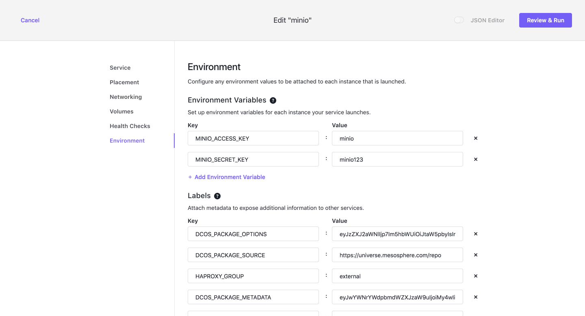


  - We're ready to update! Verify your settings are correct, click on `Review and Run` and then `Run Service`.

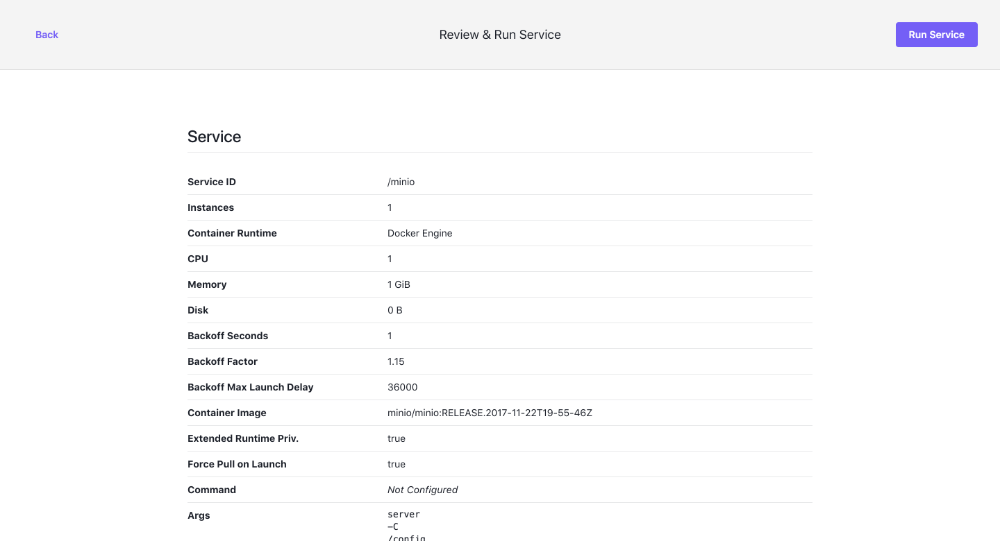

## Access Minio Browser
- Access minio browser

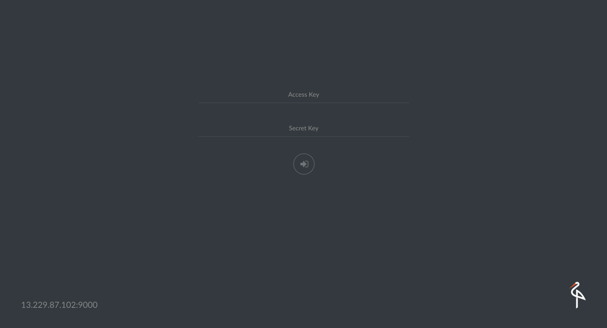

- The default access key and secret key are `minio` and `minio123` respectively. This can be used to log in on Minio browser page.

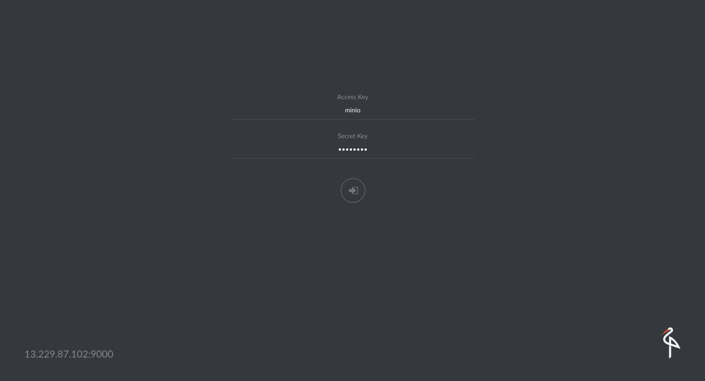

- Once you have successfully loggedin you should see the following screen.

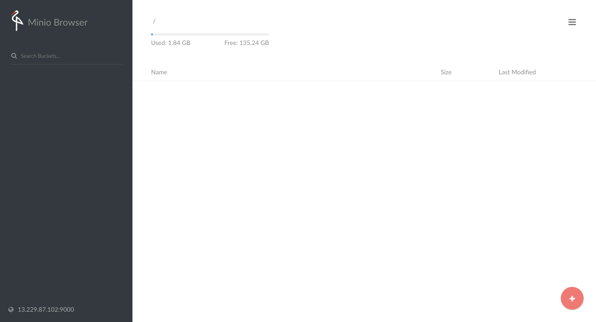

- Create a bucket from bottom right corner and upload any file for testing.

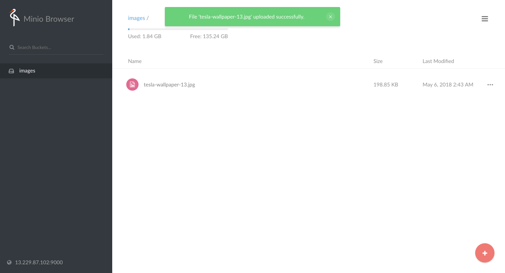

## Minio Installation using CLI

You can install minio using [dcos cli](https://docs.mesosphere.com/1.11/cli/). Download and setup dcos cli for your OS.

Run following command to install minio with default values.

```
$ dcos package install minio
```

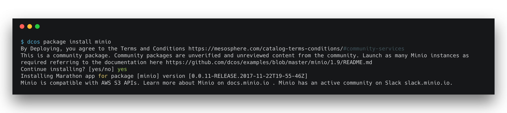

## Install Minio Client

Minio Client (mc) provides a modern alternative to UNIX commands like ls, cat, cp, mirror, diff etc. It supports filesystems and Amazon S3 compatible cloud storage service (AWS Signature v2 and v4).

[Click here](https://minio.io/downloads.html#download-client) for instructions on installing mc.

## Configure Minio Client

- There are different ways to configure Minio Client for different S3 cloud storage providers.
- Refer to [Guide](https://docs.minio.io/docs/minio-client-complete-guide) for further configuration.

### Example - Minio Cloud Storage

```sh
mc config host add <ALIAS> <YOUR-MINIO-BROWSER-ADDRESS> <YOUR-ACCESS-KEY> <YOUR-SECRET-KEY> <API-SIGNATURE>(optional)
```

*Example: Create a new bucket named "mybucket" on http://YOUR-MINIO-BROWSER-ADDRESS*

```sh
mc config host add minio-dcos http://YOUR-MINIO-BROWSER-ADDRESS ELVUN4CWOAIRWOT2AO9D 4e6CIFtWW1/YI91Pd6FONRJgssKiFO2Ea1d5fDwp S3v4
mc mb minio-dcos/mybucket
Bucket created successfully ‘minio-dcos/mybucket’.
```
Now switch to Minio Browser, you can see mybacket in left-side panel where all the backets are listed.

Last but not least I want you to see what Minio’s resource footprint looks like:
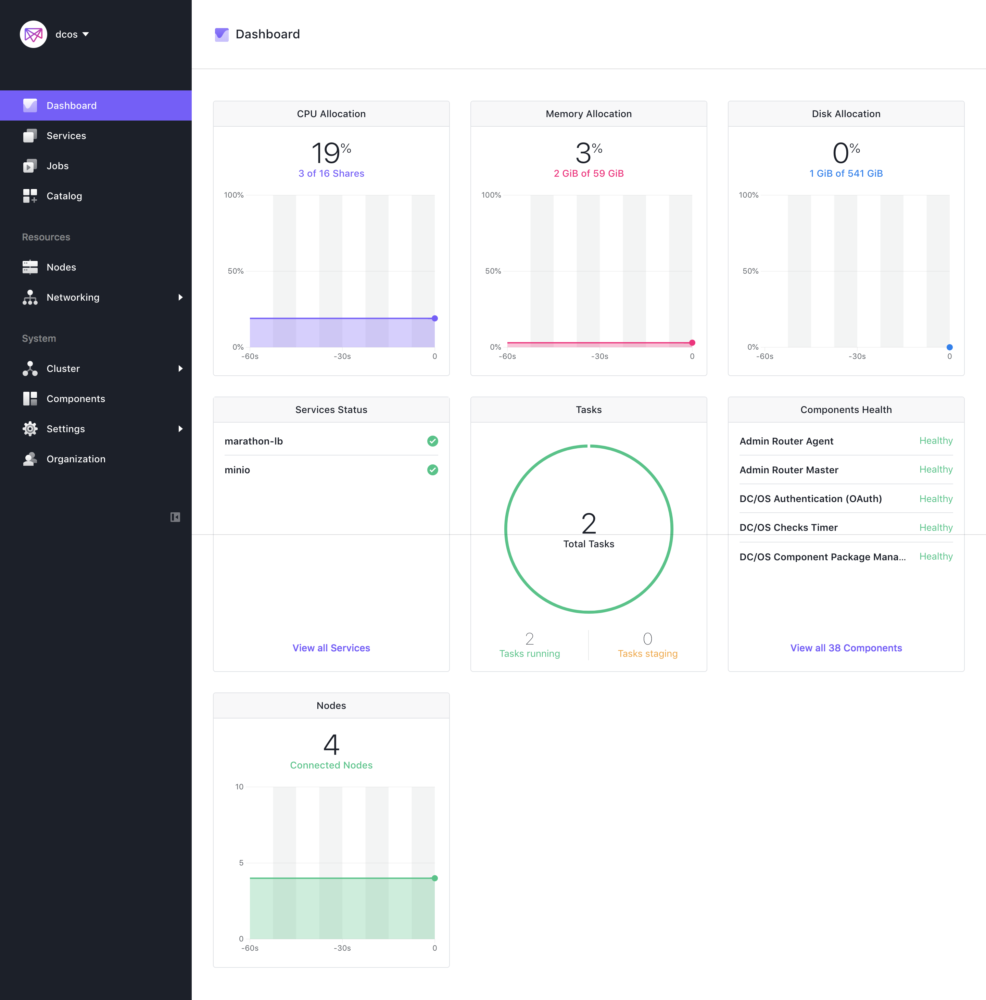

## Uninstall Minio using CLI

You can always uninstall minio package using following command even if you have installed it using GUI.

```
dcos package uninstall minio
```

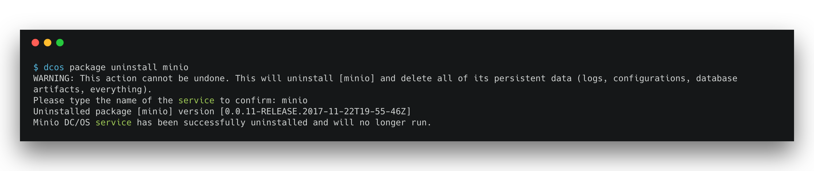

## Explore Further
- [Minio Erasure Code QuickStart Guide](https://docs.minio.io/docs/minio-erasure-code-quickstart-guide)
- Download minio client
- [Use `mc` with Minio Server](https://docs.minio.io/docs/minio-client-quickstart-guide)
- [Minio Client SDK](https://docs.minio.io/categories/17)
- [Use `aws-cli` with Minio Server](https://docs.minio.io/docs/aws-cli-with-minio)
- [Use `s3cmd` with Minio Server](https://docs.minio.io/docs/s3cmd-with-minio)
- [Use `minio-go` SDK with Minio Server](https://docs.minio.io/docs/golang-client-quickstart-guide)
- [The Minio documentation website](https://docs.minio.io)
