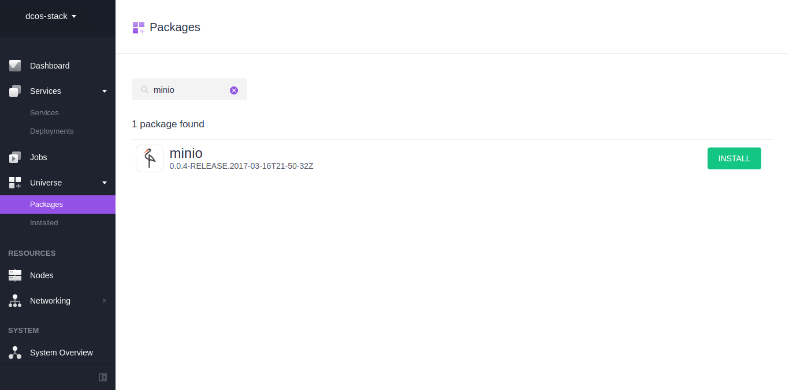
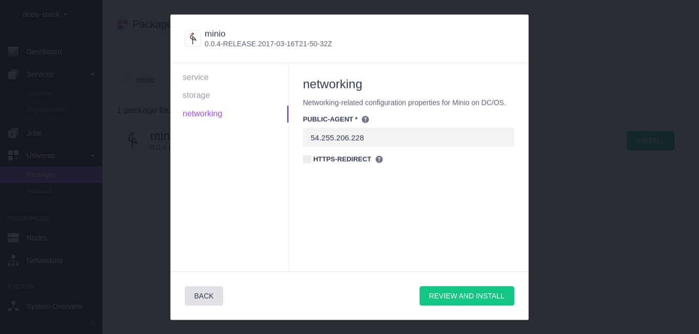
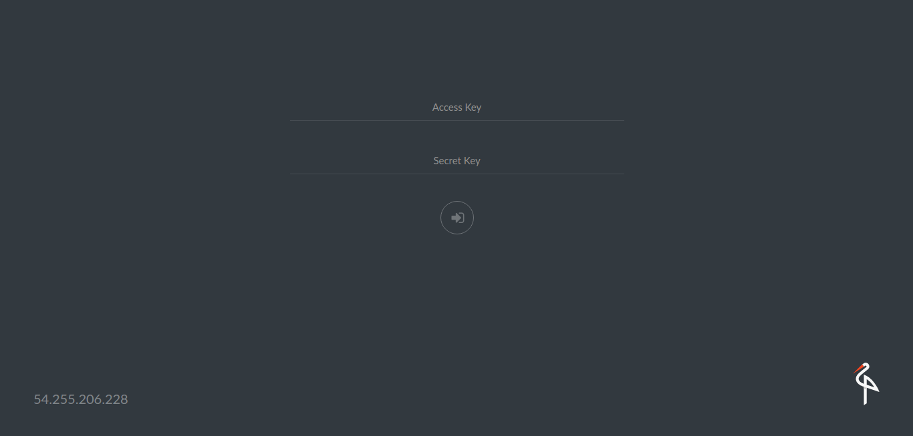
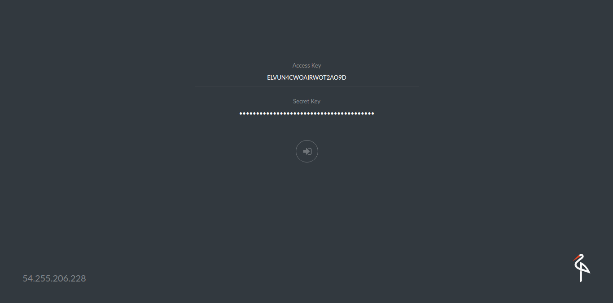

# Install and use Minio on DC/OS

[Minio](https://minio.io) is an object storage server released under Apache License v2.0. It is compatible with Amazon S3 cloud storage service. It is best suited for storing unstructured data such as photos, videos, log files, backups and container / VM images. Size of an object can range from a few KBs to a maximum of 5TB.

Minio server is light enough to be bundled with the application stack, similar to NodeJS, Redis and MySQL. 

This installation uses the single node version of Minio (Minio FS), checkout the [Minio docs](https://docs.minio.io) for more details.

The instructions below use a pinned hostname constraint to ensure the application is always restarted on the same host by Marathon. This allows it to get back to its data but means that you could lose data if that agent goes down. 

- Estimated time for completion: less than 5 minutes. 
- Target audience:
    - Operators
    - Application admins
    - Developers 
    - Devops Engineers
- Scope: Learn to install Minio on DC/OS and learn to use it using Minio command line tool `mc`.

**Table of Contents**:

- [Prerequisites](#prerequisites)
- [Setting up Minio](#setting-up-minio)
- [Minio Installation using GUI](#minio-installation-using-gui)
- [Access Minio Browser](#access-minio-browser)
- [Install Minio Client](#install-minio-client)
- [Configure Minio Client](#configure-minio-client)
- [Uninstalling Minio](#uninstalling-minio)
- [Explore Further](#explore-further)

## Prerequisites

- DC/OS 1.9 or later
- [Marathon-LB](https://dcos.io/docs/1.9/usage/service-discovery/marathon-lb/usage/) must be installed and running
- IP address of the public agent(s) where Marathon-LB or an available hostname configured to point to the public agent(s) where Marathon-LB is running.

## Setting up Minio

You can install Minio Universe package using the DC/OS GUI or CLI.

Before starting, identify the IP address or hostname of a public agent where Marathon-LB is running. 

## Minio installation using GUI

- Visit the DC/OS admin page, and click on Universe on the left menu bar. Then click on the Packages tab and search for Minio, click on the ```Install``` button on the right hand side.



- Then click on ```Advanced Installation```, enter configuration values like the storage and service type you’d like to use with your Minio instance. Finally specify the IP address or hostname of the public agent where Marathon-LB is running under ```networking >> public agent```. Make sure you remove the leading http:// and the trailing / from the IP.



- We're ready to install! Click the green ```Review and Install``` button, verify your settings are correct and then click ```Install``` green button.


 
- This completes the install process. Once Minio has been deployed, navigate to the IP/hostname you used earlier for Public Agent. You should see the following login page.

## Access Minio Browser



- We need the access key and secret key from the Minio container logs. Click on ```Services``` and select Minio service in DC/OS admin page. Then go to the ```logs``` tab and copy the accesskey and secretkey.


- Navigate to services UI and click on Minio and go to the logs section. Copy the _AccessKey_ and _SecretKey_ and use it to log into the browser console.



- Once you have successfully loggedin you should see the following screen. 


### Minio installation using CLI

To install Minio package via CLI, type

```sh
dcos package install minio
```

## Install Minio Client

Minio Client (mc) provides a modern alternative to UNIX commands like ls, cat, cp, mirror, diff etc. It supports filesystems and Amazon S3 compatible cloud storage service (AWS Signature v2 and v4).

[Click here](https://docs.minio.io/docs/minio-client-quickstart-guide) for instructions on installing mc.

## Configure Minio Client

### Example - Minio Cloud Storage

```sh
mc config host add <ALIAS> <YOUR-S3-ENDPOINT> <YOUR-ACCESS-KEY> <YOUR-SECRET-KEY> <API-SIGNATURE>
```

*Example: Create a new bucket named "mybucket" on http://54.255.206.228*

```sh
mc config host add minio-dcos http://54.255.206.228 ELVUN4CWOAIRWOT2AO9D 4e6CIFtWW1/YI91Pd6FONRJgssKiFO2Ea1d5fDwp S3v4
mc mb minio-dcos/mybucket
Bucket created successfully ‘minio-dcos/mybucket’.
```

Last but not least I want you to see what Minio’s resource footprint looks like:


## Uninstalling Minio

```sh
dcos package uninstall minio
```

## Explore Further

- [Minio Erasure Code QuickStart Guide](https://docs.minio.io/docs/minio-erasure-code-quickstart-guide)
- [Use `mc` with Minio Server](https://docs.minio.io/docs/minio-client-quickstart-guide)
- [Use `aws-cli` with Minio Server](https://docs.minio.io/docs/aws-cli-with-minio)
- [Use `s3cmd` with Minio Server](https://docs.minio.io/docs/s3cmd-with-minio)
- [Use `minio-go` SDK with Minio Server](https://docs.minio.io/docs/golang-client-quickstart-guide)
- [The Minio documentation website](https://docs.minio.io)
