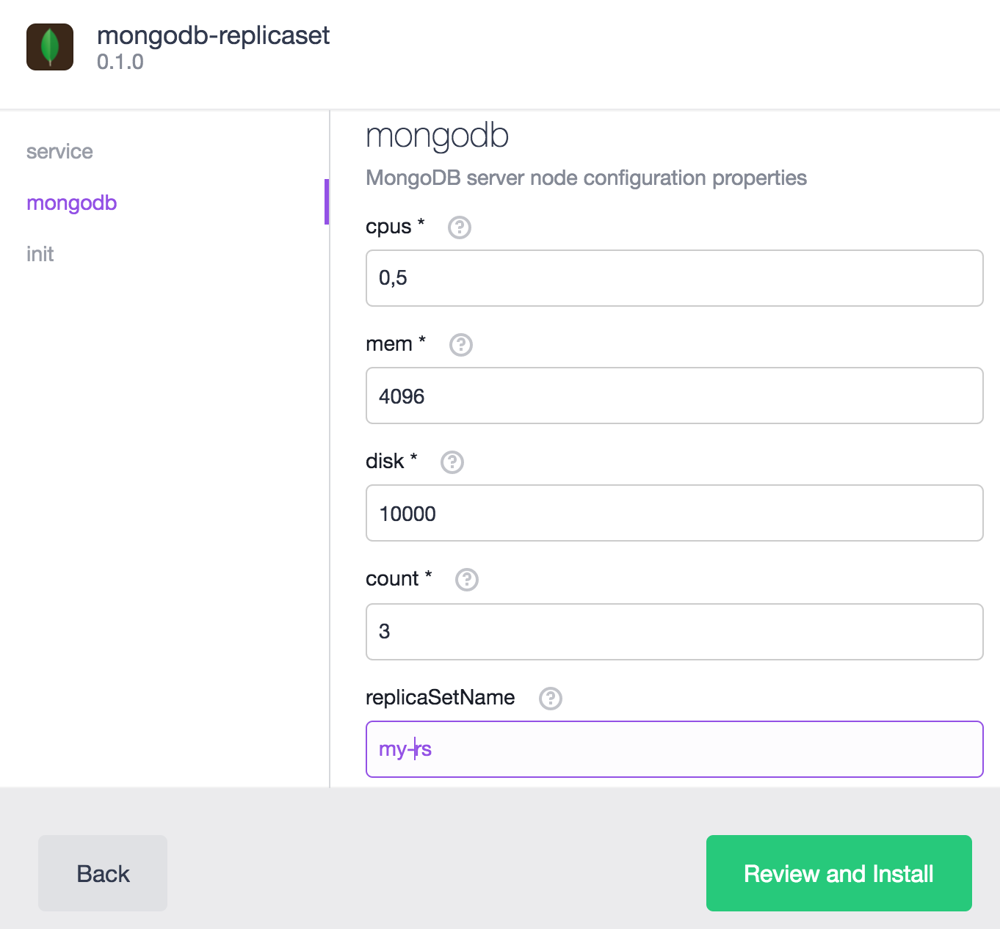
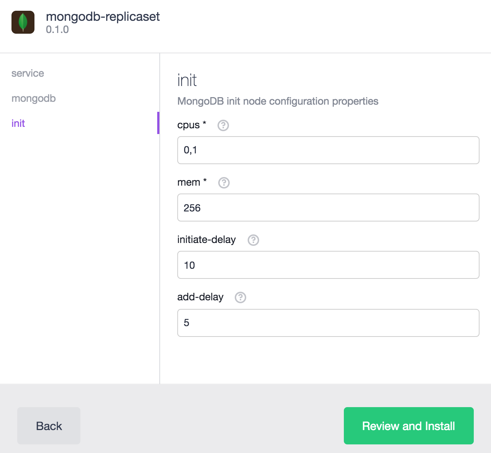

# How to use the MongoDB Replica Set package for DC/OS

[MongoDB](http://www.mongodb.com) is a popular document-oriented NoSQL database. It can be used to create clusters of `mongod` instances, so-called Replica Sets.

- Estimated time for completion: 15 minutes
- Target audience: Anyone interested in using MongoDb Replica Sets on top of DC/OS
- Scope: Learn how to install a MongoDB Replica Set on DC/OS

**Table of Contents**:

- [Prerequisites](#prerequisites)
- [Limitations](#limitations)
- [Installation](#installation)
 - [CLI installation](#cli-installation)
 - [UI installation](#ui-installation)
- [CLI integration](#cli-integration)
 - [Manual extension installation](#manual-extension-installation)
 - [Command overview](#command-overview)
- [Service discovery](#service-discovery)
- [Uninstallation](#uninstallation)

## Prerequisites

- A running DC/OS 1.8 cluster with at least 3 private agents, each having at least 0.5 CPU shares and 2 GB of RAM available.
- [DC/OS CLI](https://dcos.io/docs/1.8/usage/cli/install/) installed.

## Limitations

Currently, it is not possible to scale the Replica Set to more instances than defined when installing the package, due to how the YAML plans work in [dcos-commons](https://github.com/mesosphere/dcos-commons). In the future, it's very likely that this will be possible.

## Installation

There are two ways to install the `mongodb-replicaset` package from the Universe:

### CLI installation

To install the `mongodb-replicaset` package with default settings, use the following:

```bash
$ dcos package install --yes mongodb-replicaset
```

If you want to customize the package, create an `options.json` file and add your custom configuration (see the example below):

```javascript
{
  "service": {
    "name": "my-mongodb-replicaset"
  },
  "mongodb": {
    "cpus": 1,
    "mem": 4096,
    "disk": 10000,
    "replicaSetName": "my-rs"
  }
}
```

This would then launch a service called `my-mongodb-replicaset`, which uses `1` cpu, `4096` megabytes of memory, and `10000` megabytes of disk space (local persistent volume) for each `mongo` instance. Furthermore, the Replica Set name would be `my-rs`.

### UI installation

In the first tab, you can define your DC/OS service name:


In the second tab, you can set everything related to the actual `mongod` instances, namingly the resource requirements, the Replica Set name the MongoDB version, among other things:


In the third tab you can configure the resources and delays for the `init` container. Normally, you don't need to change anything here:


## CLI integration

The `mongodb-replicaset` package has a integration in the DC/OS CLI (via the `dcos-commons` cli extensions), which is installed if you install the package via CLI.

### Manual extension installation

You can also manually install the CLI extension (if you have installed the package via DC/OS UI for example) by running

```bash
$ dcos package install --cli mongodb-replicaset
```

### Command overview

```bash
$ dcos mongodb-replicaset --help
usage: mongodb-replicaset [<flags>] <command> [<args> ...]

Provides CLI integration for the mongodb-replicaset package

Flags:
  -h, --help            Show context-sensitive help (also try --help-long and
                        --help-man).
      --version         Show application version.
  -v, --verbose         Enable extra logging of requests/responses
      --info            Show short description.
      --force-insecure  Allow unverified TLS certificates when querying service
      --custom-auth-token=DCOS_AUTH_TOKEN
                        Custom auth token to use when querying service
      --custom-dcos-url=DCOS_URI/DCOS_URL
                        Custom cluster URL to use when querying service
      --custom-cert-path=DCOS_CA_PATH/DCOS_CERT_PATH
                        Custom TLS CA certificate file to use when querying
                        service
      --name="mongodb-replicaset"
                        Name of the service instance to query

Commands:
  help [<command>...]
    Show help.

  config list
    List IDs of all available configurations

  config show <config_id>
    Display a specified configuration

  config target
    Display the target configuration

  config target_id
    List ID of the target configuration

  pods list
    Display the list of known pod instances

  pods status [<pod>]
    Display the status for tasks in one pod or all pods

  pods info <pod>
    Display the full state information for tasks in a pod

  pods restart <pod>
    Restarts a given pod without moving it to a new agent

  pods replace <pod>
    Destroys a given pod and moves it to a new agent

  endpoints [<flags>] [<name>]
    View client endpoints

  plan active
    Display the active operation chain, if any

  plan show
    Display the full plan

  plan continue
    Continue a currently Waiting operation

  plan interrupt
    Interrupt the current InProgress operation

  plan force <phase> <step>
    Force the current operation to complete

  plan restart <phase> <step>
    Restart the current operation

  state framework_id
    Display the mesos framework ID

  state status <name>
    Display the TaskStatus for a task name

  state task <name>
    Display the TaskInfo for a task name

  state tasks
    List names of all persisted tasks
``` 

## Service discovery

If you have installed the DC/OS cli subcommand for `mongodb-replicaset` [as described](#cli-integration), then you can use the following command to retrieve the endpoints information: 

```bash
$ dcos mongodb-replicaset endpoints --native
{
  "mongodb": {
    "direct": [
      "172.17.0.5:27017",
      "172.17.0.3:27017",
      "172.17.0.4:27017"
    ],
    "vip": "mongodb.mongodb-replicaset.l4lb.thisdcos.directory:27017"
  }
}
```

If you pass the `--native` flag, the result will contain actual `<ip>:<port>` information. If you omit it, then Mesos DNS hostnames will be shown.

As the framework uses VIPs, you can use a simple MongoDB connection string to connect to the running Replica Set from inside the DC/OS cluster:

```bash
mongodb://mongodb.mongodb-replicaset.l4lb.thisdcos.directory:27017/?replicaSet={mongodb.replicaSetName}
```

where `{mongodb.replicaSetName}` is the Replica Set name you used while configuring the package.

It will then use Minuteman under the hood to loadbalance the requests to individual MongoDB instances.

## Uninstallation

To uninstall the service `mongodb-replicaset` (please adapt/replace accordingly if you used another service name):

```bash
$ dcos package uninstall --app-id=mongodb-replicaset mongodb-replicaset
```

Use the [framework cleaner](https://docs.mesosphere.com/1.8/usage/managing-services/uninstall/#framework-cleaner) to remove your `mongodb-replicaset` service from ZooKeeper and to destroy all data associated with it. The script requires several arguments, the values for which are derived from your service name:

- `framework-role` is `mongodb-replicaset-role`
- `framework-principal` is `mongodb-replicaset-principal`
- `zk_path` is `dcos-service-mongodb-replicaset`