About OMS and Container Solution
================================

Microsoft Operations Management (OMS) is Microsoft's cloud-based IT
management solution that helps you manage and protect your on-premises
and cloud infrastructure. Container Solution is a solution in OMS Log
Analytics, which helps you view the container inventory, performance,
and logs in a single location. You can audit, troubleshoot containers by
viewing the logs in centralized location, and find noisy consuming
excess container on a host.

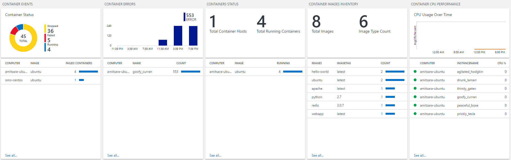

For more information about Container Solution, please refer to the
[Container Solution Log
Analytics](https://azure.microsoft.com/en-us/documentation/articles/log-analytics-containers/).

Setting up OMS from the DC/OS universe
======================================

This article assumes that you have set up an DC/OS cluster and
have deployed simple web container applications on the cluster.

### Pre-requisite
- [Microsoft Azure Subscription](https://azure.microsoft.com/en-us/free/) - You can try this for free.  
- Microsoft OMS WorksSpace Setup - if you have not set this up see "Step 3" below
- [DC/OS CLI](https://dcos.io/docs/1.9/usage/cli/install/) installed.

### Install OMS Agent for Linux 

**Step 1:** In the DC/OS dashboard, click on Universe / Packages and search
for ‘OMS’ as shown below.

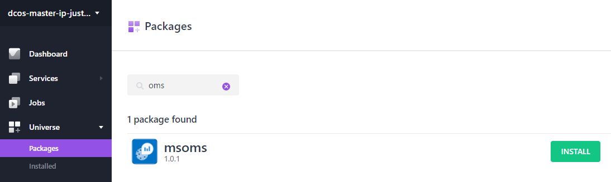
==================================================================

**Step 2:** Click on **Install**. You will see a pop up with the OMS version
information and an **Install Package** or **Advanced Installation**
button. When you click on the **Advanced Installation** button. Once you
click the button, it will lead you to **OMS specific configuration
properties** page.

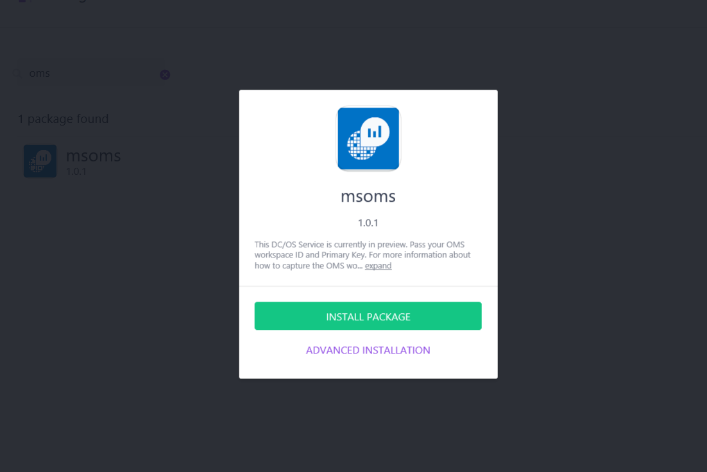

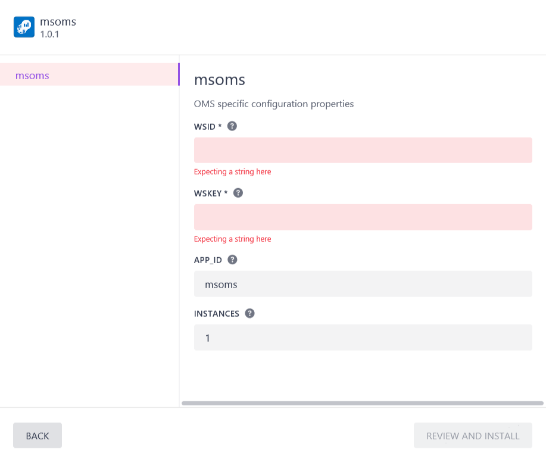

**Step 3:** Here, you will be asked to enter the `wsid` (OMS workspace id
and `wskey` (OMS Primary key for the workspace id). To get both `wsid` and
`wskey` you need to create an OMS account at <https://mms.microsoft.com>.
Please follow the steps to create an account. Once you are done creating 
the account, you need to obtain your `wsid` and `wskey` by clicking **Settings**, then **Connected Sources**, and then **Linux Servers**, as shown below.

You will get both the workspace id and the workspace key (=Primary Key) that 
you can copy paste in the OMS configuration pop up.

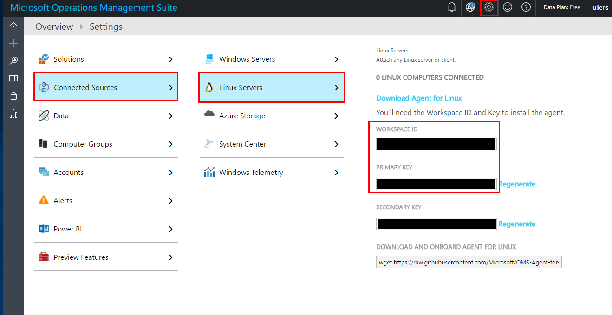

**Step 4**: Select the number of your OMS instances that you want and click
the ‘Review and Install’ button. Typically, you will want to have the
number of OMS instances equal to the number of VM’s you have in your
agent cluster. OMS Agent for Linux is installs as individual
containers on each VM that it wants to collect information for
monitoring and logging information. You can start with one and scale later.

## Setting up OMS dashboard

Once you have installed the OMS Agent for Linux on the VMs, next step is
to set up the OMS dashboard. There are two ways to do this: OMS Portal
or Azure Portal.

### OMS Portal 

Log in to OMS portal (<https://mms.microsoft.com>) and go to Solution
Gallery.

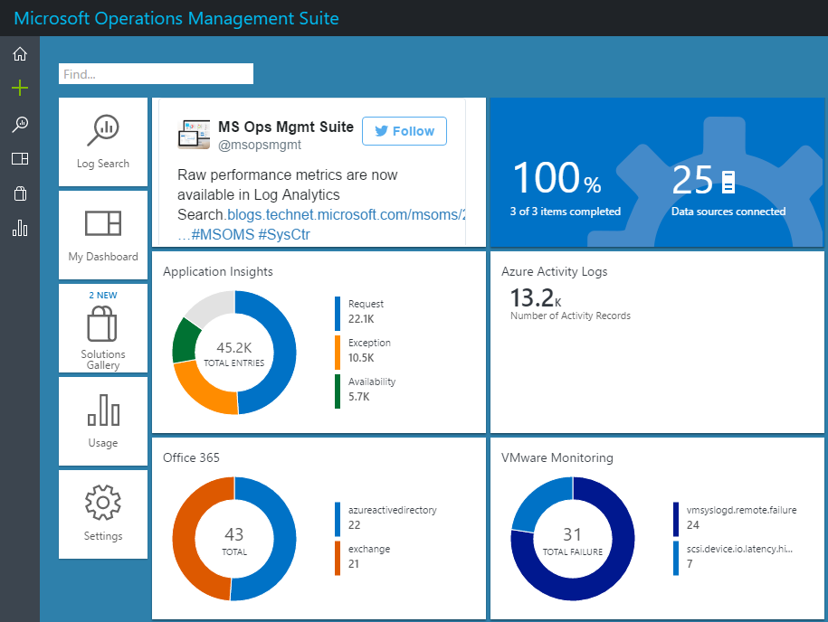

Once you are in **Solution Gallery**, select **Containers**.

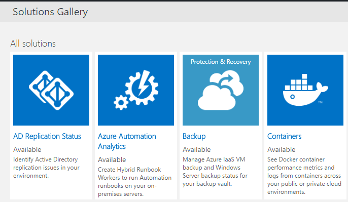

Once you’ve selected the Container Solution, you will see the tile on
the OMS Overview Dashboard page. Once the ingested Container data is
indexed, you will see the tile populated with information on the
solution view tiles. It could be few minutes before to see data collected.

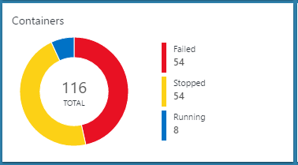

### Azure Portal 

Login to Azure Portal at <https://azure.microsoft.com/>. Go to
**Marketplace**, select **Monitoring + management** and click on **See All**
link. Then Type `containers` in search. You will see **Containers** in the
search results. Select **Containers** and click **Create**

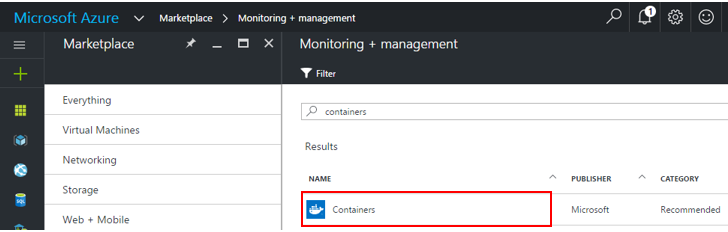

Once you click **Create** it will ask you for your workspace. Select your
workspace or if you do not have one, create a new workspace.

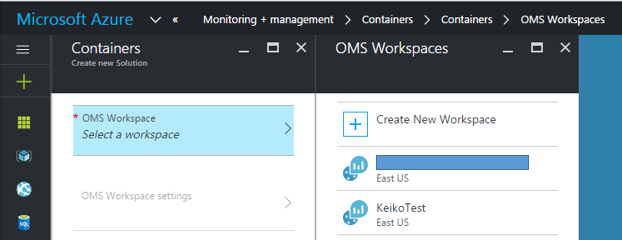

Once you’ve selected your workspace, click **Create**.

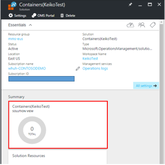

### How to scale OMS Agent with ACS DC/OS 

In case you need to have installed OMS agent short of the actual node
count or you are scaling up VMSS by adding more VM, you can do so by
scaling the **msoms** service.

You can either go to Marathon or DC/OS UI Services tab and scale up to
your node count.

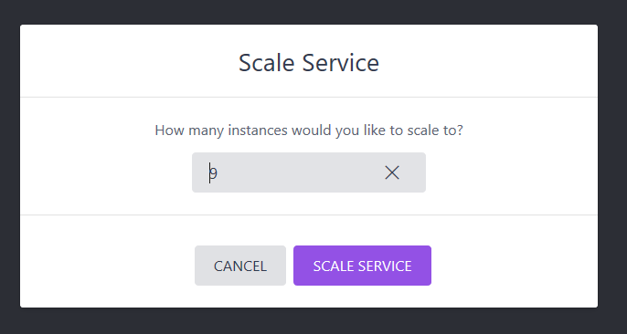

This will deploy to other nodes which has not being deployed OMS agent.

## Uninstall MS OMS

To uninstall MS OMS enter the following command from DCOS CLI:

```bash
$ dcos package uninstall msoms
```

Or you can destroy the service from DC/OS Dashboard:

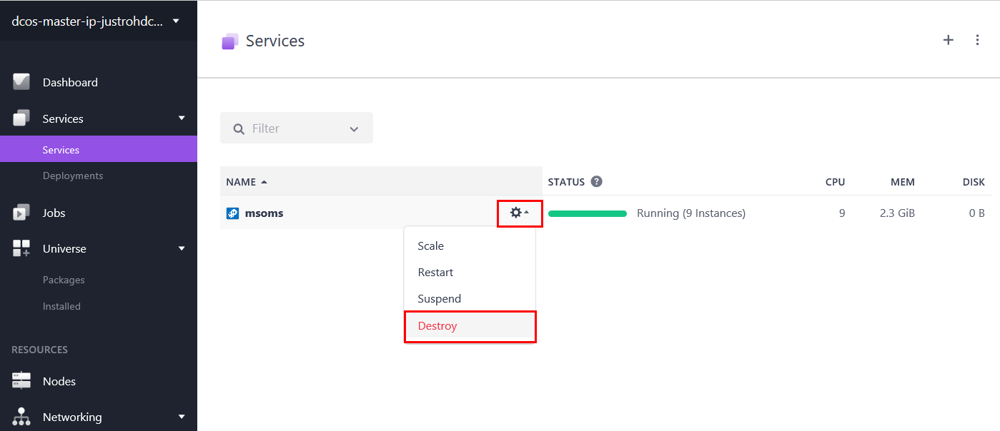

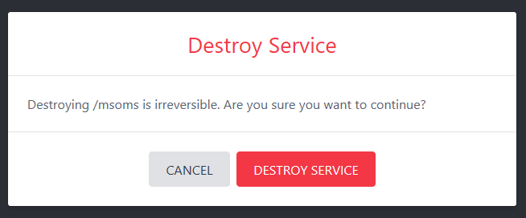

# References
For more information about Container Solution, please refer to the
[Container Solution Log
Analytics](https://azure.microsoft.com/en-us/documentation/articles/log-analytics-containers/).

# Let us know!!!
What works? What is missing? What else do you need for this to be useful for you? Let us know at OMSContainers@microsoft.com.
