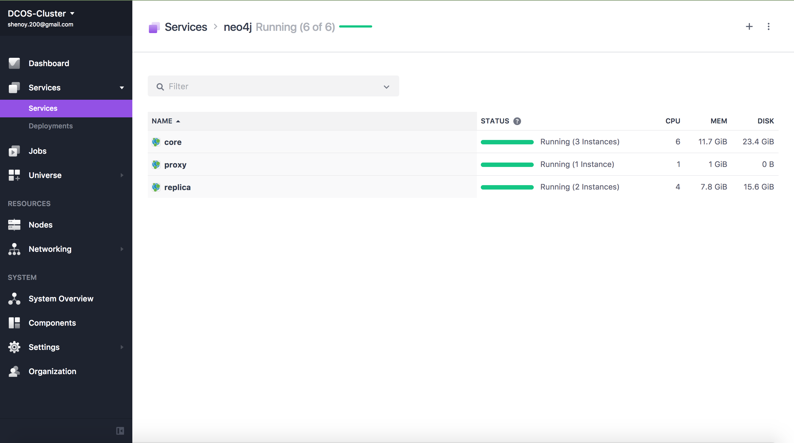
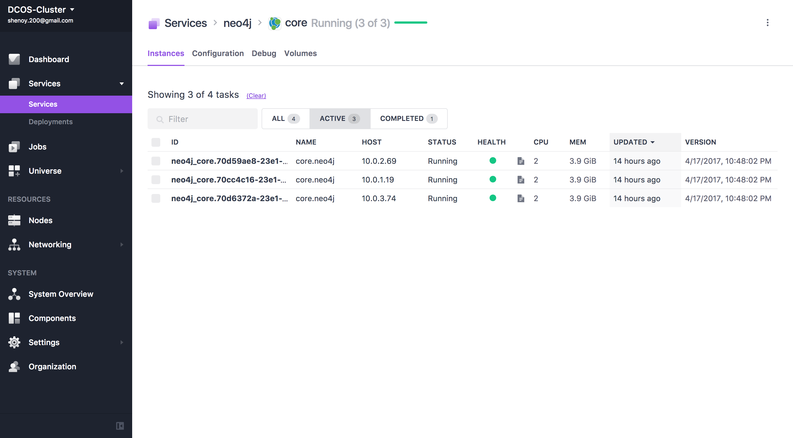
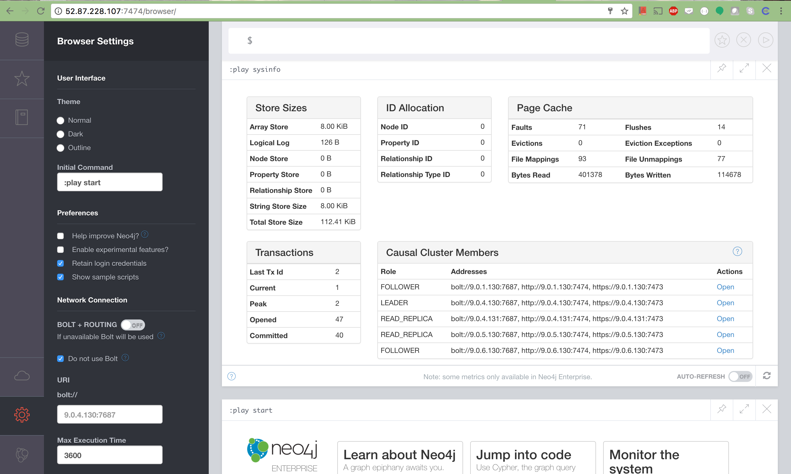
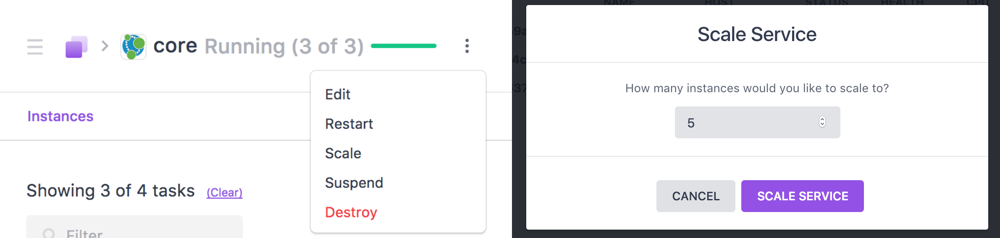

# How to use Neo4j on DC/OS

[Neo4j](https://www.neo4j.com/) is a highly scalable, native graph database purpose-built to leverage not only data but also its relationships. Neo4j's native graph storage and processing engine deliver constant, real-time performance, helping enterprises build intelligent applications to meet today’s evolving data challenges.

- Estimated time for completion: 5 minutes
- Target audience: Anyone who wants to deploy a clustered graph-model database on DC/OS. Beginner level.
- Scope: Covers the basics in order to get you started with Neo4j on DC/OS.

## Prerequisites

- A running DC/OS 1.9 cluster with at least 3 nodes having 3 CPU, 6GB of memory and 12GB of persistent disk storage in total. (Suggested: 3 nodes having 6 CPU, 24GB of memory and 24GB)
- [DC/OS CLI](https://dcos.io/docs/1.9/usage/cli/install/) installed.

## Install Neo4j

The DC/OS CLI provides a convenient way to deploy applications on your DC/OS cluster:

```
$ dcos package install neo4j
This DC/OS Service is currently in preview. There may be bugs, incomplete features, incorrect documentation, or other discrepancies. The default configuration requires at least 3 nodes having 6 CPU, 24GB of memory and 24GB of persistent disk storage in total. Default credentials are neo4j/dcos. Please change them on first use.
Continue installing? [yes/no] yes
Installing Marathon app for package [neo4j] version [3.1.2-1.0.0]
Neo4j has been successfully installed.
Documentation can be found at https://neo4j.com/docs and https://neo4j.com/developer
```

If you want to install read replica servers as well, please do:

```
$ dcos package install neo4j-replica
This DC/OS Service is currently in preview. There may be bugs, incomplete features, incorrect documentation, or other discrepancies. The default configuration requires at least 2 nodes having 4 CPU, 8GB of memory and 16GB of persistent disk storage in total.
Continue installing? [yes/no] yes
Installing Marathon app for package [neo4j-replica] version [3.1.2-1.0.0]
Neo4j has been successfully installed.
Documentation can be found at https://neo4j.com/docs and https://neo4j.com/developer
```


Now click on the Services tab in the DC/OS UI to watch Neo4j start up:



Click on the `Neo4j` group and the `core` App to reveal the tasks that the framework has started:



Congratulations, you now have Neo4j running on DC/OS!

## Public proxy for debugging purpose

If you want to access your Neo4j cluster from outside your DC/OS cluster, you need to install the public proxy:

```
$ dcos package install neo4j-proxy
This DC/OS Service is currently in preview. There may be bugs, incomplete features, incorrect documentation, or other discrepancies. Default credentials are neo4j/dcos. Please change them on first use.
Continue installing? [yes/no] yes
Installing Marathon app for package [neo4j-proxy] version [1.0.0-0.0.1]
Neo4j has been successfully installed.
Documentation can be found at https://neo4j.com/docs and https://neo4j.com/developer
```

After installation, point your web browser to the public IP of the agent running the proxy on port 7474. If you login (default: neo4j/dcos) and enter `:sysinfo` you will see all your running cluster nodes.

**Important:** Please check in the configuration sidebar `Do not use Bolt`. Only http via port 7474 is exported through this proxy, therefore the binary Bolt protocol is not working on the outside. Inside DC/OS Bolt works as expected. 




## Scale Neo4j

To scale out your Neo4j cluster, just use the functionality in the DC/OS service section. Select either `neo4j/core` or `neo4j/replica` and do `Scale` and select the required numbers of instances.



## Further reading

### Uninstall

Use the following commands to delete your Neo4j service and the:

```bash
$ dcos package uninstall neo4j; dcos package uninstall neo4j-replica; dcos package uninstall neo4j-proxy
```

### Configuration options

There are a number of configuration options, which can be specified in the following
way:

```bash
$ dcos package install --config=<JSON_FILE> neo4j
```

where `JSON_FILE` is the path to a JSON file. For a list of possible
attribute values and their documentation see

```bash
$ dcos package describe --config neo4j
```

#### Config options in detail - core

* neo4j-core.auth-password[=dcos]

	Password for authentication

* neo4j-core.auth-username[=neo4j]

	Username for authentication

* neo4j-core.cpus[=2]

	CPU shares allocated to one neo4j core instance.

* neo4j-core.disk[=8000]

	Disk size [mb] allocated to one neo4j core instance.

* neo4j-core.expected-cluster-size[=3]

	Expected core cluster size.

* neo4j-core.instances[=3]

	Amount of neo4j core instances.

* neo4j-core.network-name=[dcos]

	The name of your existing DC/OS overlay network.

* neo4j-core.mem[=4000]

	Memory [mb] allocated to one neo4j core instance.

#### Config options in detail - replica

* neo4j-replica.auth-password[=dcos]

	Password for authentication

* neo4j-replica.auth-username[=neo4j]

	Username for authentication

* neo4j-replica.cpus[=2]

	CPU shares allocated to one neo4j replica instance.

* neo4j-replica.disk[=8000]

	Disk size [mb] allocated to one neo4j replica instance.

* neo4j-replica.instances[=3]

	Amount of neo4j replica instances.

* neo4j-core.network-name=[dcos]

	The name of your existing DC/OS overlay network.

* neo4j-replica.mem[=4000]

	Memory [mb] allocated to one neo4j replica instance.

#### Config options in detail - proxy

* neo4j-replica.auth-password[=dcos]

	Password for authentication

* neo4j-replica.auth-username[=neo4j]

	Username for authentication

### Further Information

The Neo4j Mesos, Marathon and DC/OS integrations are supported by Neo Technology, the company developing Neo4j, the most widely used graph database. 
If you need help or have feedback or suggestions, just ask via one of the following channels:

- [Slack](http://neo4j.com/slack) in the #neo4j-dcos channel
- [Google Group](https://groups.google.com/group/neo4j)
- [Stack Overflow](http://stackoverflow.com/questions/tagged/neo4j) tagged `neo4j` and `dcos` or `mesos`
- `feedback@neo4j.com`: Neo4j Feedback email alias
- `devrel@neo4j.com`: Direct email for the neo4j developer relations team

We manage issues, bug reports, and questions via GitHub issues

- [neo4j-dcos](https://github.com/neo4j-contrib/neo4j-dcos/issues): Neo4j DC/OS repository
- [neo4j](https://github.com/neo4j/neo4j/issues): Neo4j itself
- [neo4j docker](https://hub.docker.com/r/neo4j): The Docker Images
