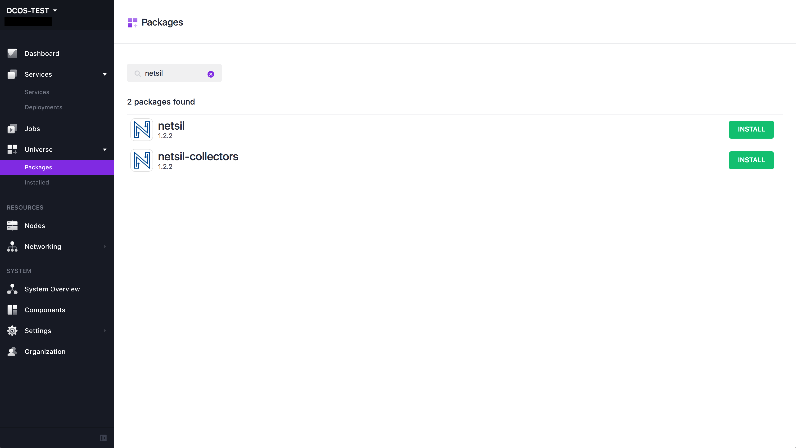

# How to use Netsil on DC/OS

[Netsil](http://netsil.com) is a converged platform for SREs and DevOps engineers that automatically maps the entire application, discovers all internal and external services, and captures dependencies among services.

- Estimated time for completion: 5 minutes
- Target audience: Those who are interested in monitoring their application on DC/OS
- Scope: Learn how to use Netsil on DC/OS

There are two different DC/OS services to install in order to use Netsil:
- The **AOC** is the main Netsil instance that processes and analyzes the captured traffic.
- The **collectors** capture the traffic going through your application servers and mirrors it back to the AOC.

**Table of Contents**:

- [Prerequisites](#prerequisites)
- [Install Netsil](#install-netsil)
- [Install Netsil Collectors](#install-netsil-collectors)
- [Using Netsil](#using-netsil)
- [Uninstall Netsil](#uninstalling-netsil)

## Prerequisites

- For running the AOC (The `netsil` package), you will need a running DC/OS 1.9 cluster with at least 4 CPUs, 16GB of RAM, and 120GB of HDD available.
- For running the collectors (The `netsil-collectors` package), you will need a running DC/OS 1.9 cluster with at least 0.1 CPU and 128MB of RAM available.
- [DC/OS CLI](https://dcos.io/docs/1.9/usage/cli/install/) installed.

## Installing Netsil
You may search for and install Netsil via the DC/OS UI:



## Install Netsil Collectors
You may install Netsil Collectors via the DC/OS UI. You should modify the number of instances to reflect the number of DC/OS nodes in your cluster.


## Using Netsil

### Topology
The AOC topology map captures all of the internal and external services along with their dependencies. In the map, 

* **Nodes** are services, which are auto-created groups of instances.
* **Edges** are network interactions among services.


### Analytics
The Analytics Sandbox is a powerful, real-time analytics engine that can be used to build queries and gain insights into the health of all application components. 
It has the following main components:

* Chart Plot: Provides a real-time plot as you build the queries.
* Time Window Slider: Used to set the time interval for queries and plots.
* Query Builder: For creating complex queries and subqueries.
* Save Query: Ability to save the query to your dashboards or alerts.


### Dashboards
Dashboards are collections of metrics and charts that provide complete insight into the health of application components.
We provide default dashboards, which are are out-of-the-box dashboards for all the supported datasources such as DNS, MySQL, HTTP, Memcached, PostgreSQL, and more.
Users also have the ability to create their own custom dashboards.


### Alerts
Alerts define health conditions for services. The violation of these conditions results in notifications to responsible users via a notification system, such as email or pagerduty. 
Upon switching to the alerts tab, the user will see a dashboard summary of all the alerts along with their trigger status. 
The trigger status is for the selected time window, which is apportioned by the slider. Color coding on trigger status refers to:

* Red: critical threshold violation
* Yellow: warning threshold violation
* Green: no violations


## Uninstall Netsil

```bash
$ dcos package uninstall netsil
$ dcos package uninstall netsil-collectors
```

## Further resources

1. [Netsil Official Documentation](https://netsil.github.io/docs)

