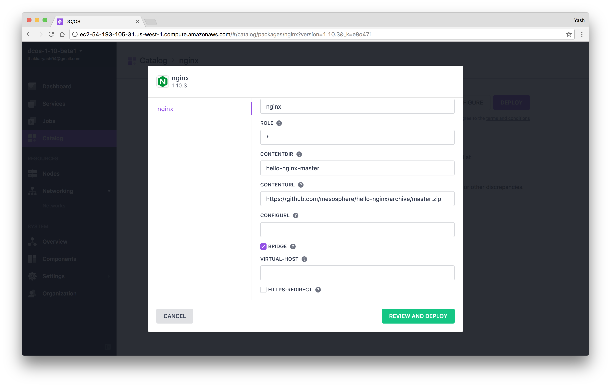

# How to use NGINX on DC/OS

[NGINX](https://www.nginx.com) is a high-performance HTTP server, reverse proxy, and an IMAP/POP3 proxy server. NGINX is known for its high performance, stability, rich feature set, simple configuration, and low resource consumption. DC/OS allows you to quickly configure, install and manage NGINX.

- Estimated time for completion: 10 minutes
- Target audience: Anyone interested in running a HTTP (proxy) server
- Scope: Learn how to deploy NGINX service on DC/OS and to serve a static website

## Prerequisites

- A running DC/OS 1.10 cluster with at least 1 node having at least 1 CPUs and 1 GB of RAM available.
- [DC/OS CLI](https://dcos.io/docs/1.10/cli/install/) installed.

There are three ways to deploy NGINX container.
1. [using Catalog](#deploy-nginx-using-catalog)
2. [using CLI](#deploy-nginx-using-cli)

## Deploy NGINX using Catalog

Assuming you have a DC/OS cluster up and running, we install NGINX to serve up a static Web site, available via the GitHub repo [mesosphere/hello-nginx](https://github.com/mesosphere/hello-nginx).

- Visit the DC/OS admin page, and click on `Catalog` on the left menu bar.
- Search and select `nginx`

- Click on `CONFIGURE` button
- Enter "`hello-nginx-master`" in `CONTENTDIR` and "`https://github.com/mesosphere/hello-nginx/archive/master.zip`" in `CONTENTURL`

- Click on `REVIEW AND DEPLOY`, verify values and click on `DOWNLOAD CONFIG.JSON` button from top right corner

- Click on `DEPLOY` and wait
- One popup should appear with `Success` message

- Click on `Services` from left menu bar
- there should be link button beside `nginx` service name, click on it or go to http://<MASTER-NODE-URL/ADDRESS>/service/nginx/

## Deploy NGINX using CLI

- If you followed GUI step, you have already config file downloaded, so you can skip next step.
- Creating a file called `config.json` with following contents:

```json
{
  "nginx": {
    "instances": 1,
    "cpus": 1,
    "mem": 1024,
    "name": "nginx",
    "contentDir": "hello-nginx-master",
    "contentUrl": "https://github.com/mesosphere/hello-nginx/archive/master.zip",
    "bridge": true
  }
}
```

The above `config.json` file configures NGINX as follows:

- `cpus`: This parameter configures the number of CPU share to allocate to NGINX.
- `mem`: This parameter configures the amount of RAM to allocate to NGINX.
- `instances`: This parameter configures the number of replicas you want of this service.
- `bridge`: This parameter configures whether the container should use `BRIDGE` mode networking or not. If this parameter is false, NGINX will be launched using `HOST` mode networking for docker. For more details, please refer to [Docker documentation](https://docs.docker.com/).
- `contentUrl`: This parameter is the URL to a file archive of a static website that we would like to serve using NGINX.
- `contentDir`: This parameter is the name of the directory that gets created when the file specified using `contentUrl` is downloaded and uncompressed.

Next, we are going to install nginx using this `config.json` file:

```sh
$ dcos package install nginx --options=config.json
This DC/OS Service is currently in preview. There may be bugs, incomplete features, incorrect documentation, or other discrepancies. Experimental packages should never be used in production!
Continue installing? [yes/no] yes
Installing Marathon app for package [nginx] version [1.10.3]
Nginx has been installed.
```

To verify that our NGINX instance is up and running, we can use `dcos task` command:

```bash
$ dcos task
NAME   HOST      USER  STATE  ID                                          MESOS ID
nginx2  10.0.2.65   root    R    nginx2.1b22348f-85c4-11e7-b20e-0269c4e5f33f  a29f1b0f-4548-4be1-be69-c4f809511393-S1
```

Let's try to access the `hello-world` website our NGINX server is serving by opening the URL `http://<YOUR-DCOS-MASTER-HOSTNAME>/service/nginx`. You should see a webpage similar to this:


## Uninstall NGINX

To uninstall NGINX, run following command:

```bash
dcos package uninstall nginx
```